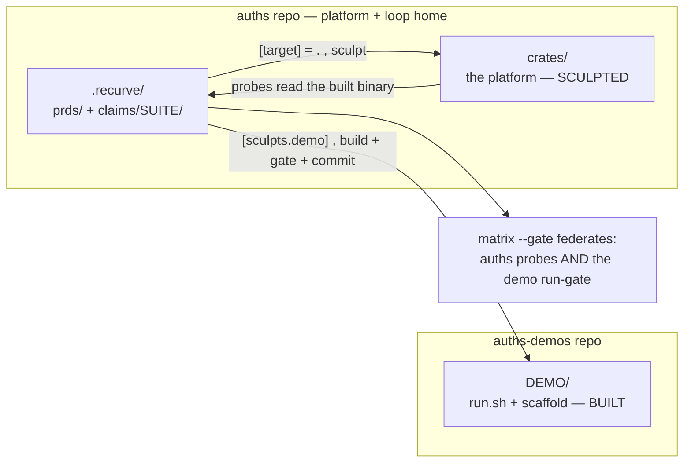

# Runbook — building the PRD suites across two repos

How to turn each PRD in `.recurve/prds/` into a live recurve suite that **hardens the
platform (this repo, `auths`) and produces the runnable demo (the `auths-demos` repo)** —
one loop, two repos.

> `recurve init --from-prd …` is **not** the whole story. It scaffolds the suite and
> claimifies the PRD, but it emits a *single-tree* config. You then wire the cross-repo
> `[target]` + `[sculpts.*]` (a manual edit today; a candidate `init` improvement to
> template). This runbook is that full sequence.

## Mental model

- **One home:** `auths/.recurve/` — every PRD in `prds/`, every claim in `claims/<suite>/`.
- **`[target]` = this repo (`auths`), `tree = "."`** — built (`cargo build`), *read* by the
  probes (the binary), and **sculpted** to make the claims go GREEN.
- **`[sculpts.<demo>]` = the demo's runnable scaffold** in `../auths-demos/<demo>` — built,
  gated (the demo runs end-to-end), and **committed to the `auths-demos` repo** on its own
  branch.
- **The gate federates:** `recurve matrix --gate` is GREEN only when the `auths` probes pass
  **and** the demo's run-gate passes — so a demo can never "pass" while regressing the
  platform it demonstrates.



## The sequence — per PRD

```bash
cd /Users/bordumb/workspace/repositories/auths-base/auths

# 1. Scaffold + claimify the PRD into a suite (single-tree config emitted).
recurve init --from-prd .recurve/prds/agent_demos/the-intern-that-couldnt.md \
             --suite the-intern-that-couldnt

# 2. Wire the cross-repo config — edit .recurve/recurve.toml (see the block below):
#    set [target] tree = "."  (the auths platform)
#    add [sculpts.the-intern-that-couldnt] tree = "../auths-demos/the-intern-that-couldnt"

# 3. Human review: skim the draft claims, answer .recurve/ADJUDICATE.md,
#    author probes + traps (accept path + adversarial twin).

# 4. Baseline (RED drafts → open, GREEN-with-trap → closed).
recurve baseline the-intern-that-couldnt

# 5. Preflight — must be green before any loop.
recurve validate && recurve matrix --gate

# 6. Burn it down (the generated workflow: sculpt auths → build the demo →
#    federated gate → per-repo commits → promote).
#    bash .recurve/workflows/burndown.sh   (or the orchestrator workflow)
```

### The cross-repo config block (step 2)

```toml
# auths/.recurve/recurve.toml   (root = the auths repo)

[target]                                   # the PLATFORM — built, read, sculpted
tree = "."
rebuild = "cargo build --release -p auths-cli"
# forbidden_strings is optional: baseline ("recurve", "GAP-") + this suite's
# claim prefixes are auto-excluded; leakcheck (default ON) enforces it.

[target.reads.cli]
method = "content-hash"
artifact = ".recurve/claims/the-intern-that-couldnt/bin/auths"
source   = "target/release/auths"

[sculpts.the-intern-that-couldnt]          # the runnable DEMO, in the other repo
tree   = "../auths-demos/the-intern-that-couldnt"
branch = "demo/the-intern-that-couldnt"    # its commits land here
rebuild = "the-intern-that-couldnt/scripts/build.sh"   # if it builds an app
gate    = "the-intern-that-couldnt/run.sh --check"     # the demo runs end-to-end → federated

[suites.the-intern-that-couldnt]
dir = ".recurve/claims/the-intern-that-couldnt"
```

## All the PRDs → suites

| PRD (`.recurve/prds/…`) | `--suite` | sculpt tree (`../auths-demos/…`) | Shape |
| --- | --- | --- | --- |
| `agent_demos/the-agent-with-a-credit-limit.md` | `the-agent-with-a-credit-limit` | same name | demo · **build first** (AGT-4) |
| `agent_demos/the-intern-that-couldnt.md` | `the-intern-that-couldnt` | same name | demo · **build first** (AGT-1) |
| `agent_demos/the-agent-that-wouldnt-die.md` | `the-agent-that-wouldnt-die` | same name | demo (rides on OPS-1) |
| `agent_demos/two-agents-who-never-met.md` | `two-agents-who-never-met` | same name | demo (rides on AGT-3 live) |
| `agent_demos/was-a-human-there.md` | `was-a-human-there` | same name | demo (rides on AGT-2 enclave) |
| `go_to_market/sovereign_messenger.md` | `sovereign-messenger` | `sovereign-messenger` | **true app** (has a UI → real `[target]` build) |
| `governance/constitution.md` | `governance` | — (no demo scaffold) | **platform-only** — sculpts `auths`, no `[sculpts.*]` |
| `aspirational/the_missing_layer.md` | `aspirational` | — | **after the burndown** moves it here |

## Where commits land (the two-repo discipline)

- **Platform sculpts** (`crates/…`) → the **`auths`** repo, on its branch (e.g. `dev-privacy`
  or a per-suite branch).
- **Demo scaffold** (`run.sh`, UI) → the **`auths-demos`** repo, on `[sculpts.<demo>].branch`.
- **Never** one commit spanning both repos; the gate is the serialization point.

## Honest notes

- **Single-tree vs. multi-tree.** A purely *behavioral* demo (probes drive the `auths`
  binary; the demo is a `run.sh`) can run single-tree (`[target] = "."`) with `run.sh` as a
  deliverable to `auths-demos`. Add `[sculpts.<demo>]` when the demo's scaffold must be
  **built and gated** (an app/UI — e.g. the messenger). The table above marks which.
- **Config-level `[sculpts.*]`.** The federated gate runs *every* declared sculpt's gate. Keep
  **one config per domain** (or per app-bearing demo) so you don't gate unrelated demos on
  every cycle.
- **`governance` and `aspirational` are platform-only** — they sculpt `auths` to make rights /
  capabilities provable; no `auths-demos` scaffold, so no `[sculpts.*]`.
- **leakcheck (default ON)** keeps loop vocabulary out of *both* `crates/` and the
  `auths-demos` scaffold — the auto-derived vocabulary is baseline + each suite's claim
  prefixes; `forbidden_strings` is only project extras.
- **Sequencing:** do `the-intern-that-couldnt` (AGT-1, just closed) or
  `the-agent-with-a-credit-limit` (AGT-4, closing) **first** — building one demo end-to-end is
  the acceptance test for the multi-tree loop before you fan out to the rest.
