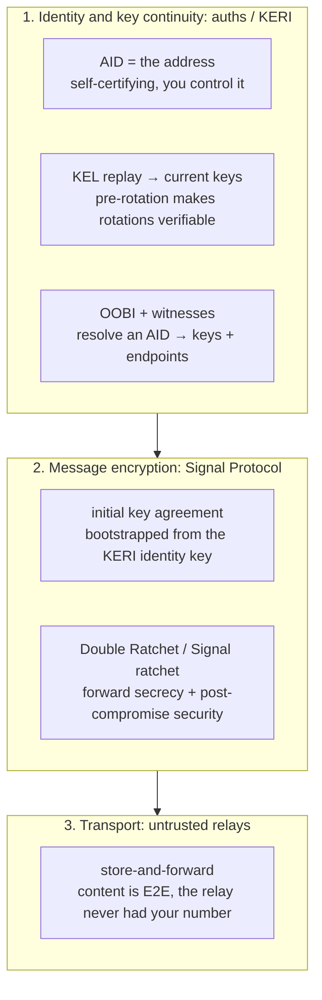
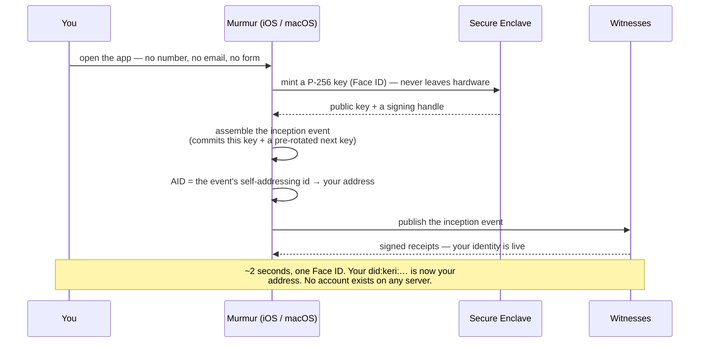
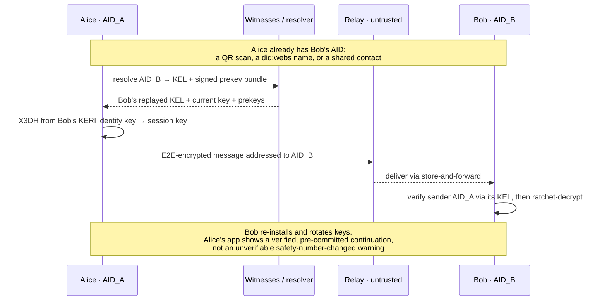

# Murmur — secure messaging with no phone number, no email

> **Product.** `murmur` — a phone-number-free, self-certifying messenger: native **iOS + macOS**
> apps (SwiftUI, **Liquid Glass**) over the auths/KERI identity layer + the Signal Protocol
> ratchet + untrusted relays. A **new base repo** (`murmur`); nothing lands in `auths-demos`.
>
> **The name.** To *murmur* is to speak softly, carrying only to who you meant it for — content-
> first and quiet, the way the app should feel. (It also pairs with the design language below:
> Liquid Glass is calm and recessive, and so is a murmur.)
>
> **Status — this is a *proof of thesis*, not a shippable product.** The build proves the claims
> (§10) — MSG-1..4 + ENC-1..6 — on **two real devices** (send from the Mac, watch it arrive
> authenticated on the iPhone). That proof is genuinely thin *because* it deliberately skips the
> messenger itself: push, relay-at-scale, prekey lifecycle, multi-device history sync, groups,
> media. Those aren't post-slice polish — they're a multi-year, security-critical build (§11), a
> different order of magnitude. We keep the two honest and separate: **the proof is achievable,
> demoable, and fundable; shipping to real users is a much larger undertaking, gated on §10's
> external-audit precondition.** It's still the most viscerally legible expression of "identity
> you own" — a messenger where *you* are the address, no number behind it — which is exactly why
> it's worth proving on real hardware before committing to the product.

---

## 1. The problem

End-to-end encrypted messengers solved the *content* problem and left the *identity* problem
alone. Signal's encryption is excellent; its **identity and address layer is a phone
number** — telco-controlled, SIM-swappable, government-registerable, PII-leaking, and the
root of its worst usability wart (the unverifiable *"your safety number changed"* warning on
every re-install, which trains users to ignore it). The phone number is not Signal's
strength. It is the soft spot.

## 2. Thesis

**Use a self-certifying identifier (an AID) as the address.** Your address becomes a
cryptographic identifier you own outright — no number, no email, and no provider that *owns your
identity* (a default witness/relay path still handles discovery and delivery — disclosed and
swappable, §3.1). The encryption protocol stays the same class as Signal's; only the identity
root changes.

The headline win: **pre-rotation makes a *benign* key change verifiable.** When a contact
re-installs or does a planned rotation, the new key was pre-committed by the prior key state — so
the app shows a *verified, pre-committed continuation of the same identity* instead of the scary,
unverifiable safety-number warning Signal fires on **every** change. Since benign reinstalls are
the overwhelmingly common case, this kills the alarm-fatigue that trains Signal users to ignore
the warning — a real, defensible UX win — and it defeats a current-key-*only* compromise outright
(an attacker holding the signing key but not the secured next key cannot rotate at all).

**The honest boundary (up front, because a security-savvy reader will probe it).** Pre-rotation
makes a rotation *authorized*, not *trustworthy*. If an attacker fully compromises a device — both
its current key **and** its pre-committed next key — they can produce a valid "verified
continuation" to a key they now control, and the badge would reassure; Signal's warning *does*
fire in exactly that case. So Murmur is **not** strictly louder than Signal on compromise: it
trades "warns on everything, including benign reinstalls" for "verifies any properly pre-committed
continuation, including a post-theft one." Full device compromise is handled by **guardian
recovery + revocation** (§9, §11.1) — out-of-band, with a revocation-race window — **not** by the
continuity badge. The wedge is "no false alarms + verifiable benign continuity," not
"unconditionally safer than a warning."

**The binding mechanism (so this isn't just prose).** On a rotation the app must **re-key the
Signal session deterministically** — tear down and re-establish X3DH against the freshly-replayed
key-state, never continue the old ratchet across an identity change — and **re-verify the
republished prekey bundle against the new current key** (accepting a bundle whose signer you
didn't re-check is the dangerous bug). Benign-continuity's integrity also depends on the **witness
threshold**: the app must reject a **forked KEL** (two different rotations at the same sequence),
or a malicious relay can serve a stale/forked key-state to suppress or fake a rotation — so the
launch-centralization asterisk (§3.1) is load-bearing here, not cosmetic.

## 3. Architecture — three layers, cleanly split



- **Layer 1 — identity (auths/KERI).** The AID is the address and its own proof of control.
  Key discovery is OOBI resolution to a witnessed KEL; key continuity is pre-rotation;
  multi-device is delegated sub-identities under one root; recovery is M-of-N guardians.
- **Layer 2 — encryption (Signal Protocol).** KERI authenticates *who*; the ratchet
  encrypts *the messages*. The initial key agreement bootstraps from the KERI-authenticated
  identity key, then the Double Ratchet (1:1) or Signal group ratchet (groups) takes over for
  forward secrecy and post-compromise security. **KERI does not replace the ratchet — it
  roots it.**
- **Layer 3 — transport (untrusted relays).** Store-and-forward servers deliver ciphertext.
  They are untrusted by design and, unlike Signal's, never held a phone number to begin with.

### 3.1 Addressing & transport — what replaces the phone number

A phone number did two jobs at once: it was your **identity** *and* the **directory key** the
network routed on. Murmur splits them — that conflation was the leak.

**Address (the "to") = the AID.** The self-certifying identifier is the destination. You can hand
each contact a **pairwise** AID, so nothing on the wire links your contacts to each other. An AID
is an identity, not a network location, so it has to resolve to somewhere.

**Routing (AID → where the bytes go) = signed endpoint records in the KEL.** Resolving an AID
(OOBI) replays its witnessed KEL, which yields the key-state **plus the AID's signed endpoint
records** — the `/end/role/add` + `/loc/scheme` reply records auths already emits
(`auths-keri/src/oobi.rs::reply_stream`), naming a **mailbox/relay endpoint** and its URL,
authorized by the AID's own signature. The routing key is not a number in a global registry; it
is a relay location the recipient **cryptographically authorized in their own log**. Switch
relays = sign a new endpoint record — no carrier, no porting, nothing to SIM-swap.

**Rail (the actual transport) = untrusted store-and-forward relays over ordinary internet.**
Ciphertext is delivered to that mailbox over HTTPS / WebSocket / QUIC; the relay queues it for an
offline recipient, who **pulls or subscribes** and drains the mailbox. The relay is dumb and
untrusted — it sees an opaque mailbox id and ciphertext, never plaintext, never a number. A
**pairwise / rotating mailbox id** keeps the relay from learning that all your traffic is one
person. (On a shared LAN the mDNS pairing path — `auths pair` / `auths-pairing-daemon` — already
moves bytes between local peers and can carry local delivery.)

```
AID ──OOBI resolve──▶ witnessed KEL ──replay──▶ signed endpoint (role=mailbox, loc=URL)
                                                       │
   ciphertext ──store-and-forward──▶ relay / mailbox ──┘ ──pull/subscribe──▶ recipient device
```

**The two-layer envelope.** The phone number smushed routing and identity together; KERI lets us
separate them, which is strictly better for metadata privacy:
- **outer** — what the relay sees: `to: <pairwise mailbox id>` + opaque ciphertext. Routing only.
- **inner** — what the recipient verifies: the real sender AID, authenticated by replaying *their*
  KEL, then decrypted.

**Where Signal's cryptography sits.** The inner envelope **is Signal Protocol ciphertext.** KERI
and Signal own different jobs and must never blur:
- **KERI authenticates and roots.** The recipient's **prekey bundle is signed by the AID's current
  KERI key**, so X3DH runs against keys you have *verified* belong to that AID (by KEL replay) —
  this is what makes the safety-number warning obsolete. Key hygiene is a hard rule: the AID key
  signs a **distinct** Signal identity key; a signing key is never reused as a DH key.
- **Signal encrypts.** X3DH derives the initial session secret from those authenticated keys; the
  **Double Ratchet** then provides per-message forward secrecy and post-compromise security for
  every message that fills the inner envelope. **KERI never sees plaintext and never encrypts;
  Signal never decides identity.**

So the layering is *KERI identity & routing* on the outside, *a Signal session* on the inside,
*your message* within that. The join between them (the KERI-signed prekey bundle) and our *use* of
the ratchet are where a real-world leak would happen — **not in Signal itself** — so they are
tested as first-class claims (**ENC-1..6, §10**).

**No global lookup-by-identifier.** There is no "search someone's number." A first contact is
bootstrapped **out-of-band** — a QR, an OOBI link, or a DNS-anchored **did:webs** name
(`did:webs:murmur.im:alice`, which resolves over HTTPS to the same KEL — an *opt-in* directory,
never a mandatory one). After first contact, the KEL's endpoint records carry everything. That
out-of-band handoff is the cost of having no phone-directory — and exactly why there is nothing to
enumerate or hijack.

**The "no provider" asterisk — who runs the witnesses and relays?** "No provider" is precise about
**identity control**: you hold your keys, your KEL is yours, and no one can impersonate you or
lock you out of your AID. It is **not** a claim that no server touches *discovery* or *delivery*.
At launch Murmur operates the default **witness set** (which receipts your KEL and serves
resolution) and the default **relay** (store-and-forward) — so on day one we are the resolver,
witness, and relay operator on the default path. That's a real, disclosed centralization, and the
escape hatch is the identity-portability superpower (§11.3): witnesses and relays are **named in
your own signed KEL and swappable** — federate or self-host them and keep every contact, because
your identity never depended on ours. The honest one-liner: *no provider for who you are; a
Murmur-operated default path for discovery and delivery, federatable over time.*

## 4. The apps — native iOS + macOS (and the testbed)

Murmur ships as **two native SwiftUI apps from one multiplatform codebase**: **iOS**
(iPhone/iPad) and **macOS**. Two apps isn't a nicety — it's how you *test the whole thesis on
real hardware*: run an endpoint on each and **send a message from the Mac and watch it arrive,
authenticated, on the iPhone** (and the reverse).

- **Each device is a delegated sub-identity under one root AID** — exactly the multi-device
  capability auths already provides (§7). The Mac and the iPhone are two **delegated devices** of
  the same person: a message from either is authenticated as the *same root identity*, and
  revoking a lost device (the *lost-the-laptop* story) is a chain event, not a re-key of the
  whole identity. Device-linking is a delegation ceremony — pair the new device under the root —
  not a password.
- **Two ways to drive it in test:** (a) *one identity, two devices* — link the Mac and iPhone
  under one root and watch multi-device delivery + the verified continuity; (b) *two identities* —
  be Alice on the Mac and Bob on the iPhone to exercise first-contact, the ratchet, and the
  **verified key-rotation** beat end-to-end on real devices.
- **Shared core, native shells.** The identity / transport / ratchet core (Rust, over the auths
  engine) is shared; each app is a thin SwiftUI shell. The Swift↔engine glue **already exists**:
  the apps embed the generated **`auths-mobile-ffi` UniFFI bindings** (`auths_mobile_ffi.swift`),
  and the private key is minted and held in the **Secure Enclave** — it never crosses the FFI,
  only signatures and public keys do. macOS gets the desktop affordances (keyboard, multiple
  windows, a wider split view); iOS gets the touch-first layout — but the *identity model and the
  verdicts are identical*, because they are the same chain.

## 5. Design language — Liquid Glass

Murmur adopts **Liquid Glass**, the iOS/iPadOS/macOS system material (iOS 26+ / macOS 26+ era),
as its design language — a deliberate philosophical match. Liquid Glass is **content-first and
calm, the chrome receding so the content is what you focus on.** For a messenger the content is
*the conversation and the people in it*; for Murmur it's also **the identity/trust state** — the
quiet badge that says *this is a verified, pre-committed continuation of the same person*. Liquid
Glass lets the chrome dissolve so the only two things you see are the message and the trust in
who sent it. Reference:
<https://developer.apple.com/documentation/TechnologyOverviews/adopting-liquid-glass>.

The mindset is **subtraction, not addition.** Don't *add* custom chrome (card backgrounds,
glows); **remove** custom backgrounds and let the system render the material. A token layer owns
only the *content* — type, spacing, the monospace for an AID, and the **trust-state colors**;
Liquid Glass owns the chrome.

**Do:**
- **Build against the latest Xcode SDK; run on the latest iOS/macOS.** Standard SwiftUI
  components pick up Liquid Glass automatically — most of the win is free.
- **Navigation (the priority).** Standard `NavigationStack` / `NavigationSplitView` (Mac and iPad
  get the split: conversation list ↔ thread ↔ identity inspector) and `.toolbar(content:)` so the
  nav layer floats in glass above the content. Keep a clear content-vs-navigation hierarchy (the
  thread and contact views are *content*; the bars are *navigation*). Remove custom toolbar/nav
  backgrounds so they don't fight the material or the scroll-edge effect. Consider
  `.tabBarMinimizeBehavior(.onScrollDown)` so the bar recedes as a thread scrolls; group toolbar
  items with `ToolbarSpacer`; give every icon an accessibility label.
- **Controls.** Standard `Button`/`Toggle`; the primary actions (send, verify a contact, link a
  device) adopt `.glass` / `.glassProminent` instead of hand-rolled fills. Match curvature with
  `ConcentricRectangle` so bubbles/sheets/controls nest cleanly.
- **Custom glass, sparingly.** Only the single most important functional element gets a custom
  `glassEffect(_:in:)`; wrap multiples in a `GlassEffectContainer`. Overusing glass distracts from
  the content — the exact failure mode to avoid.
- **Sheets/lists.** Let sheets/popovers take the system background; grouped `Form`/`List` for the
  larger system padding; title-style section headers.

**It should feel effortlessly simple to use, and equally powerful.** The simplicity is the
surface — one calm thread, no settings thicket. The power is underneath — a sovereign identity,
verifiable key continuity, multi-device, instant device revocation — surfaced only when it
matters.

**The one hard rule — translucency must never weaken a trust state.** This is the messenger's
analog of a verdict that must stay unmistakable. The **identity/trust indicators** — *verified
contact*, *verified pre-committed continuation* (the headline win, §2), and above all a
**non-continuation key-change warning** (the adversarial case, §10 MSG-2) — must read
unmistakably **behind glass, on any backdrop**:
- the shared trust-state component is **opaque enough to hold WCAG AA on any backdrop** — glass
  never dilutes a security signal;
- tokens own the trust-state color with **light/dark + increased-contrast** variants;
- the apps are tested under **Reduce Transparency** and **Reduce Motion** (the iOS analog of the
  UI-CONTRAST / UI-MOTION probes), and **motion is system, interaction-driven, and
  reduce-motion-aware** (functional, 150–300ms, no decorative loops — let the material carry
  liveness, not a pulsing dot).

## 6. The user flow — from first launch to first message

Murmur has **no sign-up form.** No phone number to type, no email to confirm, no password to
choose, no account on our servers to create. The first time you open the app it **mints you an
identity on-device in about two seconds**, and that identity *is* your address. Here is the whole
journey — and exactly where auths does each piece (the map at the end names every primitive).

### 6.1 First launch — you become an identity

1. **Open the app.** No form. One tap: *Create my identity*.
2. **A key is minted in the Secure Enclave.** The app generates a P-256 key inside Apple's Secure
   Enclave (Face ID / Touch ID); the private key **never leaves the hardware** and never crosses
   the FFI — only signatures and public keys do.
3. **An inception event is assembled.** The app builds your KEL's genesis event, committing this
   key *and* a **pre-rotated next key**. The event's self-addressing identifier **is your AID** —
   a `did:keri:…` address derived from the event itself, owned by no one but you.
4. **Witnesses receipt it.** The inception event is published to a default witness pool, which
   return signed receipts — now your identity is *witnessed* and resolvable by anyone you hand
   your address to.
5. **Optionally claim a name.** A 44-char AID isn't memorable, so you can claim a human-readable
   **did:webs** name (e.g. `murmur.im/alice`) that projects to the same key-state.

That's the account. There is no company-held secret, nothing to phish, nothing to SIM-swap.



### 6.2 Your second device — pair the Mac to the iPhone

Your iPhone holds your root identity. To bring the Mac in, you **pair** — you don't re-sign-up:

1. On the Mac, *Add this device* shows a short code / QR; the iPhone scans it.
2. The two find each other on the LAN (mDNS) and open an encrypted channel; the Mac mints **its
   own** Secure-Enclave key and builds a **delegated inception** naming your root as delegator;
   the iPhone **anchors** that delegation with a signed event from your root key.
3. Done: the Mac is now a **delegated device of the same identity.** A message from the Mac
   authenticates as *you*; the root key never left the iPhone.

This is also the **testbed**: be one identity on two devices, or run two identities (Alice on the
Mac, Bob on the iPhone) and message across them.

### 6.3 Finding someone — three ways to get their address

You can't message someone until you have their AID. Three ways, all ending in the same verified
key-state:

- **In person:** scan their **QR** (their OOBI).
- **A link:** they send you an **OOBI URL** over any channel (iMessage, email, a webpage).
- **A name:** you resolve their human-readable **did:webs** name.

However you get it, your app **resolves the OOBI and cryptographically replays their KEL** to
their current keys + delivery endpoints — trust comes from the *replay*, not from the link. You
save them with a petname. And because contact is **opt-in**, they become reachable only once each
side has admitted the other's AID — a spammer who mints a million AIDs reaches no one (§8).

### 6.4 First message — first contact with a stranger

With their verified key-state in hand, the ratchet takes over: fetch their signed prekey bundle,
do the initial key agreement from their KERI-rooted identity key, and send forward-secret
ciphertext through an untrusted relay. They verify your AID by replaying *your* KEL, then
ratchet-decrypt. The relay sees neither plaintext nor a phone number.



### 6.5 Life happens — they reinstall, you lose a device

- **They reinstall / rotate keys.** Their new key was pre-committed at the prior step, so your app
  shows a **verified, pre-committed continuation of the same person** — not a scary safety-number
  warning (the headline win, §2).
- **You lose the Mac.** Revoke it from the iPhone: the root rotates the delegation, and the revoked
  device stops verifying as you. The honest bound (same lesson the agent-gateway learned —
  prevention vs detection, witness-dependent): revocation is only as fast as each contact
  **re-resolves** your key-state, and only safe if they get **witness-corroborated** state rather
  than a relay's stale cache — an offline contact, or one served stale state, still has a window.
  It's clawback from the chain, not an instant global kill, and not a best-effort server logout.

### 6.6 Where auths does the work (the map)

Every step above is a real auths primitive — the app is a SwiftUI shell over them:

| Flow step | What the user sees | Where auths does it |
| --- | --- | --- |
| Mint the key | one tap + Face ID, no form | key minted in the **Secure Enclave** — `auths-core/src/storage/ios_keychain.rs`, `secure_enclave.rs` (macOS: `macos_keychain.rs`); FFI `build_p256_identity_inception_payload()` (`auths-mobile-ffi`) |
| Become an AID | your `did:keri:…` address appears | `assemble_p256_identity()` → `IdentityResult` (`auths-mobile-ffi`); core `create_keri_identity()` (`auths-id/src/keri/inception.rs:466`); the AID is the inception event's SAID |
| Pre-rotation | (invisible) next key already committed | `compute_next_commitment()` (`auths-core/src/crypto/said.rs`); `n` field of `IcpEvent` (`auths-keri/src/events.rs`) |
| Get witnessed | "your identity is live" | receipts (`auths-keri/src/witness/receipt.rs`); `auths witness` (`auths-cli/src/commands/witness.rs`) |
| Human-readable name | claim `alice` | did:webs projection — `DidWebsDocument::build()` (`auths-keri/src/did_webs.rs:148`) |
| Pair a 2nd device | scan QR, Mac↔iPhone | `auths pair` + **pairing daemon** (mDNS + HTTP, `auths-pairing-daemon` `build_pairing_router()`); X25519 channel (`auths-pairing-protocol`); FFI `build_pairing_binding_message()` / `assemble_pairing_response_body()` |
| Device = same identity | the Mac sends as *you* | delegated inception `incept_delegated_device()` + root anchor `anchor_received_dip()` (`auths-id/src/keri/delegation.rs:70`) |
| Find someone | scan / open link / type a name | OOBI resolve — `auths oobi resolve`, `ingest_oobi_stream()` (`auths-keri/src/oobi.rs:483`); serve side `for_controller()` + `reply_stream()` |
| Trust their keys | (invisible) | KEL replay `replay_with_receipts()` → `KeyState` (`auths-keri/src/validate.rs:477`); FFI `validate_kel_json()` |
| Send a message | type & send | **Signal Protocol + relay — not auths**; auths only roots the identity key the ratchet starts from |
| Verified continuation | "verified — same person" badge | `rotate_keys()` (`auths-id/src/keri/rotation.rs:142`) + `verify_commitment()`; replay to the new key-state |
| Revoke a lost device | remove the Mac | delegated rotation `rotate_delegated_device()` (`auths-id/src/keri/delegation.rs:935`); org-scale revoke via `auths-api` |
| Recover everything *(future)* | M-of-N guardians | pre-rotation continuity ✅; multisig primitives ✅ (`auths-sdk/src/workflows/multi_sig.rs`); **guardian-recovery UX is the build** |

The unlock: the identity glue **already exists** — `auths-mobile-ffi` ships generated Swift
bindings, and `auths pair` + the pairing daemon already do LAN device-linking. Murmur's app work
is the SwiftUI shell, the Signal ratchet, and the relay — *not* the identity engine.

## 7. What exists vs. what must be built

| Capability | auths today | To build / compose |
| --- | --- | --- |
| AID as address; control = signing | ✅ built | — |
| **Onboarding** — incept an identity on first launch (no sign-up, no PII) | ✅ built (`auths-mobile-ffi` incept) | the first-run UI |
| **Swift ↔ engine glue** (embed the core in the apps) | ✅ built (`auths-mobile-ffi` UniFFI, Swift generated) | wire it into the SwiftUI shells |
| Key discovery (OOBI → witnessed KEL) | ✅ built | a hosted resolver/relay for the default path |
| **Verifiable key continuity (pre-rotation)** | ✅ built | UI that *shows* the verified rotation |
| Multi-device (delegated sub-identities) | ✅ built — incl. mDNS **pairing daemon** + `auths pair` | the device-linking UI that wraps the pairing flow |
| Recovery (M-of-N guardians) | ◔ aspirational | the guardian ceremony + UX |
| Metadata privacy (pairwise / unlinkable AIDs) | ◔ aspirational | per-contact AID derivation |
| **Native iOS + macOS apps** (SwiftUI multiplatform) | ❌ | two thin SwiftUI shells over the shared Rust core |
| **Liquid Glass design + trust-state-behind-glass guardrail** | ❌ | the re-skin (subtraction) + the WCAG-AA trust component |
| **Message encryption + forward secrecy** | ❌ not auths's job | integrate Signal Protocol |
| **Ephemeral prekeys** | ❌ | publish prekey bundles signed by the AID's current key |
| **Transport / store-and-forward** | ❌ | relay infrastructure (untrusted) |
| **Abuse / sybil resistance** | ❌ | the genuinely new problem — see §8 |
| **Address UX** (an AID is not memorable) | partial | QR exchange, optional `did:webs` names, contacts/petnames |

## 8. The frontier — the problems Murmur gets to own

- **Abuse / sybil resistance is the new frontier — and we have a clean answer.** A phone number
  gives weak spam resistance "for free" because a SIM costs money; AIDs are free to mint
  (permissionless). So Murmur brings its own, and the simplest answer wins: **opt-in contact** —
  you can't message me unless I admit your AID. A spammer can mint a million AIDs and reach no
  one. Reputation, proof-of-work on first contact, and witness-gated rate limits are in reserve
  if we ever want them, but opt-in alone dissolves the problem **for 1:1**. This is ours to
  define — and that's the moat. **The honest caveat: opt-in is a 1:1 defense.** Groups reopen the
  vector — the moment someone can **add you to a group**, or a **group-invite link leaks or is
  enumerable**, a spammer reaches you without your per-AID admission, and a group is an amplifier.
  Group-invite abuse is its own unsolved surface, handled at the membership layer (§11.3's
  group-as-AID governance — admits are signed events you can gate, and you can leave), **not** by
  1:1 opt-in. Name it; don't let "opt-in dissolves spam" imply groups are covered.

  > **On biometrics.** The tempting fix — require a biometric at account creation — helps
  > with one thing and not the thing you'd hope: biometrics give **liveness, not uniqueness**,
  > and only uniqueness is sybil resistance.
  > - *Device-local* biometrics (Face ID / Secure Enclave) prove a human is present on a
  >   device but never leave it, so nothing can check whether that human already has an
  >   account — one person with ten devices mints ten accounts. This kills *bots*, not
  >   sybils, while preserving sovereignty. auths's human-present custody attestation
  >   (`AGT-2`) is exactly this: a sovereignty-preserving liveness signal that raises the cost
  >   of *automated* account creation, with **no central database**.
  > - *Central* biometric dedup (the Worldcoin model) is the only way to enforce
  >   one-human-one-account — and it **destroys the premise**: a global biometric registry is
  >   a worse central authority than the phone number you left (a honeypot, coercible,
  >   unrotatable once leaked, a regulatory minefield). You'd re-centralize harder than the
  >   telco.
  >
  > Resolution: a messenger **mostly doesn't need uniqueness.** Make contact **opt-in**
  > (§above) and a spammer can mint a million AIDs that reach no one — the abuse problem
  > dissolves without any personhood check. Use device-local liveness (`AGT-2`) for anti-bot;
  > reserve true uniqueness (proof-of-personhood — an unsolved, centralizing problem) for
  > open-network cases a messenger doesn't have.
- **The ratchet is not optional.** KERI gives authenticated identity keys; it does **not**
  give per-message forward secrecy or post-compromise security. Skipping Signal Protocol
  would be a downgrade from Signal, not an upgrade. The value is in the *identity root*, not
  in reinventing the messaging crypto.
- **Metadata.** No phone number removes Signal's contact-discovery liability outright (no
  address-book to leak). Pairwise AIDs make linkage across contacts impossible. But the
  relays still see delivery patterns; sealed-sender-class techniques still apply.
- **Address UX.** A 44-character AID is not human-shareable. QR codes (already the norm for
  Signal safety numbers), optional human-readable `did:webs` names, and contact lists carry
  this — but it is product work, not a given.
- **Prior art.** Messaging rooted in DIDs already exists (**DIDComm v2**), and `did:keri` is
  a real DID method, so the *idea* is established in the SSI world. What is novel is a
  *polished consumer messenger* that markets directly against the phone-number dependency.

## 9. Why Murmur wins

**It's the best expression of the identity layer we have.** It attacks a weakness everyone
already feels — *"why does Signal need my number?"* — and answers it with the layer's strongest,
most legible properties: a sovereign address you own outright, **verifiable** key continuity,
seamless multi-device, guardian recovery. A non-technical person gets it instantly, because they
can hold it: *send from your Mac, and it arrives verified as you on your phone, with no number
anywhere.*

**The wedge is real — stated honestly.** "No phone number" is the headline everyone gets
immediately. The subtler win is **verifiable benign continuity**: pre-rotation proves a reinstall
or planned rotation is a pre-committed continuation, so Murmur doesn't fire Signal's cry-wolf
"safety number changed" alarm on the common, harmless case — the alarm users are trained to
ignore. That's a genuine edge a key-pinning model can't offer, and it defeats a current-key-only
leak outright. What it is **not** is "unconditionally safer than a warning": a full device
compromise can still forge a green continuation (§2), which is why recovery and revocation — not
the badge — carry the compromise case. The honest version is still a strong wedge, and it's the
one that survives scrutiny from the exact security-savvy crowd who decides whether a new messenger
is credible.

**And the wedge widens past the slice.** Three more features fall out of self-certifying identity
that no incumbent can ship without rebuilding their foundation — each both a differentiator *and*
the answer to a real user need (full set in §11):
- **Guardian recovery.** "Pick three friends; any two restore you." Recovery is native KERI
  multisig, so the scariest part of going phone-number-free becomes a *trust* feature instead of a
  fragile PIN.
- **Identity portability — own, don't rent.** Your AID is a `did:keri` we don't own; switch relay
  providers and keep every contact, or carry the same identity to other apps. A structural answer
  to platform lock-in.
- **Verifiable group governance.** A group *is* an identifier whose membership changes are signed
  KEL events — "who's in, who added whom, when" is cryptographically auditable, with no server
  deciding and no silent member-injection.

**The plan — prove the thesis on two real devices first.** Build the proof (§10): MSG-1..4 +
ENC-1..6, native iOS + macOS, the ratchet integrated properly, opt-in contact, and Liquid Glass
making it feel effortless. The two apps are the point — they let us *show*, not tell, that the
identity wedge works on hardware a person can hold. That is the achievable, demoable, fundable
milestone. Turning the proof into a messenger real users live in is the **much larger** build in
§11, and it is explicitly gated on an external audit of the encryption join (§10). We're
deliberate about which we're doing: **prove first, and don't market the proof as the product.**

## 10. Claim sketch (the thinnest provable slice)

- **MSG-1 — a message is addressed to, and authenticated by, an AID with no phone number or
  email anywhere in the flow.** Adversarial: a message claiming to be from an AID the sender
  does not control is rejected.
- **MSG-2 — a contact's key rotation verifies as a pre-committed continuation of the same
  identity.** Adversarial: a substituted (not-pre-committed) key is rejected, where a
  pinning model would show only an unverifiable warning — and the **key-change warning reads
  unmistakably behind Liquid Glass** (§5), holding WCAG AA under Reduce Transparency.
- **MSG-3 — message content is forward-secret and the relay learns neither the plaintext nor
  a phone number.** Adversarial: a compromised relay cannot read messages or link a holder
  to PII. (The integration that must hold for this — our *use* of Signal — is proven in
  ENC-1..6 below.)
- **MSG-4 — a delegated device (the Mac) sends a message authenticated as the *same root
  identity* the iPhone holds, and revoking that device stops it.** Accept: a message from the
  Mac verifies as the root AID on the iPhone (device=Mac, identity=root); the iPhone keeps
  sending. Adversarial: after the root revokes the Mac (lost-laptop), the Mac's next message is
  rejected — clawback across devices, from the chain.
- **UI-TRUST — the trust state survives the material.** The verified-continuation badge and the
  non-continuation key-change warning hold **WCAG AA contrast on any backdrop behind Liquid
  Glass**, in light/dark/increased-contrast, and under **Reduce Transparency + Reduce Motion** —
  translucency never weakens a security signal (the iOS analog of UI-CONTRAST / UI-MOTION).

### Encryption integration — proving *we* use Signal correctly (not just that Signal is correct)

Signal Protocol is battle-tested; the risk is entirely in *how we wire it*, so these claims test
the **integration**, not the primitive. The rule: **don't reimplement the crypto** — embed
**libsignal** (the audited Rust implementation, whose Swift bindings the apps need anyway) behind
a small **misuse-resistant wrapper** (one-time-prekey accounting, automatic key zeroization, no
plaintext logging by construction), and gate the wrapper hard.

- **ENC-1 — the session is rooted in a KERI-authenticated prekey bundle.** Before X3DH, the
  recipient's signed prekey bundle is verified against their AID's current key (KEL replay); a
  bundle signed by a wrong or non-pre-committed key is **rejected** — closing the MITM the
  safety-number warning exists to catch. Also asserts key hygiene: the AID key signs a *distinct*
  Signal identity key (no signing↔DH key reuse).
- **ENC-2 — forward secrecy holds across our wiring.** A ciphertext captured off the relay cannot
  be decrypted from a *later*, compromised session state; used message keys are zeroized.
  Adversarial: snapshot the session state at message N, fail to decrypt message N−k.
- **ENC-3 — post-compromise healing.** After a simulated state compromise, the next DH ratchet
  step restores confidentiality — the attacker is locked back out.
- **ENC-4 — nothing but routing leaves the device in the clear.** No plaintext, message key,
  ratchet state, or **sender AID** appears in the outer envelope, the relay-visible bytes, logs,
  crash reports, receipts, or telemetry. A leakcheck-style scan **and** a relay-capture assertion.
- **ENC-5 — the untrusted relay can't tamper, replay, or link.** Bit-flipped ciphertext fails AEAD
  and is rejected (no oracle); a replayed ciphertext is deduped; the relay-visible envelope carries
  only a **pairwise mailbox id**, never a stable cross-contact linker.
- **ENC-6 — vetted implementation, used correctly.** The wrapper passes libsignal's **official
  test vectors** and a **differential / interop test** (our send ↔ a reference Double-Ratchet
  decrypt); a property test asserts no one-time prekey or message key is ever reused.

A green encryption gate means we proved the **integration** is tight — any leak, or any accepted
tampered / replayed / mis-signed message, is RED. "Signal is battle-tested" is the premise here,
never the proof.

### Release gate — external cryptographic audit (non-negotiable, blocks real users)

A green ENC gate is necessary but **not sufficient** to put this in front of a single real user
who believes it's private. ENC-1..6 are written by the same people who wrote the wiring; on the
most adversarial surface there is, self-tests are a floor, not an audit — and consumer messaging
is precisely where "we tested it ourselves" has burned people. So one precondition **gates any
real-user release** (a hard blocker, not "someday"):

> **The KERI↔Signal join and the multi-device key lifecycle get an external cryptographic review
> before any non-demo user.**

The review must cover not just the *static* join (the AID key signs a distinct Signal identity
key; no signing↔DH reuse) but the **combinatorial multi-device state machine** where the subtle
break hides: N delegated devices, each with its own Signal identity key and prekey bundles, and a
continuity story that must hold across **rotation and delegation simultaneously**. Until that
review passes, the build stays a **proof on demo/internal devices only** (§0). The cost of
rounding up here isn't a weak demo — it's someone trusting a channel with a hole in the part we
built.

## 11. Product surface & roadmap (beyond the thin slice)

§10 proves the identity *core*; this section is **the actual cost of turning that proof into a
messenger real users live in** — a *different order of magnitude* than the proof (multi-year,
security-critical: push, relay-at-scale, prekey lifecycle, sync, groups, media). It's kept
explicitly **post-slice** so we never blur "proved the thesis" with "shipped a product." Design
the stances below **now**, though — four of them decide whether "no phone number" survives contact
with a real user.

### 11.1 Existential gaps — name the stance before the slice ships

Not "later." Without a stance, the no-phone-number story breaks on day one.

| Gap | Stance (direction, not full design) |
| --- | --- |
| **Recovery — you lose *all* devices** | **Guardian / social recovery** (native KERI M-of-N multisig): choose N guardians, any M rotate you back. Promoted to a flagship (§9) — the scariest gap and our best differentiator are the *same* feature. Pre-rotation alone is **not** recovery: to rotate you need a live key, so losing every device must have a social path back. **Threat model (say it):** this trades "the telco can SIM-swap you" for "M of your guardians can be social-engineered or can collude" — a *social-engineered guardian is the new SIM-swap*, and M colluding guardians can **steal** you, not just restore you (3-of-5 ≠ 2-of-3; the threshold is a real decision, and guardians should be **notified** of a recovery they co-sign so quiet collusion is visible). Better trust distribution, not the elimination of trust. Guardian designation is anchored in your KEL (a relay can't lie about who they are), and recovery and device-revocation are the **same event class** — a rotation that changes who can sign. |
| **Push notifications** | "No phone number" does **not** remove APNs. Use **content-less push + fetch** — the push says only "you have mail," the app pulls ciphertext from the relay — so the notifier never learns a stable AID↔device-token link. Token/notifier separation is a named design item, not hand-waved. |
| **Multi-device sync & history** | Each delegated device has its own keys/sessions. New messages **fan out** to each device's prekeys (the per-device Sender-Keys problem Signal/WhatsApp both had to solve); a **newly-paired device gets history via an encrypted device-to-device transfer over the existing pairing channel** (§6.2), never from the relay. **Honest bound:** if the *only* device holding history is the one you lost, recovery returns your **identity, not your history** — guardians restore who you are, not what you said. |
| **Discovery — the empty-room problem** | No number + opt-in contact = you can't be found and open to an empty list. Answer with **invite links** (an OOBI link you DM/post), **did:webs handles** for those who *want* to be findable, **QR-in-person**, and a designed **contact-request handshake** (the "admit your AID" flow, today only referenced). |

**Threat model — say what's protected and what isn't.** Murmur protects message **content** and
the **identity↔phone-number link** (there is no number, and the relay sees only ciphertext + a
pairwise mailbox id). It does **not** claim metadata-resistance against a **global passive
adversary** or against **Apple**: content-less push still routes through **APNs**, so Apple sees
device-token↔delivery-timing for every message, and the AID↔token unlinkability assumes the relay
and the push notifier **don't collude** — which, while we operate both at launch, is a "trust us,"
not a proof. The privacy-maximalist segment this targets will assume the strong version unless we
disclaim it: **we protect you against the relay and the network, not against the platform's push
layer.** Closing that gap (notifier/relay separation, a third-party notifier) is roadmap, not a
launch claim.

### 11.2 Table stakes — the surface, each with a privacy stance

A privacy messenger can't inherit defaults; every row is a *decision*, not a checkbox:

| Surface | Stance |
| --- | --- |
| **Groups** | The big one — built as **group-as-AID governance** (§11.3), not a server-side member list. |
| **Media / attachments** | Encrypted blobs through the untrusted relay; same E2E envelope as text (§3.1). |
| **Voice / video calls** | SRTP / WebRTC keyed from the same KERI-rooted session — no new identity surface. |
| **Reactions / replies / edits / deletes** | Standard; deletes are local + best-effort remote (honest about what E2E can't force on a peer). |
| **Disappearing messages** | On-brand for the segment; per-conversation, consider default-on. |
| **Read receipts / typing / presence** | **Off by default** — they leak metadata; opt-in per conversation. |
| **Block & report** | Block is local + opt-in-contact. "Report" without a central moderator is open design — likely client-side with **signed evidence** a recipient can choose to escalate. |
| **App-lock · on-device search · encrypted backup** | Biometric app-lock; search stays on-device; backup keyed from the identity / guardian-assisted (ties to 11.1 recovery). |

### 11.3 KERI superpowers — the moat

Each is a direct consequence of self-certifying identity; none is copyable without rebuilding on
KERI. ★ = promoted into "why we win" (§9).

| Superpower | Why only KERI can do it |
| --- | --- |
| ★ **Guardian / social recovery** | Recovery is native delegated multisig — M-of-N co-signers rotate you back. |
| ★ **Identity portability (own, don't rent)** | The AID is a `did:keri` we don't own; relays/witnesses swap without losing contacts. |
| ★ **Verifiable group governance** | A group *is* an AID; adds/removes are signed KEL events — tamper-evident membership. |
| **Per-device identity + chain-based revocation** | Each device is a delegated AID; revoke one as a signed chain event every contact sees on re-resolve — no identity re-key, no re-verifying with contacts. (Bound: only as fast as contacts re-resolve, and witness-corroborated; an offline / stale-served contact still has a window — §6.5.) |
| **Verified accounts, no central blue-check** | `did:webs` anchors an AID to a DNS domain you control — self-serve verified business/official accounts, killing impersonation with no Murmur-as-authority. |
| **Provable provenance + signed forwards** *(deferred — but the safety rule binds now)* | Every identity signs natively, so a message can carry a detached signature verifiable third-hand against the signer's **historical KEL** ("this came from Alice," portable, after the fact — impossible behind a phone number, which has no third-party-resolvable key history). **Non-negotiable design rule, even with the product deferred:** the Double Ratchet is *deliberately deniable* — it authenticates to the recipient but lets no one prove to a third party who sent what, which protects a source as much as it proves authenticity. Provenance is the **inversion** of that, so it must be an **explicit, per-message, opt-in signing act layered *above* the ratchet — never the default envelope.** Signing by default would silently strip deniability from every private message and detonate the thesis; and the UI must make "this is **permanently, publicly attributable** to you" unmistakable before you attach it (a UI-TRUST-class guardrail). The verticals (journalism / legal / compliance / verified accounts) are real but **out of scope for now** — §9 keeps the consumer proof first. |
| **Delegated agent / bot messaging** | A scoped, revocable sub-identity for an agent — the exact auths-mcp bounded-delegation pattern — wires Murmur into the broader agent platform. |

### 11.4 Two product decisions to force now

- **Opt-in contact vs. discoverability.** Resolve as a **spectrum**, not one mode: a public,
  verifiable **did:webs handle** for those who want to be found (businesses, creators), and
  **pairwise AIDs** for private contacts. The PRD today describes only the private end.
- **Metadata stance.** Presence / receipts / "last seen" fight the thesis — default them **off**
  and make the privacy posture a stated product value, not an afterthought.
