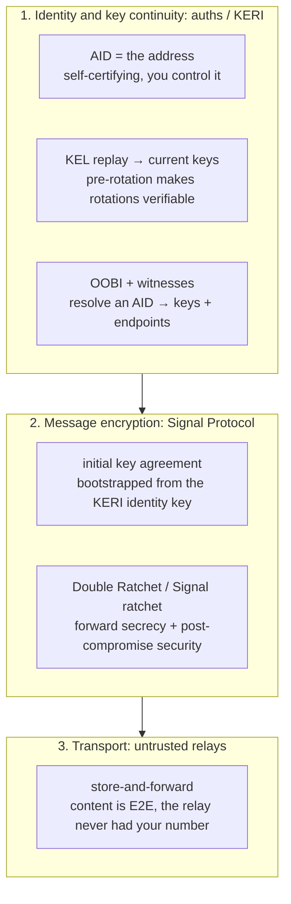
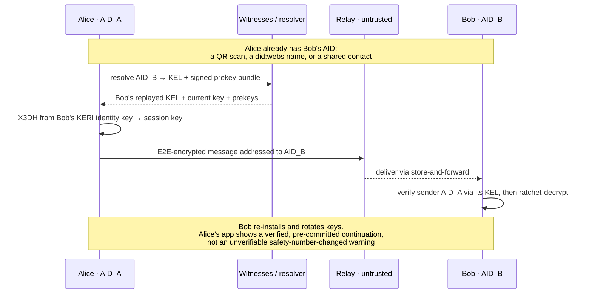

# Sovereign Messenger — secure messaging with no phone number, no email

> **Status:** concept / candidate demo. A reference application for the identity layer,
> framed as a sixth agent-wedge demonstration. This is an *architecture sketch*, not a
> committed product plan — §6 is deliberately honest about the market.

---

## 1. The problem

End-to-end encrypted messengers solved the *content* problem and left the *identity* problem
alone. Signal's encryption is excellent; its **identity and address layer is a phone
number** — telco-controlled, SIM-swappable, government-registerable, PII-leaking, and the
root of its worst usability wart (the unverifiable *"your safety number changed"* warning on
every re-install, which trains users to ignore it). The phone number is not Signal's
strength. It is the soft spot.

## 2. Thesis

**Use a self-certifying identifier (an AID) as the address.** Your address becomes a
cryptographic identifier you own outright — no number, no email, no provider. The encryption
protocol stays the same class as Signal's; only the identity root changes.

The headline win is one a key-pinning model cannot match: **pre-rotation makes a key change
*verifiable*.** When a contact re-installs or rotates keys, the new key was pre-committed and
is authorized by the prior key state — so the app shows a *verified, pre-committed
continuation of the same identity* instead of a scary, unverifiable safety-number warning.
Identity continuity *across* key changes is exactly what KERI provides and Signal does not.

## 3. Architecture — three layers, cleanly split

- **Layer 1 — identity (auths/KERI).** The AID is the address and its own proof of control.
  Key discovery is OOBI resolution to a witnessed KEL; key continuity is pre-rotation;
  multi-device is delegated sub-identities under one root; recovery is M-of-N guardians.
- **Layer 2 — encryption (Signal Protocol).** KERI authenticates *who*; the ratchet
  encrypts *the messages*. The initial key agreement bootstraps from the KERI-authenticated
  identity key, then the Double Ratchet (1:1) or Signal group ratchet (groups) takes over for
  forward secrecy and post-compromise security. **KERI does not replace the ratchet — it
  roots it.**
- **Layer 3 — transport (untrusted relays).** Store-and-forward servers deliver ciphertext.
  They are untrusted by design and, unlike Signal's, never held a phone number to begin with.

## 4. First contact with a stranger

## 5. What exists vs. what must be built

| Capability | auths today | To build / compose |
| --- | --- | --- |
| AID as address; control = signing | ✅ built | — |
| Key discovery (OOBI → witnessed KEL) | ✅ built | a hosted resolver/relay for the default path |
| **Verifiable key continuity (pre-rotation)** | ✅ built | UI that *shows* the verified rotation |
| Multi-device (delegated sub-identities) | ✅ built | device-linking UX |
| Recovery (M-of-N guardians) | ◔ aspirational | the guardian ceremony + UX |
| Metadata privacy (pairwise / unlinkable AIDs) | ◔ aspirational | per-contact AID derivation |
| **Message encryption + forward secrecy** | ❌ not auths's job | integrate Signal Protocol |
| **Ephemeral prekeys** | ❌ | publish prekey bundles signed by the AID's current key |
| **Transport / store-and-forward** | ❌ | relay infrastructure (untrusted) |
| **Abuse / sybil resistance** | ❌ | the genuinely new problem — see §6 |
| **Address UX** (an AID is not memorable) | partial | QR exchange, optional `did:webs` names, contacts/petnames |

## 6. The hard parts (called out honestly)

- **Abuse / sybil resistance is the real new problem.** A phone number gives weak spam
  resistance "for free" because a SIM costs money; AIDs are free to mint (permissionless).
  A sovereign messenger must invent its own: opt-in contact (you can't message me unless I
  admit your AID), reputation, proof-of-work on first contact, or witness-gated rate limits.
  This is the single hardest design question and it has no off-the-shelf answer.

  > **On biometrics.** The tempting fix — require a biometric at account creation — helps
  > with one thing and not the thing you'd hope: biometrics give **liveness, not uniqueness**,
  > and only uniqueness is sybil resistance.
  > - *Device-local* biometrics (Face ID / Secure Enclave) prove a human is present on a
  >   device but never leave it, so nothing can check whether that human already has an
  >   account — one person with ten devices mints ten accounts. This kills *bots*, not
  >   sybils, while preserving sovereignty. auths's human-present custody attestation
  >   (`AGT-2`) is exactly this: a sovereignty-preserving liveness signal that raises the cost
  >   of *automated* account creation, with **no central database**.
  > - *Central* biometric dedup (the Worldcoin model) is the only way to enforce
  >   one-human-one-account — and it **destroys the premise**: a global biometric registry is
  >   a worse central authority than the phone number you left (a honeypot, coercible,
  >   unrotatable once leaked, a regulatory minefield). You'd re-centralize harder than the
  >   telco.
  >
  > Resolution: a messenger **mostly doesn't need uniqueness.** Make contact **opt-in**
  > (§above) and a spammer can mint a million AIDs that reach no one — the abuse problem
  > dissolves without any personhood check. Use device-local liveness (`AGT-2`) for anti-bot;
  > reserve true uniqueness (proof-of-personhood — an unsolved, centralizing problem) for
  > open-network cases a messenger doesn't have.
- **The ratchet is not optional.** KERI gives authenticated identity keys; it does **not**
  give per-message forward secrecy or post-compromise security. Skipping Signal Protocol
  would be a downgrade from Signal, not an upgrade. The value is in the *identity root*, not
  in reinventing the messaging crypto.
- **Metadata.** No phone number removes Signal's contact-discovery liability outright (no
  address-book to leak). Pairwise AIDs make linkage across contacts impossible. But the
  relays still see delivery patterns; sealed-sender-class techniques still apply.
- **Address UX.** A 44-character AID is not human-shareable. QR codes (already the norm for
  Signal safety numbers), optional human-readable `did:webs` names, and contact lists carry
  this — but it is product work, not a given.
- **Prior art.** Messaging rooted in DIDs already exists (**DIDComm v2**), and `did:keri` is
  a real DID method, so the *idea* is established in the SSI world. What is novel is a
  *polished consumer messenger* that markets directly against the phone-number dependency.

## 7. Why it's a strong demo — and an honest read on the product

**As a demonstration of the identity layer, it may be the best one we have.** It attacks a
famous, widely-voiced weakness ("why does Signal need my number?"), showcases the layer's
strongest, most legible properties (a sovereign address, *verifiable* key continuity,
guardian recovery), and tells a story a non-technical person feels immediately. It is the
most *viscerally* legible expression of "identity you own."

**As a company to bet on, it is brutal.** Messaging is a network-effects death zone (Signal,
WhatsApp, iMessage), a full secure messenger is an enormous build, and the abuse/sybil
problem is one we would be *inventing* solutions for. "Secure and no phone number" is a real
differentiator but historically a small market — the people who left Signal *specifically*
for that reason are few.

**Recommendation:** build it as a **flagship reference app / demo**, not a v1 product bet —
the thinnest slice that proves the three claims below end-to-end, with the ratchet integrated
honestly and a deliberately minimal contact model. If messaging ever becomes the wedge, this
is the architecture; until then, it is the most persuasive way to *show* the identity layer.

## 8. Demo claim sketch (the thinnest provable slice)

- **MSG-1 — a message is addressed to, and authenticated by, an AID with no phone number or
  email anywhere in the flow.** Adversarial: a message claiming to be from an AID the sender
  does not control is rejected.
- **MSG-2 — a contact's key rotation verifies as a pre-committed continuation of the same
  identity.** Adversarial: a substituted (not-pre-committed) key is rejected, where a
  pinning model would show only an unverifiable warning.
- **MSG-3 — message content is forward-secret and the relay learns neither the plaintext nor
  a phone number.** Adversarial: a compromised relay cannot read messages or link a holder
  to PII.
