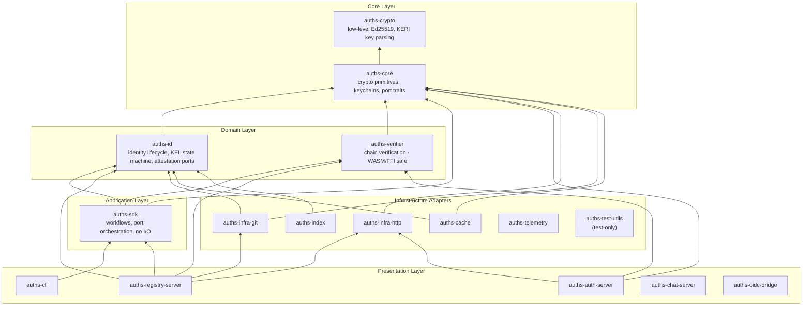
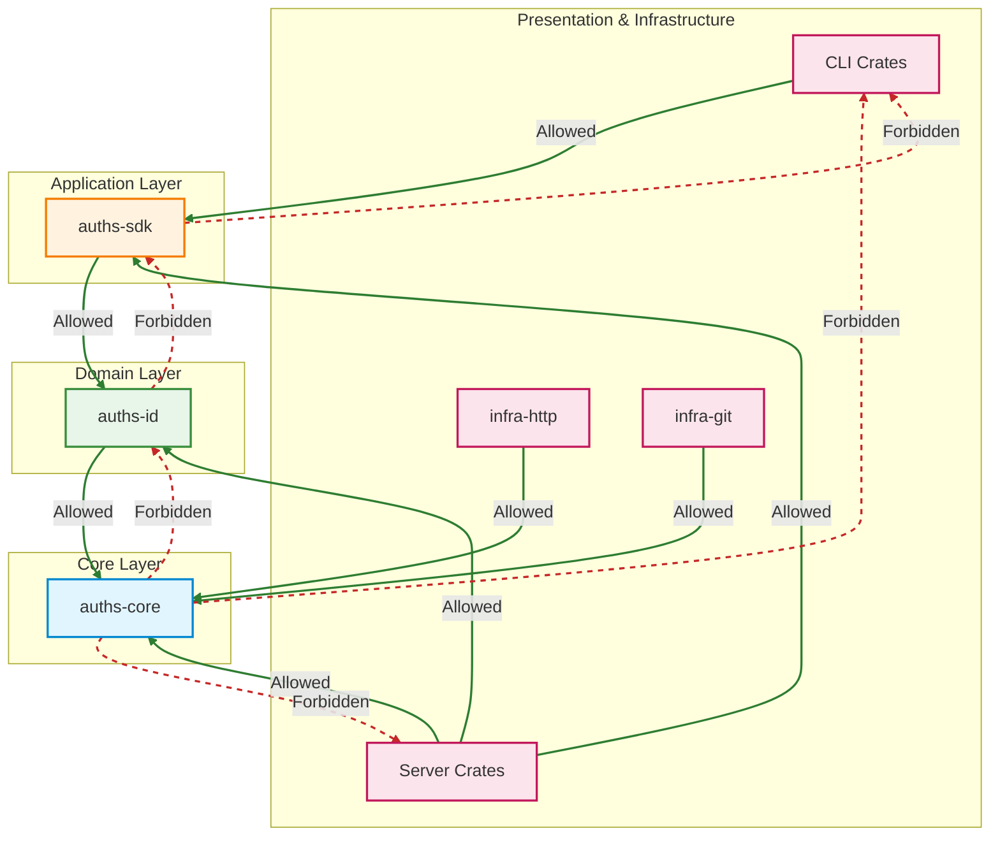
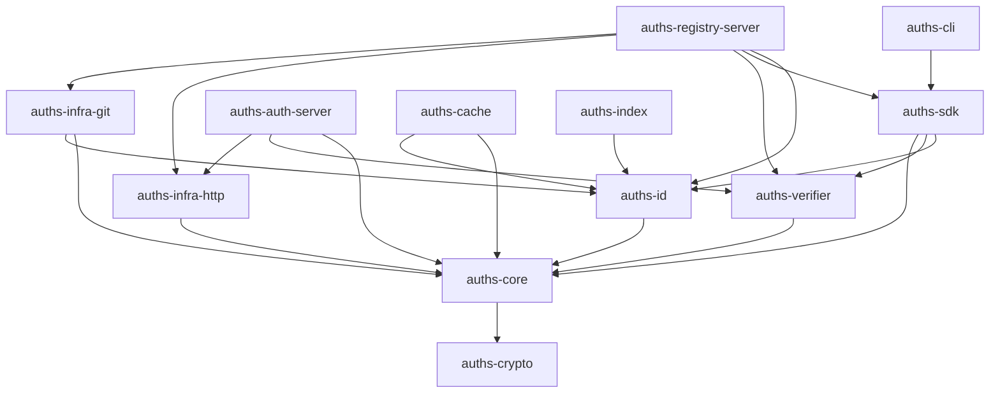

# Architecture

## Layer Diagram



## Dependency Direction Rule

Dependencies flow **inward only**. Core crates must not reference adapter, server, or CLI crates.



Violations are caught by `cargo deny check bans` and `cargo clippy` (`disallowed-methods`).

## Port Inventory

Ports are trait interfaces that decouple domain logic from infrastructure. Production adapters live in the appropriate infra crate under `src/adapters/`. Test doubles live in `auths-test-utils/src/fakes/` or `auths-test-utils/src/mocks/`.

### auths-verifier ports (`crates/auths-verifier/src/clock.rs`)

| Trait | File | Adapter Crate | Production Adapter | Test Double |
|---|---|---|---|---|
| `ClockProvider` | `clock.rs` | `auths-verifier` | `SystemClock` | `MockClock` (test-utils fakes) |

### auths-core ports (`crates/auths-core/src/ports/`)

| Trait | File | Adapter Crate | Production Adapter | Test Double |
|---|---|---|---|---|
| `ClockProvider` | `clock.rs` (re-exports from auths-verifier) | `auths-verifier` | `SystemClock` | `MockClock` |
| `IdentityResolver` | `network.rs` | `auths-infra-http` | `HttpIdentityResolver` | `FakeIdentityResolver` |
| `WitnessClient` | `network.rs` | `auths-infra-http` | `HttpWitnessClient` | inline fakes |
| `RegistryClient` | `network.rs` | `auths-infra-http` | `HttpRegistryClient` | inline fakes |
| `EventLogWriter` | `storage/event_log_writer.rs` | `auths-infra-git` | `GitEventLogWriter` | `FakeStorage` |
| `EventLogReader` | `storage/event_log_reader.rs` | `auths-infra-git` | `GitEventLogReader` | `FakeStorage` |
| `BlobReader` | `storage/blob_reader.rs` | `auths-infra-git` | `GitBlobReader` | `FakeStorage` |
| `BlobWriter` | `storage/blob_writer.rs` | `auths-infra-git` | `GitBlobWriter` | `FakeStorage` |
| `RefReader` | `storage/ref_reader.rs` | `auths-infra-git` | `GitRefReader` | `FakeStorage` |
| `RefWriter` | `storage/ref_writer.rs` | `auths-infra-git` | `GitRefWriter` | `FakeStorage` |

### auths-sdk ports (`crates/auths-sdk/src/ports/`)

| Trait | File | Adapter Crate | Production Adapter | Test Double |
|---|---|---|---|---|
| `GitLogProvider` | `git.rs` | `auths-infra-git` | `SystemGitLogProvider` | `FakeGitLogProvider` |
| `GitConfigProvider` | `git_config.rs` | `auths-infra-git` | `SystemGitConfigProvider` | `FakeGitConfigProvider` |
| `GitDiagnosticProvider` | `diagnostics.rs` | `auths-sdk` | `PosixDiagnosticAdapter` | `FakeGitDiagnosticProvider` |
| `CryptoDiagnosticProvider` | `diagnostics.rs` | `auths-sdk` | `PosixDiagnosticAdapter` | `FakeCryptoDiagnosticProvider` |
| `ArtifactSource` | `artifact.rs` | `auths-cli` | `StdinArtifactSource` | inline fakes |

### auths-registry-server ports (`crates/auths-registry-server/src/ports/`)

| Trait | File | Adapter Crate | Production Adapter | Test Double |
|---|---|---|---|---|
| `HttpAdapter` | `http.rs` | `auths-infra-http` | `ReqwestHttpAdapter` | `MockHttpAdapter` (mockall) |
| `PairingStore` | `pairing_store.rs` | `auths-registry-server` | `PostgresPairingStore` | `InMemoryPairingStore` |
| `SubscriptionStore` | `subscription_store.rs` | `auths-registry-server` | `PostgresSubscriptionStore` | — |
| `TenantMetadataStore` | `tenant_metadata_store.rs` | `auths-registry-server` | `PostgresTenantMetadataStore` | — |
| `TenantResolver` | `tenant_resolver.rs` | `auths-registry-server` | `FilesystemTenantResolver` | `SingleTenantResolver` |

## Bounded Context Guide

### auths-core
**Responsibility:** Ed25519 cryptography, platform keychains (macOS/Linux/Windows), port trait definitions for storage and network.
**Must NOT:** reference git2, axum, reqwest, or any presentation crate.

### auths-crypto
**Responsibility:** KERI key parsing, base64url encoding, low-level Ed25519 primitives.
**Must NOT:** reference any higher-layer crate.

### auths-id
**Responsibility:** Identity lifecycle state machine (inception, rotation, revocation), KEL (Key Event Log) domain logic and event validation, attestation port definitions (`AttestationSource`/`AttestationSink`).
**Must NOT:** reference auths-sdk, CLI, server crates, or git2 directly.

### auths-verifier
**Responsibility:** Standalone chain verification and signature checking. Designed for WASM, FFI, and minimal-dependency embedding. All time access via `ClockProvider` injection.
**Must NOT:** reference git2, auths-id, or any I/O crate.

### auths-sdk
**Responsibility:** Application-layer workflows (init, sign, verify, doctor). Orchestrates port traits without implementing I/O. All side effects are injected.
**Must NOT:** call `Utc::now()` directly, shell out, or write to disk.

### auths-cli
**Responsibility:** User-facing terminal commands, interactive prompts, JSON output mode.
**Must NOT:** contain business logic. All domain operations are delegated to auths-sdk workflows.

### auths-registry-server
**Responsibility:** HTTP API for KERI identity registration, KEL management, platform claims, multi-tenant routing.
**Must NOT:** contain domain logic beyond input validation and error translation to HTTP status codes.

### auths-auth-server
**Responsibility:** "Login with Auths" challenge-response authentication. Issues challenges, verifies signatures by resolving identity keys.
**Must NOT:** store private keys or implement key derivation logic.

### auths-infra-http
**Responsibility:** Production reqwest-backed implementations of `IdentityResolver`, `WitnessClient`, `RegistryClient` from auths-core.
**Must NOT:** contain business logic or be referenced by core/domain crates.

### auths-infra-git
**Responsibility:** Production git2-backed implementations of the storage ports defined in auths-core (`GitEventLogWriter`, `GitEventLogReader`, `GitBlobReader`, `GitBlobWriter`, `GitRefReader`, `GitRefWriter`) and git introspection ports from auths-sdk (`SystemGitLogProvider`, `SystemGitConfigProvider`).
**Must NOT:** contain business logic or be referenced by core/domain crates.

### auths-cache
**Responsibility:** Redis-backed tiered identity resolver with write-through archival to Git.
**Must NOT:** be referenced by core or domain crates.

### auths-index
**Responsibility:** SQLite-backed O(1) attestation index for fast lookups by device DID.
**Must NOT:** be referenced by core or domain crates.

### auths-test-utils
**Responsibility:** Shared test infrastructure — fakes, mocks, contract test macros, key fixtures.
**Must NOT:** be referenced in non-dev-dependencies (`publish = false` enforces this).

## Crate Dependency Graph



## Key Patterns

### ClockProvider Injection

Never call `Utc::now()` or `SystemTime::now()` directly in domain or application code. Always inject a `ClockProvider`:

```rust
use auths_verifier::clock::{ClockProvider, SystemClock};
use std::sync::Arc;

pub struct MyService {
    clock: Arc<dyn ClockProvider>,
}

impl MyService {
    pub fn production() -> Self {
        Self { clock: Arc::new(SystemClock) }
    }

    pub fn new(clock: Arc<dyn ClockProvider>) -> Self {
        Self { clock }
    }
}
```

In tests, use `MockClock` from `auths-test-utils` or define a local `TestClock`:

```rust
#[cfg(test)]
struct TestClock(chrono::DateTime<chrono::Utc>);

#[cfg(test)]
impl ClockProvider for TestClock {
    fn now(&self) -> chrono::DateTime<chrono::Utc> { self.0 }
}
```

The `clippy.toml` `disallowed-methods` entry enforces this at compile time in all crates with `#![deny(clippy::disallowed_methods)]`.

### Adding a New Port

1. Define the trait in `src/ports/<name>.rs` in the lowest-layer crate that owns the abstraction.
2. Add `pub mod <name>;` and re-export from `src/ports/mod.rs`.
3. Implement the production adapter in the appropriate infra crate (`auths-infra-git`, `auths-infra-http`, etc.) under `src/adapters/<name>_adapter.rs`.
4. Add a fake to `auths-test-utils/src/fakes/<name>.rs` and a mock via `mockall::mock!` in `auths-test-utils/src/mocks/mod.rs`.
5. Inject via constructor: `fn new(..., port: Arc<dyn YourTrait>) -> Self`.

### Test Pyramid

```
Unit tests              — mocks/fakes, no I/O, <1ms each
                        → auths-test-utils::mocks (mockall-generated)

Integration boundary    — FakeRegistryBackend, no disk/network
contract tests          → auths-test-utils::fakes + contracts module

E2E / disk tests        — real Git TempDir, real crypto
                        → auths-test-utils::git::init_test_repo()
```

Network isolation for unit tests is enforced in CI via iptables (Linux `unit-tests-isolated` job). Unit tests that require network access are a bug.
