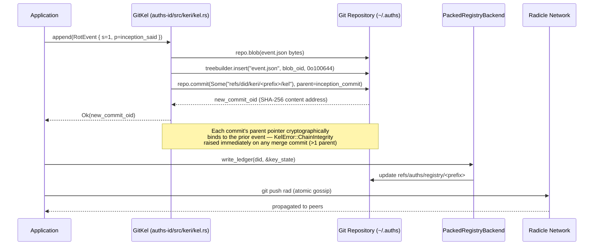

# ADR-002: Git-Backed KERI Ledger & Radicle P2P Bridge

## 1. Context and Problem Statement

Auths manages cryptographic identity through Key Event Logs (KELs) — append-only sequences of Ed25519 key events (inception, rotation, interaction). The ledger must satisfy properties that are normally associated with a blockchain or custom distributed log, but without introducing new infrastructure: content-addressed event ordering, tamper-evident chaining, and gossip-capable replication to peers.

Two storage models were evaluated. The selection criterion was: which approach provides Merkle-proof tamper evidence and P2P replication with the smallest dependency surface and zero new infrastructure?

**Key Constraints & Forces:**
* Each KERI event must be cryptographically bound to its predecessor — no out-of-order insertion is permissible.
* The ledger must be replicable to peers (Radicle) without a serialization-format translation layer or schema migration.
* `auths-core` and `auths-id` must carry zero Radicle dependencies; P2P coupling must be fully isolated behind a feature flag. All logic that facilitates Radicle must go through `auths-radicle`
* A fork in the event chain (two valid rotation branches) must be a hard, unrecoverable error — not a condition the system silently tolerates or heals.
* State resolution on the hot path must be O(1) for stable identities; full O(n) replay may only occur on cold start.

---

## 2. Considered Options

* **Option A:** Custom append-only binary WAL — a bespoke write-ahead log per identity stored as flat files in `~/.auths/kels/<prefix>`.
* **Option B:** Git commit chain as KEL (selected) — each KERI event stored as a Git commit with an `event.json` blob under `refs/did/keri/<prefix>/kel`.

---

## 3. Decision

We have decided to proceed with **Option B: Git commit chain as KEL**.

### Rationale

Git's SHA-1/SHA-256 DAG is a content-addressed Merkle structure. Every event's commit OID is a cryptographic commitment to the event payload, its parent event OID, and the authoring signature — with no external consensus layer or blockchain required.

Option A (custom WAL) would require reimplementing exactly what Git already solves: content-addressing, append-only enforcement, distributed replication (push/pull), integrity verification tooling, and auditability. The maintenance surface of a custom WAL would exceed that of the identity library itself, with no ecosystem benefit.

Each `git push` to Radicle is atomic gossip: the full KEL history transfers in one operation with no schema migration and no serialization format translation. File-lock contention from `libgit2` is bounded by the write-serialization approach in ADR-003 (DLQ absorbs write spikes), whereas a custom WAL would require equivalent locking machinery to be hand-rolled.

Radicle integration is isolated behind the `heartwood` feature flag in `crates/auths-radicle`. The `auths-id` and `auths-core` crates carry zero Radicle dependencies, enforced architecturally in `crates/auths-radicle/src/lib.rs`.

---

## 4. Implementation Specifications

### Data Flow / Architecture

**`GitKel<'a>`** — `crates/auths-id/src/keri/kel.rs`

Holds a `&Repository` borrow and a `String` prefix (the KERI inception SAID). Core invariants enforced in code:

| Operation | Enforcement |
| :--- | :--- |
| Inception creates root commit (no parent) | `&[]` parent slice in `repo.commit()` at line 115 |
| Append creates exactly one parent | `parent_commit` wired at line 166 |
| Merge commits (>1 parent) are hard-rejected | `KelError::ChainIntegrity` inside `get_state()` incremental path |
| Second inception rejected | `KelError::InvalidOperation` at line 139 |
| Ref path follows RIP-5 | `refs/did/keri/<prefix>/kel` constructed by `kel_ref()` |

**Three-tier state resolution** — `get_state()`:
1. **Cache hit** — cached `KeyState` SAID matches current tip → return immediately (O(1))
2. **Incremental** — cache is behind tip → validate only new commits (O(k), k = new events)
3. **Full replay** — cache absent or SAID mismatch → replay entire KEL (O(n)); writes cache on success

**`RadicleAuthsBridge`** — `crates/auths-radicle/src/bridge.rs`

Trait defining the adapter boundary. Implementations accept Radicle Ed25519 public key bytes and repository IDs, evaluate Auths policy, and return `VerifyResult` (`Verified`, `Rejected`, `Warn`). The bridge **authorizes but never signs** — Radicle owns cryptographic signing; Auths owns policy.

### Dependencies

| Dependency | Crate | Purpose |
| :--- | :--- | :--- |
| `git2` | `auths-id` | Git commit chain read/write via `libgit2` |
| `serde_json` | `auths-id` | `event.json` blob serialization |
| `auths-radicle` (feature-gated) | `heartwood` feature flag only | P2P gossip push; zero coupling to `auths-id` or `auths-core` |

### Security Boundaries

`kel_ref()` constructs ref paths as `refs/did/keri/<prefix>/kel`. The `prefix` is a KERI SAID (content-addressed, not user-supplied), making path traversal structurally unexpressible. Merge commits trigger `KelError::ChainIntegrity` before any event deserialization — the check fires in the incremental path's parent-count test, which runs before JSON parsing.

### Failure Modes

| Failure | Behaviour |
| :--- | :--- |
| Merge commit detected on KEL ref | Hard `KelError::ChainIntegrity` error; no fallback, no retry |
| Git lock contention on append | Surfaced as `KelError::Git`; caller (ArchivalWorker) retries with backoff — see ADR-003 |
| Radicle peer unreachable | Local KEL remains authoritative; DLQ absorbs pending archival — see ADR-003 |
| Cache SAID mismatch | `get_state()` falls back to full O(n) replay; cache rewritten on success |

---

## 5. Consequences & Mitigations

### Positive Impacts
* No new infrastructure: every developer already has Git; the ledger is auditable with standard `git log` tooling.
* Content-addressing is structural: every event hash is a Merkle proof requiring no additional verification layer.
* Replication is structural: `git push`/`git pull` to any remote propagates the full KEL history.
* Radicle integration requires zero changes to `auths-id` or `auths-core`; feature flag controls the coupling surface.

### Trade-offs and Mitigations

| Negative Impact / Trade-off | Remediation / Mitigation Strategy |
| :--- | :--- |
| `libgit2` is synchronous; cannot be called directly on the Tokio executor | All `git2` calls dispatched via `tokio::task::spawn_blocking`; see ADR-004 for executor-protection policy |
| High write frequency causes Git lock-file contention | `ArchivalWorker` serializes writes via `mpsc` channel; exponential backoff on contention; DLQ absorbs exhausted retries — see ADR-003 |
| Full O(n) replay on cold start after cache miss | Incremental validation (O(k)) and cache hydration prevent replay on subsequent calls; cold-start cost is bounded by KEL depth |
| Git SHA-1 is deprecated; repositories need SHA-256 object format | All KEL repositories must be initialized with `git init --object-format=sha256`; enforced by `auths-cli init` tooling |
| Single-node deployment has one authoritative KEL copy | Radicle push provides a second copy; periodic `git bundle` backup is recommended for non-Radicle deployments |

---

## 6. Validation & Telemetry

* **Health Checks:** `GitKel::exists()` returns `false` if the ref `refs/did/keri/<prefix>/kel` is missing; liveness probes should verify KEL existence for each provisioned identity.
* **Metrics (Prometheus):**
  * `auths_kel_replay_total{mode="full"}` — counter; elevated count indicates cold-cache conditions or cache corruption
  * `auths_kel_replay_total{mode="incremental"}` — counter; baseline expected under normal operation
  * `auths_kel_append_errors_total` — counter; alerts on Git write failures before DLQ routing
* **Log Signatures:**
  * `ERROR Chain integrity error: KEL has non-linear history` — P1; KEL fork detected; requires immediate operator investigation
  * `WARN Incremental validation failed … full replay` — informational; expected after crash-recovery
  * `ERROR split-brain detected in local KEL` — P1; Radicle sync divergence; drain DLQ and reconcile

---

## 7. References
* [KERI (Key Event Receipt Infrastructure) — IETF Draft](https://weboftrust.github.io/ietf-keri/draft-ssmith-keri.html)
* [RIP-5: Git Ref Path Conventions for Radicle Identity](https://radicle.xyz/guides)
* ADR-001: Repo-per-tenant isolation — establishes the filesystem isolation model that KEL refs operate within
* ADR-003: Tiered Cache & Write-Contention Mitigation — explains how `libgit2` lock contention is absorbed
* `crates/auths-id/src/keri/kel.rs` — `GitKel<'a>` implementation
* `crates/auths-radicle/src/bridge.rs` — `RadicleAuthsBridge` trait definition
