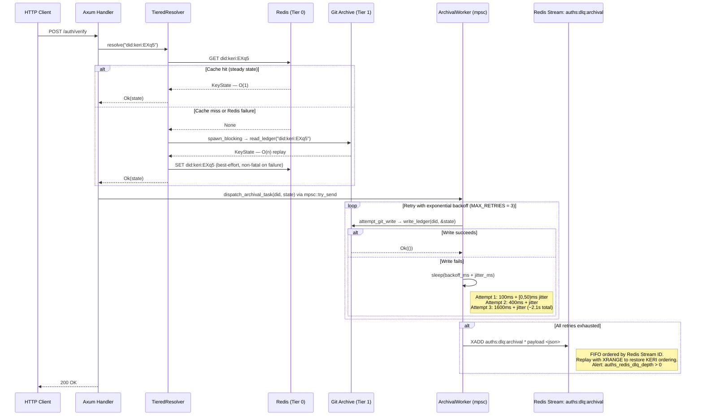

# ADR-003: Tiered Cache & Write-Contention Mitigation

## 1. Context and Problem Statement

Identity resolution under web traffic requires low-latency reads of `KeyState` (active public key, sequence number, rotation commitment). The canonical store for this state is the Git-backed KEL (ADR-002). Git's `libgit2` has two properties that make it unsuitable as a direct read path under concurrent HTTP load:

1. **Synchronous I/O** — `libgit2` is a C library with no async interface; every operation blocks its calling thread.
2. **File-lock contention** — concurrent writes to the same ref contend on a single OS lock file per repository; high write rates produce lock-timeout failures.

The system must absorb concurrent identity resolution reads without routing all traffic through O(n) Git replays, while ensuring that failed writes to Git do not silently violate the KERI hash-chain's append-only ordering guarantee.

**Key Constraints & Forces:**
* P99 identity resolution latency must not increase linearly with KEL depth under concurrent HTTP traffic.
* Git write failures must not silently drop events; KERI hash-chain ordering must be preserved across all failure scenarios.
* Redis failure must degrade to higher latency — not to a correctness failure; Git remains the authoritative source of truth.
* The write path must serialize Git operations to prevent concurrent lock acquisition on the same repository.
* Failed archival writes must be inspectable and replayable by operators without custom tooling.

---

## 2. Considered Options

* **Option A:** Direct thread-pool Git reads — all `GET /auth/verify` requests call `spawn_blocking(|| git.get_key_state())` with no caching layer.
* **Option B:** Tiered cache — Redis (Tier 0) absorbs reads; Git (Tier 1) is the write-path only; a background `ArchivalWorker` serializes Git writes with exponential backoff; permanently failed writes route to a Redis Stream Dead Letter Queue (selected).

---

## 3. Decision

We have decided to proceed with **Option B: Tiered Cache (Redis + Git) with DLQ**.

### Rationale

Under sustained traffic, multiple concurrent O(n) Git replays per request saturate Tokio's `spawn_blocking` pool. Each replay reads every commit in a KEL chain — this is an O(n) operation per identity per request, growing with key rotation frequency. Redis hit rates for stable identities are effectively 100% in steady state, eliminating Git I/O entirely on the critical read path.

Option A (no caching) imposes O(n) Git replay on every request, unbounded by traffic volume. At 10k TPS with a 50-event KEL, this means 500k Git commit reads per second — which is not sustainable without a caching layer.

The `ArchivalWorker` serializes Git writes through an `mpsc` channel, ensuring that at most one write is in flight per repository at any time. This converts lock contention from a probabilistic failure mode into a bounded queue. The Dead Letter Queue (Redis Stream `auths:dlq:archival`) preserves KERI hash-chain integrity: failed messages are FIFO-ordered, inspectable with standard Redis commands, and replayable in sequence.

Redis failures are non-fatal by design: `TieredResolver` degrades gracefully to Git-only reads, preserving correctness at the cost of latency.

---

## 4. Implementation Specifications

### Data Flow / Architecture



**`TieredResolver`** — `crates/auths-cache/src/resolver.rs`

Implements Cache-Aside: check `TierZeroCache::get_state` → on miss, call `TierOneArchive::read_ledger` → hydrate cache via `TierZeroCache::set_state` (best-effort). Redis failures in `check_hot_tier` return `None` (treated as cache miss) and log `WARN`; they do not propagate as errors.

**`ArchivalWorker`** — `crates/auths-cache/src/worker.rs`

Runs as a Tokio background task. On channel close (graceful shutdown), drains all buffered messages before exiting — no in-flight data loss.

| Constant | Value | Purpose |
| :--- | :--- | :--- |
| `MAX_RETRIES` | `3` | Maximum Git write attempts |
| `INITIAL_BACKOFF_MS` | `100` | Base retry delay |
| `BACKOFF_MULTIPLIER` | `4×` | Exponential growth per retry |
| `JITTER_RANGE_MS` | `50` | Random jitter to prevent thundering herd |
| `DLQ_STREAM_KEY` | `"auths:dlq:archival"` | Redis Stream key for dead letters |

**`git2` dispatch** — `crates/auths-auth-server/src/adapters/local_git_resolver.rs:56`

```rust
let key_state = tokio::task::spawn_blocking(move || backend.get_key_state(&prefix))
    .await??;
```

All `git2` calls in the auth-server are dispatched via `spawn_blocking`. Direct calls on async tasks are prohibited (see ADR-004).

### Dependencies

| Dependency | Crate | Purpose |
| :--- | :--- | :--- |
| `redis` + `bb8-redis` | `auths-cache` | Redis connection pool (`bb8::Pool<RedisConnectionManager>`) |
| `tokio::sync::mpsc` | `auths-cache` | Backpressure-bounded channel to `ArchivalWorker` |
| `rand` | `auths-cache` | Jitter generation in `retry_with_backoff` |
| `git2` | `auths-id` | Tier 1 archive via `PackedRegistryBackend` |

### Security Boundaries

DLQ messages contain serialized `KeyState` (public key material only — no private keys or seeds). Redis connections must be authenticated at deployment time. `mpsc::try_send` returns `DispatchError::ChannelClosed` if the worker has crashed — callers must alert on this condition; a silent drop would violate KERI append-only semantics.

### Failure Modes

| Failure | Behaviour |
| :--- | :--- |
| Redis unreachable on read | `check_hot_tier` returns `None`; resolver falls back to Git; `WARN` logged |
| Redis unreachable on write (cache hydration) | `hydrate_hot_tier` logs `WARN`; request succeeds |
| Git write fails all 3 retries | Message routed to `auths:dlq:archival` via `XADD`; `ERROR` logged |
| DLQ `XADD` fails | `CRITICAL` logged; message may be lost; requires immediate operator response |
| `mpsc` channel full | `dispatch_archival_task` returns `DispatchError::ChannelFull`; caller must handle |
| `ArchivalWorker` crashes | `mpsc::try_send` returns `DispatchError::ChannelClosed`; must trigger P1 alert |

---

## 5. Consequences & Mitigations

### Positive Impacts
* Hot-path identity resolution is O(1) for stable identities — Git I/O is eliminated on the critical request path.
* Write contention is isolated to the background worker; HTTP handlers are never blocked on Git lock acquisition.
* DLQ provides an ordered, inspectable, replayable buffer — KERI hash-chain integrity is never silently lost.
* `ArchivalWorker` drains buffered messages on graceful shutdown — no in-flight data loss.

### Trade-offs and Mitigations

| Negative Impact / Trade-off | Remediation / Mitigation Strategy |
| :--- | :--- |
| Redis is a new infrastructure dependency | Redis is already required for the auth server; no net-new infrastructure for deployments that use `auths-auth-server` |
| DLQ depth > 0 indicates archival lag | Alert on `auths_redis_dlq_depth > 0`; replay with `XRANGE auths:dlq:archival - +` in sequence order; `XDEL` only after confirmed replay |
| `mpsc::try_send` drops if channel full (`DispatchError::ChannelFull`) | Size the channel capacity to absorb burst traffic; alert on `DispatchError::ChannelFull` occurrences; state is recoverable from Redis TTL expiry and KEL replay |
| Cache-cold restart shifts load to Git reads | Incremental O(k) validation and cache hydration restore Redis coverage within one pass per active DID |
| `XDEL` before replay permanently loses a write | Ops runbook must require: replay-then-verify-then-delete; `XDEL` before replay is prohibited |

---

## 6. Validation & Telemetry

* **Health Checks:** `ArchivalWorker` liveness — `mpsc::Sender::is_closed()` returns `true` if the worker has exited; liveness probes should expose this as a 503.
* **Metrics (Prometheus):**
  * `auths_redis_dlq_depth` — gauge; alert threshold: `> 0` (P1 on sustained depth); derived from `XLEN auths:dlq:archival`
  * `auths_cache_hit_total` / `auths_cache_miss_total` — counters; hit rate < 80% indicates cache sizing issue
  * `auths_git_write_retry_total{attempt="1|2|3"}` — counter; elevated attempt-3 count indicates persistent Git lock contention
  * `auths_archival_dlq_routed_total` — counter; any increment triggers P1
* **Log Signatures:**
  * `ERROR … Exhausted retries. Routing to DLQ.` — indicates Git write permanently failed; expect DLQ depth to increase
  * `CRITICAL: Failed to route to DLQ. Message may be lost.` — P0; KERI chain integrity at risk; requires immediate investigation
  * `WARN Cache read failed, degrading to archive` — Redis connectivity issue; monitor for sustained occurrence

---

## 7. References
* ADR-002: Git-Backed KERI Ledger — establishes Git as the canonical Tier 1 store
* ADR-004: Async Executor Protection — mandates `spawn_blocking` for all `git2` calls
* `crates/auths-cache/src/worker.rs` — `ArchivalWorker`, `retry_with_backoff`, `route_to_dlq`
* `crates/auths-cache/src/resolver.rs` — `TieredResolver` Cache-Aside implementation
* `crates/auths-cache/src/traits.rs` — `TierZeroCache` and `TierOneArchive` trait definitions
* `crates/auths-auth-server/src/adapters/local_git_resolver.rs:56` — `spawn_blocking` dispatch for `git2`
