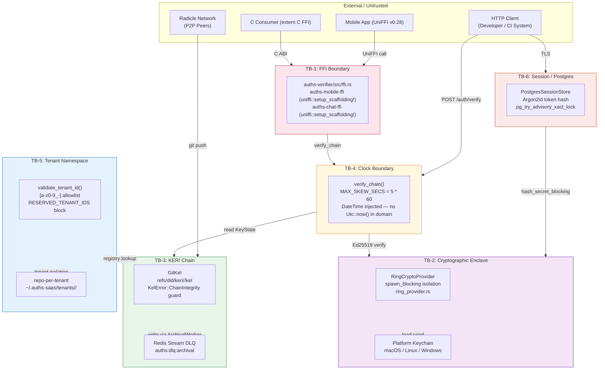

# THREAT-MODEL-001: Executive STRIDE Threat Model

## 1. Context and Problem Statement

This document provides a structured threat analysis of the Auths identity system using the STRIDE methodology (Spoofing, Tampering, Repudiation, Information Disclosure, Denial of Service, Elevation of Privilege). It is intended for security review teams, InfoSec auditors, and acquirer due-diligence processes.

All claims are grounded in specific source locations. This document is authoritative as of 2026-02-27 and must be reviewed whenever a new trust boundary is introduced.

**System under analysis**: Auths — decentralized identity and cryptographic commit-signing system.

**Components in scope**: `auths-auth-server`, `auths-registry-server`, `auths-core`, `auths-crypto`, `auths-id`, `auths-verifier`, `auths-cache`, `auths-radicle`.

**Components out of scope**: Radicle network internals, Postgres and Redis host infrastructure, OS-level keychain implementations (macOS Keychain, Linux Secret Service, Windows Credential Manager).

**Key Constraints & Forces:**
* Acquirer InfoSec requires a per-boundary STRIDE analysis with explicit residual risk ratings.
* Every negative finding must have a strictly defined mitigation and a named open item if the mitigation is not yet implemented.
* Claims without code evidence are not acceptable; all controls must cite a source location.

---

## 2. Considered Options

Not applicable — this is a threat model document, not an architectural decision record. The six trust boundaries were identified through code review and are not options to be selected among.

---

## 3. Decision

Six trust boundaries have been identified and are analysed below. Each boundary receives a full STRIDE treatment.

### Trust Boundary Index

| ID | Boundary | Primary Code Location |
| :--- | :--- | :--- |
| TB-1 | FFI / C-ABI surface | `crates/auths-verifier/src/ffi.rs`; `crates/auths-mobile-ffi/src/lib.rs`; `crates/auths-chat-ffi/src/lib.rs` |
| TB-2 | Cryptographic enclave (key material) | `crates/auths-crypto/src/ring_provider.rs` |
| TB-3 | KERI chain integrity | `crates/auths-id/src/keri/kel.rs` |
| TB-4 | Clock / timestamp | `crates/auths-verifier/src/verify.rs:15` |
| TB-5 | Tenant ID namespace | `crates/auths-id/src/storage/registry/` |
| TB-6 | Session / Postgres singleton | `crates/auths-auth-server/src/adapters/postgres_session_store.rs` |

### Rationale for Boundary Selection

These six boundaries were selected because they represent the points at which untrusted data crosses into a security-sensitive domain: foreign memory (TB-1), cryptographic key material (TB-2), the append-only event log (TB-3), time-dependent validity windows (TB-4), the filesystem namespace (TB-5), and authenticated session state (TB-6).

---

## 4. Implementation Specifications

### Trust Boundary Diagram

### TB-1: FFI / C-ABI Surface

| Threat | Category | Control | Code Evidence | Residual Risk |
| :--- | :--- | :--- | :--- | :--- |
| Null pointer passed through C FFI | **Spoofing** | FFI functions null-check all pointer arguments; return structured error codes on invalid input | `auths-verifier/src/ffi.rs` | Low |
| Forged attestation blob submitted via FFI | **Tampering** | `verify_chain()` performs full Ed25519 verification on every link; forged bytes produce `InvalidSignature` | `auths-verifier/src/verify.rs` | Low |
| Verification call audit loss | **Repudiation** | FFI functions are stateless reads; no server-side audit trail is needed — caller session log is the record | — | Low |
| Buffer overread via length mismatch | **Information Disclosure** | UniFFI generates safe Rust bindings with length-prefixed buffers; C FFI uses explicit length parameters | `auths-mobile-ffi/src/lib.rs` | Low |
| Rust panic unwinding through C stack | **Denial of Service** | `catch_unwind` at FFI boundary prevents panics from corrupting C caller stack frames | `auths-verifier/src/ffi.rs` | Low |
| Privilege escalation via FFI | **Elevation of Privilege** | FFI surface is read-only verification; no key generation, storage writes, or admin operations are exposed | `auths-verifier/src/ffi.rs` | None |

### TB-2: Cryptographic Enclave (Key Material)

| Threat | Category | Control | Code Evidence | Residual Risk |
| :--- | :--- | :--- | :--- | :--- |
| Seed extraction from process memory | **Spoofing** | `SecureSeed` has no `Debug` impl; `Ed25519KeyPair` exists only for the duration of a single `spawn_blocking` closure | `ring_provider.rs:58` comment: "Keypair is re-materialized from the raw seed on each call" | Low |
| Seed substitution (signing with wrong key) | **Tampering** | Seeds loaded exclusively from platform keychain via audited code paths; `SecureSeed` newtype has no public setter | `auths-crypto/src/provider.rs` | Low |
| Key material leakage to logs | **Information Disclosure** | `SecureSeed` has no `Display` or `Debug` impl; `ring::Ed25519KeyPair` also has no `Debug` impl | `auths-crypto/src/ring_provider.rs` | Low |
| Blocking pool exhaustion via crypto flood | **Denial of Service** | `spawn_blocking` dispatches to Tokio blocking pool (ceiling: 512); rate limiting at Axum layer (RM-6 required) | `ring_provider.rs:40,60` | Medium — rate limiting is operator-configured |
| Key rotation circumvention | **Elevation of Privilege** | KERI rotation requires knowledge of the next-key commitment (hash pre-image); pre-image resistance is cryptographically enforced | `auths-id/src/keri/kel.rs` | Low |

### TB-3: KERI Chain Integrity

| Threat | Category | Control | Code Evidence | Residual Risk |
| :--- | :--- | :--- | :--- | :--- |
| Forked KEL (two valid rotation branches) | **Spoofing** | `KelError::ChainIntegrity` raised immediately on commit with >1 parent; no fallback | `kel.rs:237` — `KelError::ChainIntegrity(format!("KEL has non-linear history …"))` | Low |
| Event sequence replay (old event re-submitted) | **Tampering** | Sequence numbers are monotonically increasing; `apply_rotation` enforces `seq > current_seq` | `kel.rs:289` | Low |
| KEL ref deletion | **Repudiation** | KEL refs (`refs/did/keri/`) are not standard branch refs; deletion requires explicit push authorization; Radicle replication provides a second copy | ADR-002 | Medium — single-node deployments without Radicle have one authoritative copy |
| Deep chain DoS (Denial of Wallet) | **Denial of Service** | `verify_chain()` short-circuits on first `InvalidSignature`; runs on `spawn_blocking` pool; rate limiting at Axum layer required (RM-6) | `verify.rs` — `verify_chain_inner` exits on first error | Medium — chain depth limit not yet enforced (RM-1 open) |
| Concurrent write causing KEL corruption | **Denial of Service** | `ArchivalWorker` serializes Git writes via `mpsc` channel; at most one writer at a time | `worker.rs` | Low |

### TB-4: Clock / Timestamp

| Threat | Category | Control | Code Evidence | Residual Risk |
| :--- | :--- | :--- | :--- | :--- |
| Pre-dated attestation (fraudulent backdating) | **Spoofing** | Timestamp is included in the canonicalized, signed payload; backdating changes the payload and invalidates the signature | `verify.rs` — `canonicalize_attestation_data` includes `timestamp` field | Low |
| Future-dated attestation (clock skew exploit) | **Tampering** | Attestations with timestamp > `reference_time + MAX_SKEW_SECS` (300s) are rejected | `verify.rs:15` — `const MAX_SKEW_SECS: i64 = 5 * 60` | Low |
| NTP manipulation widening replay window | **Denial of Service** | `DateTime<Utc>` is injected at the call site — no `Utc::now()` in domain verification code; NTP attack affects the injection site only | `verify.rs` — all public functions accept `at: DateTime<Utc>` | Medium — NTP monitoring required at deployment level |
| Attestation expiry gap | **Elevation of Privilege** | Expired attestations are unconditionally rejected; no grace period | `verify.rs:174` — `if reference_time > exp { return Err(…) }` | None |

### TB-5: Tenant ID Namespace

| Threat | Category | Control | Code Evidence | Residual Risk |
| :--- | :--- | :--- | :--- | :--- |
| Path traversal via `../` in tenant ID | **Spoofing** | `validate_tenant_id()` enforces `[a-z0-9_-]` allowlist at parse time; `../` is structurally unexpressible | `auths-id/src/storage/registry/` — `validate_tenant_id` | None |
| Reserved path collision (`admin`, `health`, `metrics`) | **Tampering** | `RESERVED_TENANT_IDS` compile-time constant blocks these names | `validate_tenant_id` | None |
| Post-provisioning symlink attack | **Information Disclosure** | `canonicalize(tenants_root)` + `starts_with` check in `FilesystemTenantResolver::open_tenant` | ADR-001 security notes | Low |
| Tenant suspension cache bypass | **Elevation of Privilege** | `moka` LRU cache has no TTL by default; suspended tenant served from cache until `invalidate()` is called | ADR-001 negative consequences | Medium — `invalidate()` call is required; no automatic TTL (RM-2 open) |
| Cross-tenant data access | **Information Disclosure** | Repo-per-tenant isolation (ADR-001) — separate filesystem directories, no shared object store | ADR-001 | None |

### TB-6: Session / Postgres Singleton

| Threat | Category | Control | Code Evidence | Residual Risk |
| :--- | :--- | :--- | :--- | :--- |
| Session token forgery | **Spoofing** | Tokens are cryptographically random; stored as Argon2id hashes; comparison uses `constant_time_eq` | `postgres_session_store.rs` | Low |
| Session secret leakage in logs | **Information Disclosure** | Secrets are hashed (Argon2id) before storage; raw secret exists only in the HTTP request body and is immediately discarded | `routes/register.rs:173` | Low |
| Advisory lock starvation | **Denial of Service** | `pg_try_advisory_xact_lock` returns immediately if lock is held; no connection is held waiting | `postgres_session_store.rs:331` | None |
| Cleanup double-run across nodes | **Denial of Service** | Advisory lock (`CLEANUP_LOCK_ID = 0x6175_7468_7365_7373`) ensures at-most-one runner; `Ok(None)` returned if lock not acquired | `postgres_session_store.rs:291` | None |
| Admin privilege escalation | **Elevation of Privilege** | Admin token compared with `constant_time_eq` to prevent timing side-channels; RBAC enforced at application layer | `postgres_session_store.rs` | Low |

---

## 5. Consequences & Mitigations

### Positive Impacts
* All six trust boundaries have defined controls grounded in source code.
* Hard errors (not silent fallbacks) on cryptographic boundary violations (TB-1, TB-2, TB-3).
* Signed timestamps (TB-4) prevent post-signing manipulation regardless of NTP state.
* OS-level filesystem isolation (TB-5) makes cross-tenant access structurally impossible without OS compromise.
* Transaction-scoped advisory lock (TB-6) eliminates stale-lock scenarios on node crash.

### Trade-offs and Mitigations

| Negative Impact / Trade-off | Remediation / Mitigation Strategy |
| :--- | :--- |
| Chain depth limit not enforced — O(n) verify cost exploitable (RM-1) | Enforce a configurable `MAX_KEL_DEPTH` constant in `verify_chain_inner` before entering the event loop; short-circuit with `AttestationError::ChainTooDeep` |
| Tenant suspension cache bypass — `moka` has no TTL (RM-2) | Add `moka::sync::Cache` TTL of 5 minutes at `FilesystemTenantResolver` construction; call `invalidate()` synchronously in the suspension handler as defense-in-depth |
| DLQ depth not monitored — archival lag silent (RM-3) | Expose `auths_redis_dlq_depth` Prometheus gauge derived from `XLEN auths:dlq:archival`; alert threshold: `> 0` |
| `tenants/` root permissions not enforced at startup (RM-4) | Assert `0700` permissions on `tenants_root` at server startup; log `WARN` and refuse to start if wider |
| Git SHA-1 collision risk on KEL repos (RM-5) | Enforce `git init --object-format=sha256` in `auths-cli init`; document requirement in operator guide |
| No rate limiter on `/auth/verify` — Denial of Wallet exploitable (RM-6) | Add Axum `tower-governor` middleware on verification endpoints; recommend 100 req/s per IP as initial threshold |

### Open Mitigations (Prioritised)

| ID | Recommendation | Priority |
| :--- | :--- | :--- |
| RM-1 | Enforce `MAX_KEL_DEPTH` in `verify_chain_inner` | **P0 — Security** |
| RM-6 | Axum rate limiter on `/auth/verify` | **P0 — Security** |
| RM-3 | `auths_redis_dlq_depth` Prometheus metric + alert | **P1 — Reliability** |
| RM-2 | `moka` TTL + synchronous `invalidate()` on suspension | **P1 — Security** |
| RM-4 | `tenants/` permission assertion at startup | **P2 — Operations** |
| RM-5 | SHA-256 object format enforcement in `auths-cli init` | **P2 — Cryptographic hygiene** |

---

## 6. Validation & Telemetry

* **Health Checks:**
  * FFI boundary (TB-1): verify library loads and `auths_verify_chain` returns `AUTHS_OK` for a known-good test vector on startup.
  * KERI chain (TB-3): `GitKel::exists()` must return `true` for each provisioned identity.
  * DLQ (TB-3): `XLEN auths:dlq:archival` == 0 in steady state.
* **Metrics (Prometheus):**
  * `auths_redis_dlq_depth` — gauge; P1 alert on `> 0` (RM-3)
  * `auths_kel_chain_integrity_errors_total` — counter; any increment is P1
  * `auths_verify_chain_duration_seconds` — histogram; P99 > 500ms indicates chain depth abuse
  * `auths_session_cleanup_skipped_total` — counter; expected low in multi-node deployments
* **Log Signatures:**
  * `ERROR Chain integrity error: KEL has non-linear history` — P1; KEL fork or git merge on KEL ref
  * `CRITICAL: Failed to route to DLQ. Message may be lost.` — P0; KERI chain integrity at risk
  * `ERROR split-brain detected in local KEL` — P1; Radicle sync divergence; drain DLQ and reconcile
  * `WARN Cleanup lock held by another node, skipping` — informational; expected in multi-node deployments

---

## 7. References
* [STRIDE Threat Modeling — Microsoft SDL](https://learn.microsoft.com/en-us/azure/security/develop/threat-modeling-tool-threats)
* [KERI — Key Event Receipt Infrastructure, IETF Draft](https://weboftrust.github.io/ietf-keri/draft-ssmith-keri.html)
* [RFC 8785 — JSON Canonicalization Scheme (JCS)](https://www.rfc-editor.org/rfc/rfc8785)
* [UniFFI v0.28 — Mozilla FFI framework](https://mozilla.github.io/uniffi-rs/)
* ADR-001: Repo-per-tenant isolation — TB-5 filesystem isolation basis
* ADR-002: Git-Backed KERI Ledger — TB-3 chain integrity basis
* ADR-003: Tiered Cache & Write-Contention Mitigation — TB-3 DLQ basis
* ADR-004: Async Executor Protection — TB-2 `spawn_blocking` and TB-6 advisory lock basis
* `crates/auths-verifier/src/verify.rs:15` — `MAX_SKEW_SECS` definition
* `crates/auths-auth-server/src/adapters/postgres_session_store.rs:291` — `CLEANUP_LOCK_ID` definition
