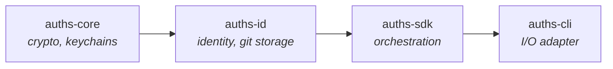

# auths-core

Foundation crate providing cryptographic primitives, secure key storage, and signing abstractions for Auths.

## Role in the Architecture



`auths-core` is the lowest-level domain crate. It provides Ed25519 cryptography, platform keychain integration, passphrase management, encryption primitives, and the agent daemon. Higher-level crates depend on it but never the reverse.

## Public Modules

| Module | Purpose |
|--------|---------|
| `signing` | `SecureSigner` trait, `PassphraseProvider` trait, `DidResolver` trait |
| `storage` | `KeyStorage` trait and platform keychain implementations |
| `crypto` | Encryption algorithms, SAID computation, Ed25519 signer utilities |
| `agent` | SSH agent daemon (`AgentCore`, `AgentHandle`, `AgentSession`) |
| `error` | `AgentError` enum with `AuthsErrorInfo` trait for structured error codes |
| `config` | `EnvironmentConfig` for reading keychain and path settings |
| `keri_did` | KERI DID parsing and construction |
| `pairing` | Ephemeral ECDH pairing protocol types |
| `paths` | `auths_home()` and related path resolution |
| `policy` | Policy evaluation types |
| `ports` | Clock, network, and UUID provider port traits |
| `proto` | Wire protocol types |
| `server` | Server configuration types |
| `trust` | Trust anchor types |
| `utils` | Shared utility functions |
| `witness` | Witness server types and HTTP handlers |
| `testing` | Test utilities (gated behind `test-utils` feature) |

## Key Traits

### `SecureSigner`

Defined in `signing.rs`. Performs signing operations using stored keys, handling passphrase decryption transparently.

```rust
pub trait SecureSigner: Send + Sync {
    fn sign_with_alias(
        &self,
        alias: &KeyAlias,
        passphrase_provider: &dyn PassphraseProvider,
        message: &[u8],
    ) -> Result<Vec<u8>, AgentError>;

    fn sign_for_identity(
        &self,
        identity_did: &IdentityDID,
        passphrase_provider: &dyn PassphraseProvider,
        message: &[u8],
    ) -> Result<Vec<u8>, AgentError>;
}
```

The concrete implementation is `StorageSigner<S: KeyStorage>`, which loads an encrypted key from the keychain, obtains a passphrase via `PassphraseProvider`, decrypts the PKCS#8 blob, extracts the Ed25519 seed, and signs. On incorrect passphrase, it retries up to 3 times before returning `AgentError::IncorrectPassphrase`.

### `PassphraseProvider`

Abstraction for obtaining passphrases without coupling to terminal I/O.

```rust
pub trait PassphraseProvider: Send + Sync {
    fn get_passphrase(&self, prompt_message: &str) -> Result<Zeroizing<String>, AgentError>;
    fn on_incorrect_passphrase(&self, _prompt_message: &str) {}
}
```

Implementations:

| Type | Purpose |
|------|---------|
| `CallbackPassphraseProvider` | Wraps a `Fn(&str) -> Result<Zeroizing<String>>` for GUI/FFI contexts |
| `CachedPassphraseProvider` | Caches passphrases with a TTL, wraps an inner provider. Cached values use `Zeroizing<String>` for secure cleanup |
| `PrefilledPassphraseProvider` | Returns a pre-collected passphrase for CI/headless environments |
| `UnifiedPassphraseProvider` | Prompts exactly once regardless of prompt message, designed for multi-key operations |

### `DidResolver`

Resolves a DID string to its public key and method metadata.

```rust
pub trait DidResolver: Send + Sync {
    fn resolve(&self, did: &str) -> Result<ResolvedDid, DidResolverError>;
}
```

Returns `ResolvedDid` containing the raw Ed25519 public key and a `DidMethod` enum (`Key` or `Keri { sequence, can_rotate }`).

### `KeyStorage`

Platform-agnostic interface for storing and loading encrypted private keys. All implementors must be `Send + Sync`.

```rust
pub trait KeyStorage: Send + Sync {
    fn store_key(&self, alias: &KeyAlias, identity_did: &IdentityDID, encrypted_key_data: &[u8]) -> Result<(), AgentError>;
    fn load_key(&self, alias: &KeyAlias) -> Result<(IdentityDID, Vec<u8>), AgentError>;
    fn delete_key(&self, alias: &KeyAlias) -> Result<(), AgentError>;
    fn list_aliases(&self) -> Result<Vec<KeyAlias>, AgentError>;
    fn list_aliases_for_identity(&self, identity_did: &IdentityDID) -> Result<Vec<KeyAlias>, AgentError>;
    fn get_identity_for_alias(&self, alias: &KeyAlias) -> Result<IdentityDID, AgentError>;
    fn backend_name(&self) -> &'static str;
}
```

Blanket implementations exist for `Arc<dyn KeyStorage + Send + Sync>` and `Box<dyn KeyStorage + Send + Sync>`.

## Platform Keychain Implementations

| Platform | Module | Feature Required | Backend |
|----------|--------|-----------------|---------|
| macOS | `macos_keychain.rs` | (default) | Security Framework |
| iOS | `ios_keychain.rs` | (default) | Keychain Services |
| Linux | `linux_secret_service.rs` | `keychain-linux-secretservice` | Secret Service D-Bus API |
| Windows | `windows_credential.rs` | `keychain-windows` | Credential Manager |
| Android | `android_keystore.rs` | (default on android) | Android Keystore |
| Any | `encrypted_file.rs` | `keychain-file-fallback` | AES/ChaCha encrypted file at `~/.auths/keys.enc` |
| Any | `memory.rs` | (always available) | In-memory (testing only) |

Platform selection is handled by `get_platform_keychain()` which reads `AUTHS_KEYCHAIN_BACKEND` from the environment. Valid override values are `"file"` and `"memory"`.

## Encryption Primitives

The `crypto::encryption` module provides two symmetric encryption algorithms behind a tagged format:

| Algorithm | Tag Byte | Use Case |
|-----------|----------|----------|
| AES-256-GCM | `0x01` | Default tier |
| ChaCha20-Poly1305 | `0x02` | Pro tier |

Two key derivation strategies exist:

- **Legacy HKDF path** (tags 1-2): `[tag][salt:16][nonce:12][ciphertext]`. Uses HKDF-SHA256 for key derivation. No passphrase strength validation.
- **Argon2id path** (tag 3): `[0x03][salt:16][m_cost:4 LE][t_cost:4 LE][p_cost:4 LE][algo_tag:1][nonce:12][ciphertext]`. Uses Argon2id for key derivation with OWASP-recommended parameters (m=64 MiB, t=3 in production; m=8 KiB, t=1 in tests). Enforces passphrase strength validation (12+ characters, 3/4 character classes).

`decrypt_bytes()` auto-detects the format from the tag byte, ensuring backward compatibility.

## Cryptographic Utilities

| Function/Type | Module | Purpose |
|--------------|--------|---------|
| `SignerKey` | `crypto::signer` | Ed25519 key pair wrapper with encrypt/decrypt |
| `encrypt_keypair` / `decrypt_keypair` | `crypto::signer` | PKCS#8 blob encryption/decryption |
| `compute_said` / `verify_commitment` | `crypto::said` | Self-Addressing Identifier computation (BLAKE3-based) |
| `EncryptionAlgorithm` | `crypto` | Enum with `AesGcm256` and `ChaCha20Poly1305` variants |
| `Secp256k1KeyPair` | `crypto::secp256k1` | BIP340 Schnorr support (feature-gated) |
| `provider_bridge` | `crypto::provider_bridge` | Synchronous Ed25519 signing bridge to `auths-crypto` |

## `KeyAlias` Newtype

`KeyAlias` is a validated wrapper around `String` used to identify stored keys. Invariants: non-empty, no null bytes. Implements `Deref<Target=str>`, `Display`, `Borrow<str>`, `AsRef<str>`, and equality with `str`/`&str`/`String`.

## Error Types

`AgentError` is a `thiserror` enum with 20 variants covering all failure modes. Every variant implements the `AuthsErrorInfo` trait, providing:

- `error_code()` -- stable `AUTHS_*` identifiers (e.g., `AUTHS_KEY_NOT_FOUND`, `AUTHS_INCORRECT_PASSPHRASE`)
- `suggestion()` -- optional actionable advice (e.g., "Run `auths key list` to see available keys")

## Feature Flags

| Feature | What it enables | Dependencies added |
|---------|----------------|-------------------|
| `test-utils` | Exports `testing` module with `InMemoryKeychain` and test helpers | None |
| `keychain-linux-secretservice` | Linux Secret Service D-Bus backend | `secret-service` |
| `keychain-windows` | Windows Credential Manager backend | `windows` |
| `keychain-file-fallback` | Encrypted file storage at `~/.auths/keys.enc` | None (uses existing deps) |
| `crypto-secp256k1` | secp256k1/BIP340 Schnorr support for Nostr integration | `k256` |
| `witness-server` | Witness HTTP server with SQLite persistence | `axum`, `tower`, `tower-http`, `rusqlite` |
| `tls` | TLS support for witness server | `axum-server` (implies `witness-server`) |

## Agent Daemon

The `agent` module provides an SSH-compatible signing agent (`AgentCore`) that runs as a Unix domain socket server. Key types:

- `AgentCore` -- the agent state machine holding loaded identities
- `AgentHandle` -- handle for sending commands to a running agent
- `AgentSession` -- per-connection session handler

Unix-only client functions (gated behind `#[cfg(unix)]`): `add_identity`, `agent_sign`, `check_agent_status`, `list_identities`, `remove_all_identities`.

## Lint Configuration

The crate enforces strict lints:

- `deny(clippy::print_stdout, clippy::print_stderr, clippy::exit, clippy::dbg_macro)` -- no accidental I/O
- `deny(clippy::disallowed_methods)` -- `Utc::now()` is banned via clippy config
- `warn(missing_docs)` -- all public items should be documented
