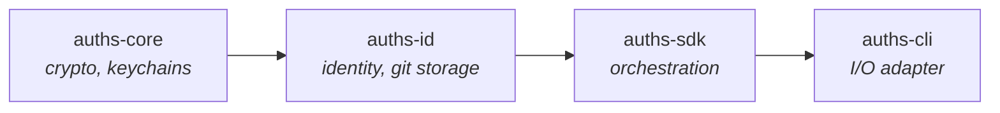

# auths-id

Identity management, attestation logic, and Git-native storage for Auths.

## Role in the Architecture



`auths-id` sits between the cryptographic foundation (`auths-core`) and the workflow orchestration layer (`auths-sdk`). It owns the domain model for identities and attestations, the KERI key event log implementation, and the Git ref-based storage layer. All identity data is persisted as Git objects referenced by well-defined ref paths.

## Public Modules

| Module | Feature Gate | Purpose |
|--------|-------------|---------|
| `attestation` | (always) | Attestation creation, verification, export, revocation, grouping |
| `identity` | `git-storage` for most submodules | Identity creation, DID resolution, key rotation |
| `storage` | `git-storage` for Git-backed impls | Storage traits and Git implementations |
| `keri` | (always) | KERI Key Event Log: inception, rotation, validation, sealing |
| `domain` | (always) | Domain types for attestation messages and KEL ports |
| `ports` | (always) | Hexagonal architecture port traits (re-exports from `storage`) |
| `policy` | (always) | Policy evaluation types |
| `freeze` | (always) | Identity freeze/thaw operations |
| `trailer` | (always) | Git commit trailer parsing/writing |
| `agent_identity` | `git-storage` | Agent identity management |
| `trust` | `git-storage` | Trust anchor evaluation |
| `witness` | `git-storage` | Witness integration |
| `witness_config` | (always) | Witness configuration types |

## Key Traits

### `IdentityStorage`

Abstracts creation and retrieval of the primary identity document.

```rust
pub trait IdentityStorage {
    fn create_identity(
        &self,
        controller_did: &str,
        metadata: Option<serde_json::Value>,
    ) -> Result<(), Error>;

    fn load_identity(&self) -> Result<ManagedIdentity, Error>;

    fn get_identity_ref(&self) -> Result<String, Error>;
}
```

The concrete implementation is `GitIdentityStorage`, which stores identity data as a JSON blob (`identity.json` by default) in a Git commit pointed to by a configurable ref (e.g., `refs/auths/identity`). The internal `StoredIdentityData` structure contains `version`, `controller_did`, and an optional arbitrary `metadata` JSON field that consumers define.

### `AttestationSource`

Read-side trait for loading attestations from storage. Implementations may be backed by Git refs, SQLite indexes, or in-memory stores.

```rust
pub trait AttestationSource {
    fn load_attestations_for_device(&self, device_did: &DeviceDID) -> Result<Vec<Attestation>, Error>;
    fn load_all_attestations(&self) -> Result<Vec<Attestation>, Error>;
    fn load_all_attestations_paginated(&self, limit: usize, offset: usize) -> Result<Vec<Attestation>, Error>;
    fn discover_device_dids(&self) -> Result<Vec<DeviceDID>, Error>;
}
```

The concrete implementation `GitAttestationStorage` walks Git history on per-device refs to reconstruct the attestation timeline. Paginated loading avoids stalling on repositories with thousands of devices.

### `StorageDriver`

Low-level async blob storage abstraction supporting both local and remote backends.

```rust
#[async_trait]
pub trait StorageDriver: Send + Sync {
    async fn get_blob(&self, path: &str) -> Result<Vec<u8>, StorageError>;
    async fn put_blob(&self, path: &str, data: &[u8]) -> Result<(), StorageError>;
    async fn cas_update(&self, ref_key: &str, expected: Option<&[u8]>, new: &[u8]) -> Result<(), StorageError>;
    async fn list_prefix(&self, prefix: &str) -> Result<Vec<String>, StorageError>;
    async fn exists(&self, path: &str) -> Result<bool, StorageError>;
    async fn delete(&self, path: &str) -> Result<(), StorageError>;
}
```

`StorageError` distinguishes three failure modes: `NotFound`, `CasConflict` (for optimistic concurrency), and `Io` (backend-specific).

### `RegistryBackend` (from `ports::registry`)

Trait for packed registry storage operations (single-ref storage under `refs/auths/registry`). Provides higher-level operations like `append_event`, `get_key_state`, and `store_attestation`.

## Git Ref Layout

### Configurable Layout (`StorageLayoutConfig`)

The `StorageLayoutConfig` struct allows consumers to define custom Git reference paths. Three presets are available:

| Preset | Identity Ref | Attestation Prefix | Identity Blob | Attestation Blob |
|--------|-------------|-------------------|---------------|-----------------|
| `default()` | `refs/auths/identity` | `refs/auths/devices/nodes` | `identity.json` | `attestation.json` |
| `radicle()` | `refs/rad/id` | `refs/keys` | `radicle-identity.json` | `link-attestation.json` |
| `gitoxide()` | `refs/auths/id` | `refs/auths/devices` | `identity.json` | `attestation.json` |

Full device attestation ref path: `{device_attestation_prefix}/{sanitized_did}/signatures`

### KERI Ref Layout (Fixed)

KERI refs follow a standardized pattern that is not configurable:

| Ref Pattern | Content |
|-------------|---------|
| `refs/did/keri/{prefix}/kel` | Key Event Log (inception + rotations) |
| `refs/did/keri/{prefix}/receipts/{said}` | Witness receipts for a specific event |
| `refs/did/keri/{prefix}/document` | Cached DID document (optional) |

### Organization Refs

Organization membership attestations use a fixed pattern:

| Ref Pattern | Content |
|-------------|---------|
| `refs/auths/org/{sanitized_org_did}/identity` | Organization identity/metadata |
| `refs/auths/org/{sanitized_org_did}/members/{sanitized_member_did}` | Member attestation |

DID sanitization replaces all non-alphanumeric characters with underscores.

## KERI Implementation

The `keri` module implements a KERI-inspired Key Event Log with the following components:

| Submodule | Purpose |
|-----------|---------|
| `inception` | ICP event creation with initial key pair and next-key commitment |
| `rotation` | ROT event creation with pre-committed key promotion |
| `event` | Event type definitions (`IcpEvent`, `RotEvent`, `IxnEvent`) |
| `kel` | `GitKel` struct for reading/writing KEL from Git refs |
| `state` | `KeriKeyState` for tracking current key state after replaying events |
| `validate` | KEL validation: signature checks, commitment verification, sequence ordering |
| `seal` | Anchoring data (attestation SAIDs) into interaction events |
| `anchor` | Anchoring attestations to the KEL via `ixn` events |
| `resolve` | KERI DID resolution to current public key |
| `cache` | Caching layer for resolved key states |
| `types` | `Prefix`, `Said`, and other KERI primitive types |
| `witness_integration` | Witness receipt collection and storage |

### Rotation Protocol

Key rotation follows the KERI pre-commitment pattern:

1. **At inception**: Generate two key pairs (current + next). The current key is stored in the keychain. The next key's public key is hashed into a commitment stored in the ICP event.
2. **At rotation**: Verify the pre-committed next key matches the commitment. The next key becomes the new current key. A fresh next key pair is generated, and its commitment is embedded in the ROT event.
3. **Keychain management**: The new current key is stored under the `next_alias`. A future next key is stored under `{next_alias}--next-{sequence}`. The old pre-committed key alias is deleted.

Two rotation backends exist:

- `rotate_keri_identity()` -- GitKel backend (per-identity refs under `refs/did/keri/`)
- `rotate_registry_identity()` -- Packed registry backend (single `refs/auths/registry` ref)

Both follow the same protocol but differ in how they read/write the KEL.

## Attestation Subsystem

The `attestation` module handles the full attestation lifecycle:

| Submodule | Purpose |
|-----------|---------|
| `core` | `Attestation` struct shared with `auths-verifier` |
| `create` | Attestation creation with dual signing (issuer + device) |
| `verify` | Local attestation verification |
| `revoke` | Setting `revoked_at` timestamp on existing attestations |
| `export` | `AttestationSink` trait for writing attestations to storage |
| `load` | Loading attestations from storage |
| `group` | Grouping attestations by device or identity |
| `encoders` | Encoding attestation data for signing |
| `json_schema_encoder` | JSON Schema validation for attestation documents |

## Storage Error Types

`StorageError` (from `storage::driver`) provides three variants:

- `NotFound(String)` -- normal condition, path does not exist
- `CasConflict { expected, found }` -- optimistic concurrency violation
- `Io(Box<dyn Error + Send + Sync>)` -- backend-specific errors

## Feature Flags

| Feature | Default | What it enables | Dependencies added |
|---------|---------|----------------|-------------------|
| `git-storage` | Yes | Git-backed storage implementations, identity init/resolve/rotate, agent identity, trust, witness modules | `git2`, `dirs`, `tempfile`, `tokio` |
| `indexed-storage` | No | SQLite-backed O(1) attestation lookups | `auths-index` |
| `witness-client` | No | HTTP client for remote witness servers | `auths-infra-http` |

### Without `git-storage`

When `git-storage` is disabled, the crate provides only the trait definitions (`IdentityStorage`, `AttestationSource`, `StorageDriver`), attestation types, KERI types, and layout configuration. This allows embedding the domain model in environments without `libgit2` (e.g., WASM or cloud lambdas).

## Dependency Direction

The hexagonal architecture enforces strict dependency direction:


`auths-id` defines port traits in `ports/`. Storage backend crates implement these traits. The SDK and CLI wire the implementations together at the composition root.

## Key Dependencies

| Crate | Purpose |
|-------|---------|
| `auths-core` | Keychain, signing, encryption |
| `auths-crypto` | Ed25519 operations via `CryptoProvider` trait |
| `auths-policy` | Policy evaluation |
| `auths-verifier` | Attestation and DID types (shared with verification layer) |
| `git2` | Git repository operations (optional, behind `git-storage`) |
| `json-canon` | Deterministic JSON canonicalization for signatures |
| `jsonschema` | Attestation JSON Schema validation |
| `ring` | Ed25519 key generation and signing |

## Lint Configuration

- `deny(clippy::print_stdout, clippy::print_stderr, clippy::exit, clippy::dbg_macro)` -- no accidental I/O
- `deny(clippy::disallowed_methods)` -- `Utc::now()` is banned; all time-sensitive functions accept `now: DateTime<Utc>` as a parameter
