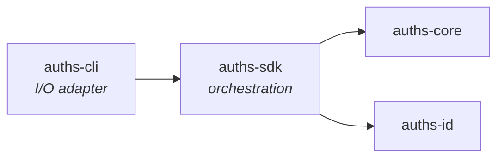

# auths-sdk

Application services layer providing high-level workflow orchestration for Auths identity operations.

## Role in the Architecture



`auths-sdk` sits between the CLI (presentation layer) and the domain crates (`auths-core`, `auths-id`). It provides workflow functions that accept typed config structs, read from injected infrastructure adapters via `AuthsContext`, and return structured `Result` types. SDK functions never prompt for input, print to stdout, or call `process::exit()`.

## Public Modules

| Module | Purpose |
|--------|---------|
| `context` | `AuthsContext` dependency container and `EventSink` trait |
| `setup` | Identity provisioning for developer, CI, and agent environments |
| `device` | Device linking, revocation, and authorization extension |
| `signing` | Artifact signing pipeline and attestation creation |
| `registration` | Remote registry publication for public DID discovery |
| `platform` | Platform identity claim creation and verification |
| `pairing` | Device pairing orchestration over ephemeral ECDH sessions |
| `workflows` | Higher-level multi-step workflows (rotation, provisioning, auditing) |
| `ports` | Port traits for external I/O adapters |
| `types` | Plain-old-data config structs for all SDK workflows |
| `result` | Return types for SDK workflow functions |
| `error` | Domain error types (`SetupError`, `DeviceError`, `RotationError`, etc.) |
| `presentation` | HTML and structured report rendering |

## `AuthsContext` -- The Dependency Container

`AuthsContext` is the central runtime dependency container. It carries all injected infrastructure adapters as `Arc<dyn Trait>` fields, enabling the SDK to operate in headless, storage-agnostic environments.

```rust
pub struct AuthsContext {
    pub registry: Arc<dyn RegistryBackend + Send + Sync>,
    pub key_storage: Arc<dyn KeyStorage + Send + Sync>,
    pub clock: Arc<dyn ClockProvider + Send + Sync>,
    pub event_sink: Arc<dyn EventSink>,
    pub identity_storage: Arc<dyn IdentityStorage + Send + Sync>,
    pub attestation_sink: Arc<dyn AttestationSink + Send + Sync>,
    pub attestation_source: Arc<dyn AttestationSource + Send + Sync>,
    pub passphrase_provider: Arc<dyn PassphraseProvider + Send + Sync>,
    pub uuid_provider: Arc<dyn UuidProvider + Send + Sync>,
}
```

### Injected Adapters

| Field | Trait Source | Purpose |
|-------|------------|---------|
| `registry` | `auths_id::ports::registry::RegistryBackend` | Packed registry storage backend |
| `key_storage` | `auths_core::storage::keychain::KeyStorage` | Platform keychain or test fake |
| `clock` | `auths_core::ports::clock::ClockProvider` | Wall-clock for deterministic testing |
| `event_sink` | `auths_sdk::context::EventSink` | Telemetry/audit event sink |
| `identity_storage` | `auths_id::storage::identity::IdentityStorage` | Identity document load/save |
| `attestation_sink` | `auths_id::attestation::export::AttestationSink` | Write signed attestations |
| `attestation_source` | `auths_id::storage::attestation::AttestationSource` | Read existing attestations |
| `passphrase_provider` | `auths_core::signing::PassphraseProvider` | Key decryption passphrase source |
| `uuid_provider` | `auths_core::ports::id::UuidProvider` | UUID generation (deterministic in tests) |

### Builder Pattern

`AuthsContext` uses a typestate builder to enforce compile-time correctness. The three required fields (`registry`, `key_storage`, `clock`) use typestate markers (`Missing` / `Set<T>`) so that `build()` is only callable once all three are set.

```rust
let ctx = AuthsContext::builder()
    .registry(Arc::new(my_registry))
    .key_storage(Arc::new(my_keychain))
    .clock(Arc::new(SystemClock))
    .identity_storage(Arc::new(my_identity_store))
    .attestation_sink(Arc::new(my_att_sink))
    .attestation_source(Arc::new(my_att_source))
    .build();
```

Optional fields with defaults:

| Field | Default |
|-------|---------|
| `event_sink` | `NoopSink` (discards all events) |
| `passphrase_provider` | `NoopPassphraseProvider` (returns error if called) |
| `uuid_provider` | `SystemUuidProvider` (random v4 UUIDs) |

## Clock Injection Pattern

`Utc::now()` is banned in `auths-core/src/` and `auths-id/src/` via a clippy lint. The SDK enforces this boundary:

1. `AuthsContext` holds an `Arc<dyn ClockProvider>` (injected at construction)
2. SDK workflow functions call `ctx.clock.now()` to obtain the current time
3. The resulting `DateTime<Utc>` is passed down to all domain functions as the `now` parameter
4. In tests, a `MockClock` with a fixed timestamp is injected for deterministic behavior
5. The CLI calls `Utc::now()` at the presentation boundary -- the only place where wall-clock reads are permitted

This pattern ensures all time-sensitive logic is fully testable without flaky timing dependencies.

## `EventSink` Trait

Fire-and-forget telemetry interface for structured audit events:

```rust
pub trait EventSink: Send + Sync + 'static {
    fn emit(&self, payload: &str);
    fn flush(&self);
}
```

`emit()` must not block. `flush()` blocks until all previously emitted payloads are written. Implement this to route audit events to a SIEM, structured logging backend, or stdout.

## Port Traits

The `ports` module defines I/O adapter traits that the CLI implements:

| Port | Purpose |
|------|---------|
| `artifact` | `ArtifactSource` for computing digests and metadata |
| `git` | `GitLogProvider` for audit and compliance workflows |
| `git_config` | `GitConfigPort` for setting signing-related git config keys |
| `diagnostics` | `DiagnosticsProvider` for system health checks |

These ports allow the SDK to remain free of filesystem, Git, or process dependencies.

## Workflow Modules

### `setup`

Identity provisioning with three environment targets:

- **Developer setup**: Generate Ed25519 key pair, create KERI identity, store in keychain, configure Git signing
- **CI setup**: Provision a workload identity from OIDC tokens
- **Agent setup**: Provision an autonomous agent identity

### `device`

Device lifecycle management:

- Link a new device to an identity (create attestation)
- Revoke a device (set `revoked_at`)
- Extend device authorization (refresh expiration)
- List devices for an identity

### `signing`

Artifact signing pipeline:

- Compute content digest
- Create attestation linking signer to artifact
- Dual-sign with identity and device keys

### `registration`

Remote registry publication:

- Register identity at a public registry endpoint
- Push attestation chains for discoverability

### `workflows` (higher-level)

| Submodule | Purpose |
|-----------|---------|
| `rotation` | Full key rotation workflow (load state, rotate, re-attest devices) |
| `provision` | Multi-step provisioning combining setup + registration |
| `audit` | Audit log generation and compliance reporting |
| `diagnostics` | System health check orchestration |
| `artifact` | Artifact verification workflows |
| `org` | Organization member management |
| `policy_diff` | Policy change detection and diffing |

## Error Types and Translation Boundaries

The SDK defines domain-specific `thiserror` enums. `anyhow` is banned in Core/SDK -- it is only used at the CLI/server translation boundary.

### Error Enums

| Error Type | Domain |
|-----------|--------|
| `SetupError` | Identity provisioning failures |
| `DeviceError` | Device linking/revocation failures |
| `DeviceExtensionError` | Authorization extension failures |
| `RotationError` | Key rotation failures |
| `RegistrationError` | Remote registry failures |
| `OrgError` | Organization member management failures |
| `SdkStorageError` | Opaque storage error wrapper (transitional) |

### Translation Boundary

The CLI wraps SDK domain errors with operational context using `anyhow::Context`:

```rust
// CLI (presentation layer)
let signature = sign_artifact(&config, data)
    .with_context(|| format!("Failed to sign artifact for namespace: {}", config.namespace))?;
```

`From` impls connect domain errors:

- `AgentError -> SetupError::CryptoError`
- `AgentError -> DeviceError::CryptoError`
- `RegistrationError -> SetupError::RegistrationFailed`
- `NetworkError -> RegistrationError::NetworkError`

### `SdkStorageError` (Transitional)

Currently wraps storage errors as `OperationFailed(String)`. This is a transitional pattern -- the plan is to migrate `auths-id` storage traits from `anyhow::Result` to typed `StorageError` variants, replacing `map_storage_err()` helpers with direct `From` impls.

### Error Variant Examples

`SetupError`:

- `IdentityAlreadyExists { did }` -- an identity already exists at the configured path
- `KeychainUnavailable { backend, reason }` -- platform keychain inaccessible
- `CryptoError(AgentError)` -- cryptographic operation failed
- `StorageError(SdkStorageError)` -- storage I/O failure
- `GitConfigError(String)` -- git config key write failed

`RotationError`:

- `IdentityNotFound { path }` -- identity missing at expected path
- `KeyNotFound(String)` -- keychain alias not found
- `KeyDecryptionFailed(String)` -- wrong passphrase
- `KelHistoryFailed(String)` -- KEL read/validation error
- `RotationFailed(String)` -- rotation protocol error
- `PartialRotation(String)` -- KEL committed but keychain write failed (requires manual recovery)

`OrgError`:

- `AdminNotFound { org }` -- no admin with matching public key
- `MemberNotFound { org, did }` -- member not in organization
- `AlreadyRevoked { did }` -- member already revoked
- `InvalidCapability { cap, reason }` -- capability string parsing failed

## Config Structs vs. Context

The SDK enforces a clear separation:

- **Config structs** (`types` module): Plain-old-data with no trait objects. Serializable. Carry parameters for a specific workflow invocation (e.g., `DeveloperSetupConfig`, `DeviceLinkConfig`).
- **`AuthsContext`**: Carries injected infrastructure adapters (`Arc<dyn Trait>`). Not serializable. Shared across workflow invocations.

This separation allows the SDK to be embedded in cloud SaaS, WASM, or C-FFI runtimes without pulling in tokio, git2, or std::fs.

## Presentation Module

The `presentation` module provides rendering utilities:

| Submodule | Purpose |
|-----------|---------|
| `html` | HTML report generation for verification results |

Output formatting is the CLI's responsibility -- the SDK only provides data-to-markup transformation.

## Key Dependencies

| Crate | Purpose |
|-------|---------|
| `auths-core` | Keychain, signing, encryption, agent, clock ports |
| `auths-id` | Identity storage, attestation, KERI |
| `auths-policy` | Policy evaluation |
| `auths-crypto` | Ed25519 operations |
| `auths-verifier` | Verification types and functions |
| `reqwest` | HTTP client for registry operations |
| `json-canon` | Deterministic JSON canonicalization |
| `html-escape` | Safe HTML rendering |
| `zeroize` | Secure memory cleanup for key material |

## Lint Configuration

- `deny(clippy::print_stdout, clippy::print_stderr, clippy::exit, clippy::dbg_macro)` -- SDK functions must not perform I/O
- `deny(clippy::disallowed_methods)` -- `Utc::now()` is banned; time is injected via `ClockProvider`
- `deny(rustdoc::broken_intra_doc_links)` -- documentation integrity
- `warn(missing_docs)` -- all public items should be documented
