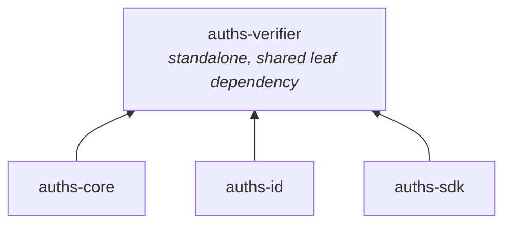

# auths-verifier

Minimal-dependency attestation verification library designed for embedding in FFI, WASM, and server contexts.

## Role in the Architecture



`auths-verifier` is a standalone crate at the bottom of the dependency graph. It provides signature verification, attestation types, DID types, KERI verification, and witness receipt validation. It is deliberately free of heavy dependencies like `git2`, platform keychains, or tokio (except when the `ffi` feature brings in a minimal tokio runtime).

Every other Auths crate depends on `auths-verifier` for its shared type definitions (`Attestation`, `IdentityDID`, `DeviceDID`, `VerificationReport`, `Capability`).

## Design Philosophy

**Minimal dependencies**: The default dependency set includes only `auths-crypto`, `base64`, `blake3`, `bs58`, `chrono`, `hex`, `json-canon`, `serde`, `serde_json`, `thiserror`, `async-trait`, and `log`. No filesystem access, no networking, no platform-specific code.

**Target portability**: The crate compiles to `wasm32-unknown-unknown` (with the `wasm` feature) and produces a C-compatible `cdylib` (with the `ffi` feature). The `native` feature (default) enables `ring` for Ed25519 verification. Without it, the crate relies on `auths-crypto`'s WASM-compatible `WebCryptoProvider`.

**Shared types**: Core types like `Attestation`, `IdentityDID`, `DeviceDID`, `Capability`, and `VerificationReport` are defined here so that all crates in the workspace share a single definition without circular dependencies.

## Public Modules

| Module | Feature Gate | Purpose |
|--------|-------------|---------|
| `core` | (always) | `Attestation`, `Capability`, `VerifiedAttestation`, `ThresholdPolicy`, `IdentityBundle`, canonical serialization |
| `types` | (always) | `VerificationReport`, `VerificationStatus`, `ChainLink`, `IdentityDID`, `DeviceDID` |
| `error` | (always) | `AttestationError` enum |
| `verifier` | (always) | `Verifier` struct with dependency-injected crypto and clock |
| `verify` | (always, but free functions require `native`) | Internal verification logic and public free functions |
| `clock` | (always) | `ClockProvider` trait and `SystemClock` implementation |
| `keri` | (always) | KERI event types, KEL parsing, KEL verification |
| `witness` | (always) | `WitnessReceipt`, `WitnessQuorum`, `WitnessVerifyConfig` |
| `ffi` | `ffi` | C-compatible FFI bindings |
| `wasm` | `wasm` | WASM bindings via `wasm-bindgen` |

## Core Types

### `Attestation`

The central data structure representing a cryptographic link between an identity and a device.

```rust
pub struct Attestation {
    pub version: u32,
    pub rid: String,                           // Record identifier
    pub issuer: IdentityDID,                   // Issuing identity (did:keri:...)
    pub subject: DeviceDID,                    // Attested device (did:key:z...)
    pub device_public_key: Vec<u8>,            // Raw Ed25519 public key (32 bytes)
    pub identity_signature: Vec<u8>,           // Issuer's signature (hex in JSON)
    pub device_signature: Vec<u8>,             // Device's signature (hex in JSON)
    pub revoked_at: Option<DateTime<Utc>>,     // Revocation timestamp
    pub expires_at: Option<DateTime<Utc>>,     // Expiration timestamp
    pub timestamp: Option<DateTime<Utc>>,      // Creation timestamp
    pub note: Option<String>,                  // Human-readable note
    pub payload: Option<Value>,                // Arbitrary JSON payload
    pub role: Option<String>,                  // Org role (e.g., "admin", "member")
    pub capabilities: Vec<Capability>,         // Granted capabilities
    pub delegated_by: Option<IdentityDID>,     // Delegation chain tracking
    pub signer_type: Option<SignerType>,       // Human, Agent, or Workload
}
```

Size limits enforced at deserialization: `MAX_ATTESTATION_JSON_SIZE` = 64 KiB per attestation, `MAX_JSON_BATCH_SIZE` = 1 MiB for arrays.

### `VerifiedAttestation`

A newtype wrapper that proves at compile time that an attestation's signatures have been verified. Cannot be deserialized directly -- must go through verification functions. Provides `inner()`, `into_inner()`, and `Deref<Target=Attestation>`.

The escape hatch `dangerous_from_unchecked()` exists for self-signed attestations and test code.

### `Capability`

Validated authorization unit. Well-known constructors: `sign_commit()`, `sign_release()`, `manage_members()`, `rotate_keys()`. Custom capabilities are created via `Capability::parse()` with validation rules:

- Non-empty, max 64 characters
- Only alphanumeric, colon (`:`), hyphen (`-`), underscore (`_`)
- `auths:` prefix is reserved

Implements `Serialize`/`Deserialize` as plain strings, `FromStr` with CLI-friendly alias resolution (e.g., `"Sign-Commit"` normalizes to `"sign_commit"`).

### `VerificationReport`

Machine-readable verification result:

```rust
pub struct VerificationReport {
    pub status: VerificationStatus,
    pub chain: Vec<ChainLink>,
    pub warnings: Vec<String>,
    pub witness_quorum: Option<WitnessQuorum>,
}
```

`VerificationStatus` is a tagged enum with variants:

| Variant | Meaning |
|---------|---------|
| `Valid` | All checks passed |
| `Expired { at }` | Attestation expired at the given timestamp |
| `Revoked { at }` | Attestation was revoked |
| `InvalidSignature { step }` | Signature verification failed at chain step N |
| `BrokenChain { missing_link }` | Issuer/subject mismatch or missing attestation |
| `InsufficientWitnesses { required, verified }` | Witness quorum not met |

### `IdentityDID` and `DeviceDID`

Strongly-typed newtype wrappers for DID strings. `DeviceDID` provides `from_ed25519()` for constructing `did:key:z...` identifiers and `ref_name()` for Git-safe sanitized strings.

## The `Verifier` Struct

Dependency-injected verifier carrying `Arc<dyn CryptoProvider>` and `Arc<dyn ClockProvider>`:

```rust
pub struct Verifier {
    provider: Arc<dyn CryptoProvider>,
    clock: Arc<dyn ClockProvider>,
}
```

**Construction**:

- `Verifier::native()` -- uses `RingCryptoProvider` + `SystemClock` (requires `native` feature)
- `Verifier::new(provider, clock)` -- custom injection for testing or WASM

**Methods**:

| Method | Purpose |
|--------|---------|
| `verify_with_keys()` | Verify a single attestation against an issuer public key |
| `verify_with_capability()` | Verify + check for a required capability |
| `verify_at_time()` | Verify against a specific timestamp (skips clock-skew check) |
| `verify_chain()` | Verify an ordered attestation chain from a root public key |
| `verify_chain_with_capability()` | Verify chain + intersect capabilities across all links |
| `verify_chain_with_witnesses()` | Verify chain + validate witness receipts against quorum |
| `verify_device_authorization()` | Verify a device is authorized under a given identity |

## Verification Algorithm

Single attestation verification (`verify_with_keys_at`) performs these steps in order:

1. **Revocation check** -- reject if `revoked_at <= reference_time`
2. **Expiration check** -- reject if `reference_time > expires_at`
3. **Timestamp skew check** -- reject if `timestamp > reference_time + 5 minutes` (when enabled)
4. **Issuer key length check** -- verify 32-byte Ed25519 public key
5. **Canonical data reconstruction** -- build `CanonicalAttestationData` and serialize with `json-canon`
6. **Issuer signature verification** -- Ed25519 verify over canonical bytes (skipped if `identity_signature` is empty)
7. **Device signature verification** -- Ed25519 verify over canonical bytes

Chain verification (`verify_chain_inner`) walks the attestation array:

1. Verify the first attestation against the provided root public key
2. For each subsequent attestation, verify that `att[i].issuer == att[i-1].subject` (chain continuity)
3. Use the previous attestation's `device_public_key` as the issuer key for the next link
4. Stop at the first failure, recording the chain state up to that point

## Clock Injection

The `ClockProvider` trait decouples time from `Utc::now()`:

```rust
pub trait ClockProvider: Send + Sync {
    fn now(&self) -> DateTime<Utc>;
}
```

`SystemClock` delegates to `Utc::now()`. Tests inject a `MockClock` with a fixed timestamp.

## KERI Verification

The `keri` module provides types and verification for KERI Key Event Logs:

| Type | Purpose |
|------|---------|
| `KeriEvent` | Enum wrapping `IcpEvent`, `RotEvent`, `IxnEvent` |
| `KeriKeyState` | Current key state after replaying a KEL |
| `Prefix` | KERI Autonomic Identifier (AID) |
| `Said` | Self-Addressing Identifier |
| `Seal` | Data anchor in interaction events |
| `KeriVerifyError` | Verification-specific errors |

Key functions: `parse_kel_json()`, `verify_kel()`, `find_seal_in_kel()`.

## Witness Verification

Types for witness receipt validation:

```rust
pub struct WitnessVerifyConfig<'a> {
    pub receipts: &'a [WitnessReceipt],
    pub witness_keys: &'a [(String, Vec<u8>)],
    pub threshold: usize,
}

pub struct WitnessQuorum {
    pub required: usize,
    pub verified: usize,
    pub receipts: Vec<WitnessReceiptResult>,
}
```

## FFI Bindings

The `ffi` module (feature: `ffi`) exposes C-compatible functions with integer return codes. A minimal tokio current-thread runtime is created per call to run async verification:

| Constant | Value | Meaning |
|----------|-------|---------|
| `VERIFY_SUCCESS` | 0 | Verification succeeded |
| `ERR_VERIFY_NULL_ARGUMENT` | -1 | Null pointer argument |
| `ERR_VERIFY_JSON_PARSE` | -2 | JSON deserialization failed |
| `ERR_VERIFY_INVALID_PK_LEN` | -3 | Public key not 32 bytes |
| `ERR_VERIFY_ISSUER_SIG_FAIL` | -4 | Issuer signature invalid |
| `ERR_VERIFY_DEVICE_SIG_FAIL` | -5 | Device signature invalid |
| `ERR_VERIFY_EXPIRED` | -6 | Attestation expired |
| `ERR_VERIFY_REVOKED` | -7 | Attestation revoked |
| `ERR_VERIFY_SERIALIZATION` | -8 | Report serialization error |
| `ERR_VERIFY_INSUFFICIENT_WITNESSES` | -9 | Witness quorum not met |
| `ERR_VERIFY_WITNESS_PARSE` | -10 | Witness JSON parse error |
| `ERR_VERIFY_INPUT_TOO_LARGE` | -11 | Input exceeds size limit |
| `ERR_VERIFY_OTHER` | -99 | Unclassified error |
| `ERR_VERIFY_PANIC` | -127 | Internal panic |

Input size limits are enforced: `MAX_JSON_BATCH_SIZE` (1 MiB) for batch inputs.

## WASM Bindings

The `wasm` module (feature: `wasm`) exposes verification functions via `wasm-bindgen`:

- `verifyAttestationJson(attestation_json_str, issuer_pk_hex)` -- verify a single attestation
- Uses `WebCryptoProvider` from `auths-crypto` for Ed25519 operations in the browser
- `SystemClock` provides time via `chrono`'s WASM-compatible implementation
- Input size limits match the FFI bindings

## Feature Flags

| Feature | Default | What it enables | Dependencies added |
|---------|---------|----------------|-------------------|
| `native` | Yes | Ring-based Ed25519 verification, free-function API | `ring`, `tokio` (via `auths-crypto/native`) |
| `ffi` | No | C-compatible FFI bindings with integer return codes | `libc`, `tokio` (implies `native`) |
| `wasm` | No | WASM bindings via `wasm-bindgen` | `wasm-bindgen`, `wasm-bindgen-futures`, `getrandom/wasm_js`, `getrandom_02/js`, `auths-crypto/wasm` |

The `native` and `wasm` features are mutually exclusive in practice -- `native` pulls in `ring` which does not compile for `wasm32-unknown-unknown`, while `wasm` uses `WebCryptoProvider`.

### Building for WASM

WASM verification must be checked from within the crate directory due to workspace resolver limitations:

```bash
cd crates/auths-verifier && cargo check --target wasm32-unknown-unknown --no-default-features --features wasm
```

## Crate Configuration

The crate produces both `rlib` (Rust library) and `cdylib` (C dynamic library) outputs:

```toml
[lib]
crate-type = ["rlib", "cdylib"]
```

## Sync Utility Functions (Always Available)

Two functions are available regardless of feature flags:

- `did_to_ed25519(did: &str)` -- resolve a `did:key:z...` to raw Ed25519 bytes. Returns an error for `did:keri:` since those require external key state resolution.
- `is_device_listed(identity_did, device_did, attestations, now)` -- checks if a device appears in a list of already-verified attestations, accounting for revocation and expiration.

## Error Types

`AttestationError` covers all verification failure modes:

| Variant | Meaning |
|---------|---------|
| `VerificationError(String)` | Signature or validity check failed |
| `SerializationError(String)` | JSON serialization/deserialization failed |
| `MissingCapability { required, available }` | Required capability not present |
| `BundleExpired { age_secs, max_secs }` | Identity bundle TTL exceeded |
| `DidResolutionError(String)` | DID could not be resolved to a public key |
| `InputTooLarge(String)` | Input exceeds size limit |

`AuthsErrorInfo` is also implemented on `AttestationError` for structured error codes.
