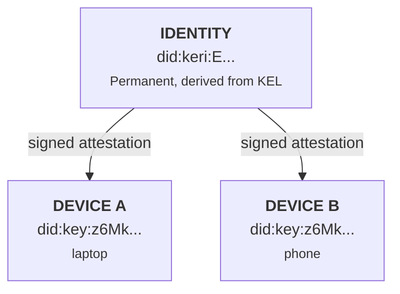

# Identity Model

KERI-inspired identity management: inception events, the Key Event Log, DID derivation, and key rotation.

## Core Concepts

Auths uses three KERI (Key Event Receipt Infrastructure) concepts adapted for Git-native storage:

1. **Self-certifying identifiers** -- the identity DID is derived from the inception event's content hash, making it cryptographically bound to its creation parameters.

2. **Pre-rotation** -- each event commits to the *next* rotation key before it is needed. A compromised current key cannot forge a rotation because the next key was committed in a previous event.

3. **Key Event Log (KEL)** -- an append-only, hash-chained sequence of events that records every key lifecycle operation. Replaying the KEL produces the current key state.

## Identity vs. Device

!!! info "The one thing to remember"
    **Your identity is not your key.** Keys live on devices and can be rotated. Your identity (`did:keri:E...`) is permanent and survives key changes.



- **Identity** (`did:keri:E...`): Your stable cryptographic identifier. Derived from the inception event's SAID. Survives key rotation.
- **Device** (`did:key:z6Mk...`): A per-machine Ed25519 keypair. Devices are instruments that act on behalf of an identity, authorized via signed attestations.

## DID Derivation

### did:keri (identity)

The `did:keri` identifier is derived from the inception event:

1. Build the inception event JSON with `d` and `i` fields set to empty defaults
2. Compute the Blake3 hash of that JSON
3. Encode as Base64url (no padding) with an `E` prefix (KERI derivation code for Blake3-256)
4. Set both `d` (SAID) and `i` (prefix) to this value -- for inception, they are identical

```
Inception JSON (d="", i="") --> Blake3 --> Base64url --> "E" + encoded
                                                         |
                                                         v
                                               did:keri:EXq5Yqa...
```

The SAID is 44 characters: `E` prefix + 43 characters of Base64url-encoded Blake3 hash.

From source (`auths-core/src/crypto/said.rs`):

```rust
pub fn compute_said(event_json: &[u8]) -> Said {
    let hash = blake3::hash(event_json);
    let encoded = URL_SAFE_NO_PAD.encode(hash.as_bytes());
    Said::new_unchecked(format!("E{}", encoded))
}
```

### did:key (device)

Device identifiers use the `did:key` method, which encodes the public key directly in the DID string:

1. Prepend the Ed25519 multicodec prefix `[0xED, 0x01]` to the 32-byte public key
2. Encode as Base58btc
3. Prepend `did:key:z`

```
32-byte Ed25519 pubkey --> [0xED, 0x01] ++ pubkey --> Base58btc --> "did:key:z" + encoded
```

From source (`auths-crypto/src/did_key.rs`):

```rust
pub fn ed25519_pubkey_to_did_key(public_key: &[u8; 32]) -> String {
    let mut prefixed = vec![0xED, 0x01];
    prefixed.extend_from_slice(public_key);
    let encoded = bs58::encode(prefixed).into_string();
    format!("did:key:z{encoded}")
}
```

Decoding reverses this process: strip `did:key:z`, Base58-decode, validate the `[0xED, 0x01]` multicodec prefix, extract the 32-byte key.

## KERI Event Types

The KEL contains three event types, discriminated by a `t` field:

### Inception Event (`icp`)

Creates a new identity. The inception event establishes the identifier prefix and commits to the first rotation key.

| Field | Type | Description |
|-------|------|-------------|
| `v` | string | Version: `"KERI10JSON"` |
| `t` | string | Type: `"icp"` |
| `d` | string | SAID (Blake3 hash of event with `d`, `i`, `x` cleared) |
| `i` | string | Identifier prefix (same as `d` for inception) |
| `s` | string | Sequence number: `"0"` |
| `kt` | string | Key threshold: `"1"` for single-sig |
| `k` | string[] | Current public key(s), KERI CESR encoded (`D` + Base64url) |
| `nt` | string | Next key threshold: `"1"` |
| `n` | string[] | Next key commitment(s) (Blake3 hash of next public key) |
| `bt` | string | Witness threshold: `"0"` when no witnesses |
| `b` | string[] | Witness list (empty when no witnesses) |
| `a` | Seal[] | Anchored seals (optional) |
| `x` | string | Ed25519 signature over canonical event (Base64url) |

### Rotation Event (`rot`)

Rotates to a pre-committed key. The new key must match the previous event's next-key commitment.

| Field | Type | Description |
|-------|------|-------------|
| `v` | string | Version: `"KERI10JSON"` |
| `t` | string | Type: `"rot"` |
| `d` | string | SAID of this event |
| `i` | string | Identifier prefix |
| `s` | string | Sequence number (increments with each event) |
| `p` | string | Previous event SAID (creates the hash chain) |
| `kt` | string | Key threshold |
| `k` | string[] | New current key(s) |
| `nt` | string | Next key threshold |
| `n` | string[] | New next key commitment(s) |
| `bt` | string | Witness threshold |
| `b` | string[] | Witness list |
| `a` | Seal[] | Anchored seals (optional) |
| `x` | string | Signature by the **new** key (the key that satisfied the commitment) |

Setting `nt` to `"0"` and `n` to `[]` abandons the identity -- no further rotations are possible.

### Interaction Event (`ixn`)

Anchors data in the KEL without changing keys. Used to link attestations, delegations, or other artifacts to the identity's event history.

| Field | Type | Description |
|-------|------|-------------|
| `v` | string | Version: `"KERI10JSON"` |
| `t` | string | Type: `"ixn"` |
| `d` | string | SAID of this event |
| `i` | string | Identifier prefix |
| `s` | string | Sequence number |
| `p` | string | Previous event SAID |
| `a` | Seal[] | Anchored seals (the primary purpose of IXN events) |
| `x` | string | Signature by the current key |

## Key Event Log (KEL)

The KEL is an append-only, hash-chained sequence of events stored as Git commits:

```
icp (s=0) --> rot (s=1) --> ixn (s=2) --> rot (s=3) --> ...
  d=E_abc      d=E_def      d=E_ghi      d=E_jkl
               p=E_abc      p=E_def      p=E_ghi
```

### Chain Integrity

Each event references the previous event's SAID via the `p` field, forming a verifiable hash chain. Breaking any link invalidates all subsequent events.

### SAID Computation

The SAID is computed by:

1. Clearing the `d`, `x`, and (for inception) `i` fields
2. Serializing to JSON
3. Computing Blake3-256 hash
4. Encoding as `E` + Base64url (no padding)

This same canonical form (with `d`, `i`, `x` cleared) is used for signature computation, avoiding circular dependencies between SAID and signature.

### Pre-Rotation

The `n` field in each event contains a **commitment** to the next rotation key:

```
commitment = "E" + Base64url(Blake3(next_public_key_bytes))
```

When a rotation event appears, the verifier:

1. Extracts the new key from `k[0]`
2. Computes `Blake3(new_key_bytes)`
3. Compares with the previous event's `n[0]`
4. Only accepts the rotation if they match

This prevents a compromised current key from forging a rotation -- the attacker would need to know the pre-committed next key.

## Key State

Replaying the KEL produces a `KeyState` struct:

```rust
pub struct KeyState {
    pub prefix: Prefix,          // KERI identifier (used in did:keri:<prefix>)
    pub current_keys: Vec<String>, // Current signing key(s), CESR encoded
    pub next_commitment: Vec<String>, // Next key commitment(s) for pre-rotation
    pub sequence: u64,           // Current sequence number
    pub last_event_said: Said,   // SAID of the last processed event
    pub is_abandoned: bool,      // Empty next commitment = abandoned
}
```

Key state is derived, not stored. It is computed by replaying events from inception. The `validate_kel` function is a pure function with no I/O:

```rust
pub fn validate_kel(events: &[Event]) -> Result<KeyState, ValidationError>
```

For performance, a three-tier caching strategy avoids full replay on every access:

1. **Cache hit**: Cached state matches current tip -- return immediately (O(1))
2. **Incremental**: Cache is behind by k events -- validate only new events (O(k))
3. **Full replay**: Cache missing or invalid -- replay entire KEL (O(n))

## Seals

Seals anchor external data in KERI events. They contain a digest of the anchored artifact and a type indicator:

```json
{ "d": "EAttestDigest...", "type": "device-attestation" }
```

Seal types include:

| Type | Purpose |
|------|---------|
| `device-attestation` | Links a device attestation to the KEL |
| `revocation` | Records a revocation in the KEL |
| `delegation` | Records a capability delegation |

Seals appear in the `a` field of any event type, binding the external artifact's integrity to the identity's event history.

## KERI Key Encoding

Public keys in KERI events use CESR (Composable Event Streaming Representation) encoding:

- **Prefix**: `D` -- derivation code for Ed25519
- **Payload**: Base64url (no padding) encoded 32-byte public key

```
"D" + Base64url(ed25519_public_key_bytes)
```

Parsing a KERI-encoded key (`auths-crypto/src/keri.rs`):

1. Validate the `D` prefix
2. Base64url-decode the remaining characters
3. Validate the result is exactly 32 bytes
