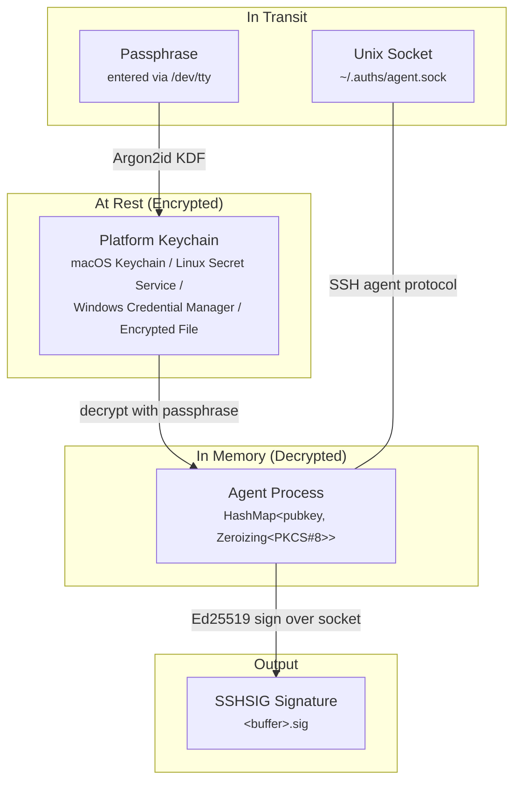
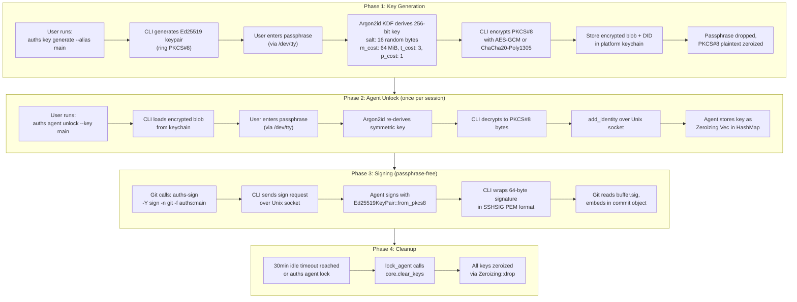
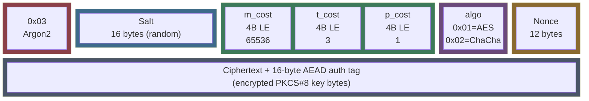
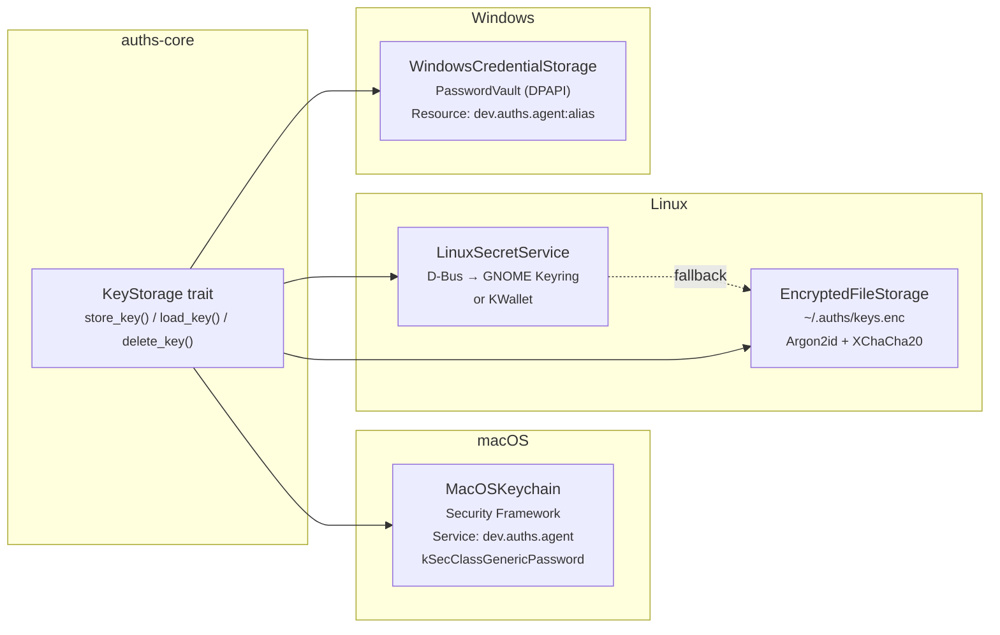
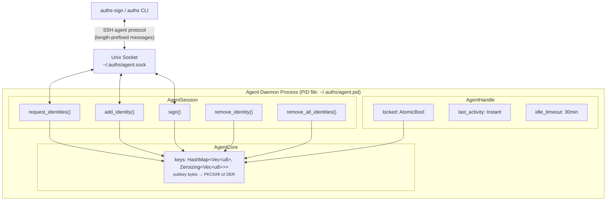
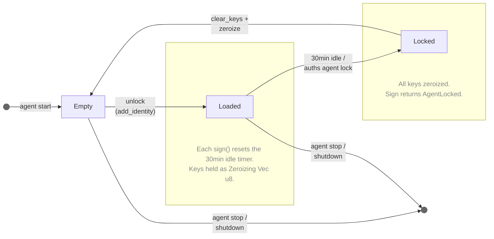
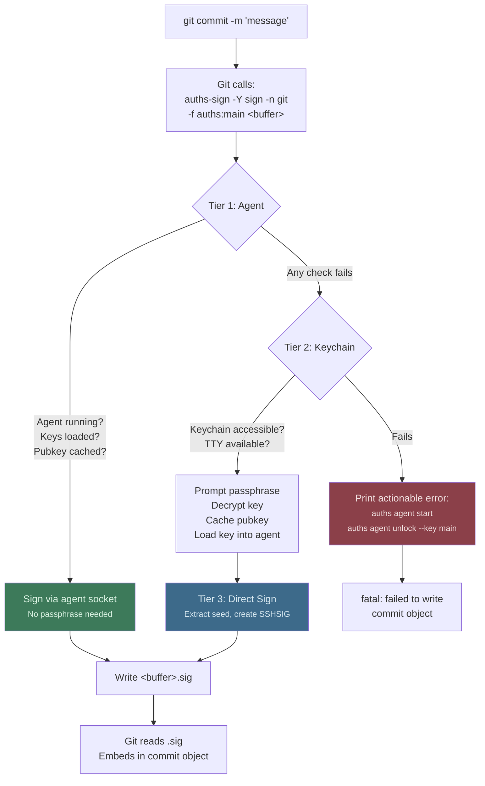
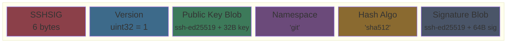

# Key Management Architecture

This document explains where keys and passphrases physically live, how they move between components, and what security properties protect them at each stage.

## Overview

Auths uses a layered architecture for key management. Private keys are encrypted at rest in platform keychains, decrypted only when needed, and held in agent memory wrapped in zeroizing buffers. Passphrases never leave the user's terminal and are never stored.



## Key Lifecycle

Every Ed25519 key goes through four phases. This diagram shows the physical locations and transformations at each phase.



## Encryption Envelope

When a key is stored in the keychain, the raw PKCS#8 bytes are encrypted into a self-describing binary envelope. The envelope contains everything needed for decryption except the passphrase.



**Source**: `crates/auths-core/src/crypto/encryption.rs`

| Field | Size | Purpose |
|-------|------|---------|
| Tag | 1 byte | `0x03` = Argon2id envelope (legacy: `0x01`/`0x02` = HKDF) |
| Salt | 16 bytes | Random, per-encryption |
| m_cost | 4 bytes (LE) | Argon2id memory: 64 MiB |
| t_cost | 4 bytes (LE) | Argon2id iterations: 3 |
| p_cost | 4 bytes (LE) | Argon2id parallelism: 1 |
| Algo tag | 1 byte | `0x01` = AES-GCM-256, `0x02` = ChaCha20-Poly1305 |
| Nonce | 12 bytes | Random, per-encryption |
| Ciphertext | variable | Encrypted PKCS#8 + 16-byte AEAD authentication tag |

**Security properties**:

- Argon2id parameters follow OWASP recommendations (64 MiB memory makes GPU attacks expensive)
- Unique salt and nonce per encryption prevent rainbow tables and nonce reuse
- AEAD authentication tag detects tampering (wrong passphrase returns `IncorrectPassphrase`, not garbage)
- Passphrase minimum: 12 characters with 3 of 4 character classes

## Platform Keychain Backends

The encrypted envelope is stored in the platform's native credential store. Auths never stores plaintext keys on disk.



**Source**: `crates/auths-core/src/storage/keychain.rs` (`get_platform_keychain()`)

| Platform | Backend | Storage Location | OS-Level Protection |
|----------|---------|-----------------|---------------------|
| macOS | Security Framework | Keychain database | Secure Enclave (M-series), ACLs, Touch ID |
| Linux | Secret Service (D-Bus) | GNOME Keyring / KWallet | Session encryption, D-Bus policy |
| Linux (headless) | Encrypted File | `~/.auths/keys.enc` | File permissions (0600) + Argon2id + XChaCha20 |
| Windows | PasswordVault | DPAPI vault | Per-user DPAPI encryption |
| CI/testing | Memory | Process heap | None (not for production) |

**Override**: Set `AUTHS_KEYCHAIN_BACKEND=file` to force encrypted file storage on any platform.

### What Gets Stored

Each keychain entry contains:

| Field | macOS | Linux Secret Service | Windows | Encrypted File |
|-------|-------|---------------------|---------|----------------|
| **Key alias** | `kSecAttrAccount` | `alias` attribute | Resource name suffix | HashMap key |
| **Identity DID** | `kSecAttrDescription` | Pipe-delimited in secret | `Username` field | Tuple element |
| **Encrypted key** | `kSecValueData` | Base64 in secret value | Base64 in `Password` | Base64 in JSON |

The encrypted key data is the binary envelope described above -- the keychain provides an additional layer of OS-level encryption on top.

## SSH Agent Architecture

The agent is a daemon process that holds decrypted keys in memory and signs data on request over a Unix domain socket.



**Source files**:

| File | Role |
|------|------|
| `crates/auths-core/src/agent/core.rs` | `AgentCore` -- in-memory key HashMap with `Zeroizing` wrappers |
| `crates/auths-core/src/agent/handle.rs` | `AgentHandle` -- lifecycle, idle timeout, locking |
| `crates/auths-core/src/agent/session.rs` | `AgentSession` -- SSH agent protocol handler |
| `crates/auths-core/src/agent/client.rs` | Client functions that talk to the agent over the socket |
| `crates/auths-cli/src/commands/agent.rs` | CLI commands: `start`, `stop`, `unlock`, `lock`, `status` |

### Agent File Locations

| File | Path | Purpose |
|------|------|---------|
| Socket | `~/.auths/agent.sock` | Unix domain socket for SSH agent protocol |
| PID file | `~/.auths/agent.pid` | Tracks daemon PID for stop/status |
| Env file | `~/.auths/agent.env` | Shell export for `SSH_AUTH_SOCK` |
| Log file | `~/.auths/agent.log` | Daemon stdout/stderr |
| Pubkey cache | `~/.auths/pubkeys/<alias>.pub` | Hex-encoded 32-byte public keys |

### Memory Security

Keys in the agent are protected by three mechanisms:

1. **Zeroizing wrappers**: Every private key is stored as `Zeroizing<Vec<u8>>`. When dropped (removed, cleared, or process exits), the memory is overwritten with zeros before deallocation.

2. **Idle timeout**: After 30 minutes of inactivity (configurable), `lock_agent()` calls `core.clear_keys()`, which drops all `Zeroizing` values and triggers zeroization. Sign attempts after lock return `AgentError::AgentLocked`.

3. **Activity tracking**: Each successful sign operation calls `touch()` to reset the idle timer. Only active usage keeps keys in memory.



## Git Commit Signing Flow

When you run `git commit`, Git calls `auths-sign` as a subprocess. The signing uses a three-tier strategy that favors the fastest path (agent) and falls back gracefully.



**Source**: `crates/auths-cli/src/bin/sign.rs`

### What Each Tier Does

| Tier | Passphrase? | Speed | When It Runs |
|------|------------|-------|--------------|
| **1: Agent** | No | ~1ms | Agent running with keys loaded AND pubkey cached in `~/.auths/pubkeys/` |
| **2: Keychain** | Yes (once) | ~500ms | Agent has no keys or pubkey not cached; loads key into agent for next time |
| **3: Direct** | N/A | ~1ms | Always runs after Tier 2 succeeds; uses the decrypted key directly |

After the first passphrase entry (Tier 2), subsequent commits use Tier 1 exclusively -- no passphrase, no keychain access, just agent signing.

## SSHSIG Signature Format

The signature written to `<buffer>.sig` follows the [SSHSIG specification](https://github.com/openssh/openssh-portable/blob/master/PROTOCOL.sshsig), making it compatible with `ssh-keygen -Y verify`.



The binary structure is base64-encoded and PEM-armored:

```
-----BEGIN SSH SIGNATURE-----
<base64 of binary blob, wrapped at 70 chars>
-----END SSH SIGNATURE-----
```

### What Gets Signed

The agent doesn't sign the raw commit data. It signs a structured SSHSIG message:

```
string  "SSHSIG"          (magic preamble)
string  "git"              (namespace)
string  ""                 (reserved, empty)
string  "sha512"           (hash algorithm)
string  SHA512(commit)     (64-byte hash of commit data)
```

This ensures the signature is bound to the namespace and commit content.

## Security Summary

| Concern | Protection |
|---------|-----------|
| **Key at rest** | Encrypted with Argon2id + AES-GCM/ChaCha20 in platform keychain |
| **Key in memory** | `Zeroizing<Vec<u8>>` -- zeroed on drop; idle timeout auto-clears after 30min |
| **Passphrase** | Read from `/dev/tty`; never stored, never logged; validated (12+ chars, 3/4 classes) |
| **Agent socket** | Unix domain socket with filesystem permissions; no network exposure |
| **Brute force** | Argon2id with 64 MiB memory cost makes GPU attacks expensive |
| **Tampering** | AEAD authentication tag detects ciphertext modification |
| **Wrong passphrase** | Returns `IncorrectPassphrase` error, not decrypted garbage |
| **Process exit** | `Zeroizing` drop handlers zero all key material |
| **Idle sessions** | Configurable timeout (default 30min) auto-locks and zeroizes keys |
