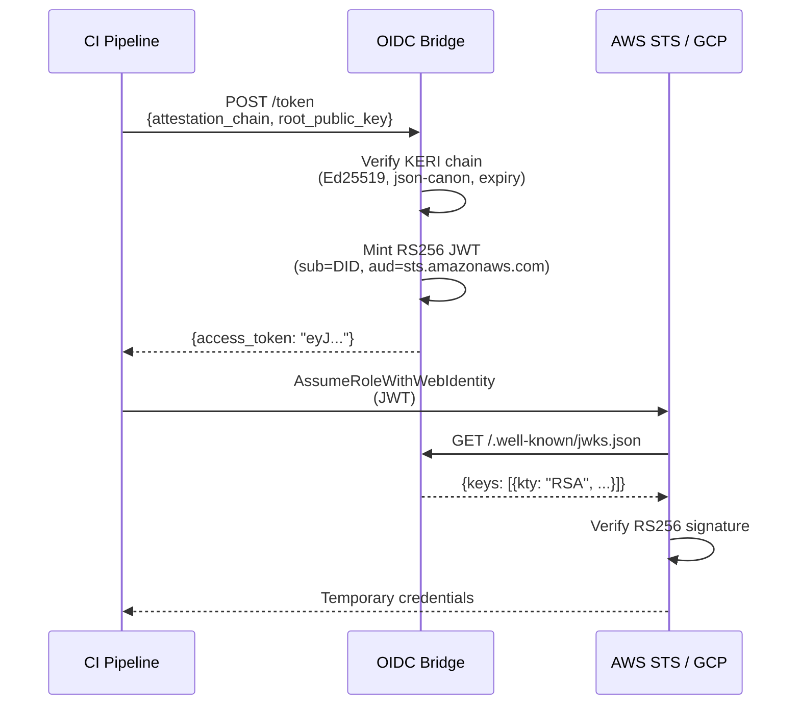

# OIDC Bridge

The `auths-oidc-bridge` is an OpenID Connect Identity Provider that translates KERI attestation chains into RS256 JWTs consumable by cloud IAM systems (AWS STS, GCP Workload Identity, Azure AD).

## Why a Bridge?

Cloud providers don't speak KERI. They speak OIDC -- specifically, they trust JWTs signed by a registered OIDC provider. The bridge sits between these two worlds:

```
KERI Identity Layer          auths-oidc-bridge           Cloud IAM Layer
(Ed25519, zero-trust)  -->  (RS256 translation)  -->  (AWS STS / GCP / Azure)
                                    ^
                          RSA signing key = trust anchor
```

A CI pipeline or service presents its KERI attestation chain to the bridge. The bridge verifies the chain locally (Ed25519 signatures, canonical JSON, chain continuity, expiration, revocation), then mints a short-lived RS256 JWT. The cloud provider validates that JWT against the bridge's published JWKS and issues temporary credentials.

## How It Works

### Token Exchange Flow



### KERI Verification (Zero-Trust)

The bridge performs full KERI attestation chain verification locally. No external service or network call is needed:

- Ed25519 signatures on each attestation in the chain
- Canonical JSON serialization (`json-canon`) integrity
- Chain continuity (issuer -> subject linkage)
- Expiration and revocation status
- Optional witness quorum (threshold-based multi-party verification)

### GitHub OIDC Cross-Reference (Defense-in-Depth)

When enabled (`github-oidc` feature), the bridge optionally verifies a GitHub Actions OIDC token alongside the KERI chain:

- Fetches GitHub's public keys from their JWKS endpoint
- Validates RS256 signature, issuer, audience, and expiry
- Cross-references the `actor` claim against the expected KERI identity

This creates a **two-factor proof**: the request must originate from both (1) a valid KERI identity holder and (2) a specific GitHub Actions workflow.

## Cryptographic Guarantees

| Layer | Algorithm | Key Size | Purpose |
|-------|-----------|----------|---------|
| KERI attestation chain | Ed25519 | 256-bit | Identity and delegation signatures |
| Attestation canonicalization | json-canon | N/A | Deterministic serialization for signing |
| Bridge JWT | RS256 (RSASSA-PKCS1-v1_5 + SHA-256) | 2048-bit minimum | Cloud-consumable identity token |
| GitHub OIDC token | RS256 | GitHub-managed | CI/CD environment proof |

## Trust Boundary

The bridge's RSA signing key is the **sole trust anchor** for cloud IAM integration. Any entity possessing this key can mint JWTs that cloud providers will accept. Compromise of this key equals full workload identity impersonation.

This makes the bridge a high-value target. See [Enterprise Security](../cloud-ci/enterprise-security.md) for the full STRIDE threat model, key rotation procedures, and incident response playbook.

## Discovery Endpoints

The bridge serves standard OIDC discovery endpoints:

| Endpoint | Purpose |
|----------|---------|
| `GET /.well-known/openid-configuration` | OIDC discovery metadata |
| `GET /.well-known/jwks.json` | RSA public keys for JWT verification |
| `POST /token` | Token exchange (attestation chain -> JWT) |

## Next Steps

- **[OIDC Bridge API](../cloud-ci/oidc-bridge-api.md)** -- Endpoints, request/response schemas, configuration
- **[AWS Integration](../cloud-ci/aws-integration.md)** -- IAM setup, Terraform, CloudFormation
- **[GitHub Actions OIDC](../cloud-ci/github-actions-oidc.md)** -- Workload identity workflow
- **[Enterprise Security](../cloud-ci/enterprise-security.md)** -- STRIDE threat model, key rotation, incident response
