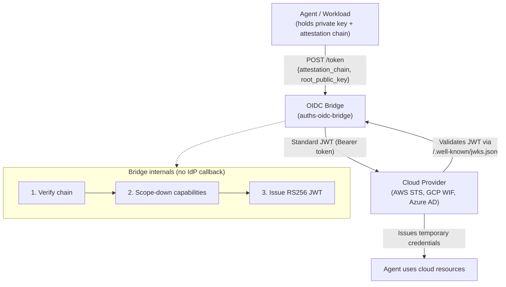

# OIDC Bridge

How Auths identities integrate with enterprise identity infrastructure through standard OIDC federation.

## Design pattern

Auths identities are self-certifying — they don't depend on any central authority. But cloud providers (AWS, GCP, Azure) and enterprise systems authenticate workloads through OAuth 2.0 and OpenID Connect. The OIDC bridge connects these two worlds: it verifies a KERI attestation chain cryptographically and issues a standard JWT that any OIDC relying party can consume.



The bridge exposes standard OIDC discovery endpoints (`/.well-known/openid-configuration` and `/.well-known/jwks.json`) so cloud providers can validate issued JWTs without any custom integration.

## How the token exchange works

1. **Client submits** an attestation chain and the root identity's Ed25519 public key to `/token`.
2. **Bridge verifies** the chain using `auths-verifier` — validates every signature, checks expiration, confirms capability scoping, and optionally verifies witness quorum.
3. **Bridge issues** an RS256 JWT containing standard OIDC claims (`iss`, `sub`, `aud`, `exp`) plus Auths-specific claims (`keri_prefix`, `capabilities`, `witness_quorum`).
4. **Cloud provider validates** the JWT against the bridge's JWKS endpoint and issues temporary credentials.

### JWT claims

| Claim | Source | Example |
|-------|--------|---------|
| `iss` | Bridge's configured issuer URL | `https://oidc.example.com` |
| `sub` | Root identity from attestation chain | `did:keri:EAbcdef...` |
| `aud` | Cloud provider or custom audience | `sts.amazonaws.com` |
| `keri_prefix` | Extracted from subject DID | `EAbcdef...` |
| `capabilities` | Intersection of chain-granted and requested | `["sign:commit", "deploy:staging"]` |
| `target_provider` | Auto-detected from audience format | `aws`, `gcp`, `azure` |
| `witness_quorum` | From witness verification (if provided) | `{"required": 2, "verified": 2}` |

### Capability scope-down

When an agent requests a token, it can request a subset of its chain-granted capabilities. The bridge computes the intersection: if the chain grants `[sign:commit, deploy:staging, deploy:production]` and the agent requests `[deploy:staging]`, the JWT contains only `[deploy:staging]`. This enforces least privilege at the protocol level.

## Cloud provider integration

The bridge has been validated against each major cloud provider's OIDC federation mechanism. No cloud-side changes are required beyond the standard OIDC provider registration.

### AWS STS

Register the bridge as an OIDC identity provider in IAM, then configure a role's trust policy to accept JWTs from the bridge:

```json
{
  "Effect": "Allow",
  "Principal": {
    "Federated": "arn:aws:iam::123456789012:oidc-provider/oidc.example.com"
  },
  "Action": "sts:AssumeRoleWithWebIdentity",
  "Condition": {
    "StringEquals": {
      "oidc.example.com:aud": "sts.amazonaws.com"
    }
  }
}
```

The agent calls `AssumeRoleWithWebIdentity` with the bridge-issued JWT and receives temporary AWS credentials.

### GCP Workload Identity Federation

Configure a Workload Identity Pool with an OIDC provider pointing to the bridge. The agent exchanges the JWT through GCP's STS endpoint (`sts.googleapis.com/v1/token`) using the standard `urn:ietf:params:oauth:grant-type:token-exchange` grant type.

### Azure AD

Register the bridge as a federated identity credential on an App Registration. The agent presents the JWT as a client assertion to Azure's OAuth 2.0 token endpoint.

## GitHub Actions OIDC cross-referencing

When running inside GitHub Actions, the bridge can cross-reference the GitHub-issued OIDC token with the Auths attestation chain. The agent submits both its attestation chain and the GitHub Actions OIDC token. The bridge verifies both independently and embeds `github_actor` and `github_repository` in the issued JWT, binding the cryptographic identity to the CI environment.

This prevents confused deputy attacks: the bridge validates that the GitHub token's actor matches the expected identity, ensuring a workflow cannot present another user's attestation chain.

## MCP integration

The [Model Context Protocol (MCP)](https://modelcontextprotocol.io/) uses OAuth 2.0 for authorization between AI agents and tool servers. The OIDC bridge provides the identity layer behind MCP's OAuth flow:

1. **MCP server** requires OAuth authorization from connecting agents.
2. **Agent** holds an Auths attestation chain with scoped capabilities.
3. **Agent** exchanges its attestation chain for a JWT via the OIDC bridge.
4. **Agent** presents the JWT to the MCP server as a Bearer token.
5. **MCP server** validates the JWT and inspects the `capabilities` claim to authorize tool access.

The result: MCP gets standard OAuth tokens, but those tokens are backed by cryptographically verifiable delegation chains traceable to human principals — not opaque API keys or borrowed service account credentials.

## Comparison with SPIFFE/SPIRE

[SPIFFE](https://spiffe.io/) and Auths both address workload identity but differ in architecture:

| | SPIFFE/SPIRE | Auths |
|---|---|---|
| **Identity issuance** | Centralized SPIRE server issues SVIDs | Self-certifying identifiers, no central issuer |
| **Verification** | Requires access to SPIRE server or trust bundle | Offline verification from attestation chain alone |
| **Delegation** | Not natively supported | First-class cryptographic delegation chains with capability scoping |
| **Key rotation** | SPIRE server rotates SVIDs on schedule | KERI pre-rotation — controller rotates locally, verifiable by anyone |
| **Storage** | In-memory or database-backed | Git-native (refs, commits) |
| **Primary use case** | Service mesh workload identity | Developer, agent, and workload identity with delegation |

The two are complementary. SPIFFE is well-suited for service-to-service authentication within a managed infrastructure. Auths addresses the gap SPIFFE does not cover: cross-boundary identity, delegation chains from humans to agents, and offline verification in environments where a SPIRE server is unreachable.

## Key rotation

The bridge supports RSA signing key rotation with an overlap window. During rotation, both the current and previous keys appear in the JWKS endpoint, allowing relying parties to validate JWTs signed with either key. After the overlap window, the previous key is dropped via an admin endpoint.
