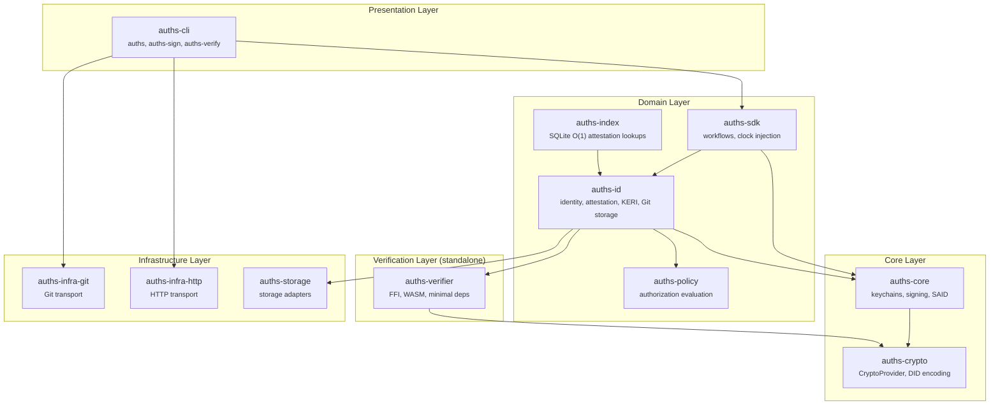
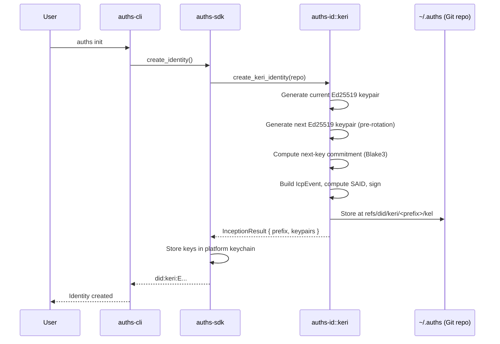
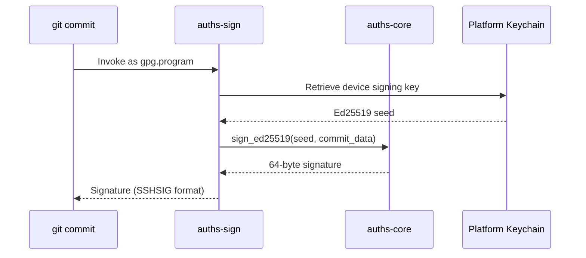
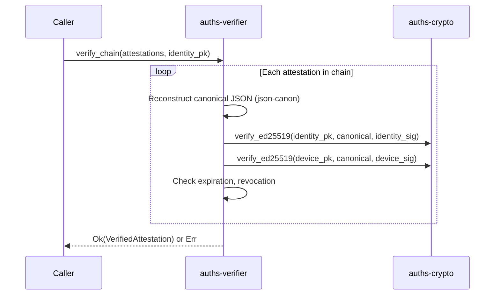

# Architecture Overview

How Auths is built: crate dependency graph, data flow, and system-level design.

## System Diagram

## Crate Dependency Graph

The workspace contains 14 crates organized into clear layers. Dependencies flow strictly downward -- core and domain crates never reference presentation layer crates.

| Crate | Role | Key Dependencies |
|-------|------|------------------|
| `auths-cli` | Three binaries: `auths`, `auths-sign`, `auths-verify` | auths-sdk, auths-id, clap |
| `auths-sdk` | Orchestration workflows, clock boundary | auths-core, auths-id |
| `auths-id` | Identity, attestation, KERI protocol, Git storage | auths-core, auths-verifier, git2 |
| `auths-core` | Keychains, signing, SAID computation, encryption | auths-crypto, ring, blake3 |
| `auths-crypto` | `CryptoProvider` trait, DID encoding, KERI key parsing | ring (optional), bs58, base64 |
| `auths-verifier` | Standalone verification for FFI/WASM embedding | auths-crypto, json-canon, blake3 |
| `auths-policy` | Authorization policy evaluation | auths-verifier |
| `auths-index` | SQLite-backed O(1) attestation lookups | auths-id |
| `auths-infra-git` | Git transport adapters | git2 |
| `auths-infra-http` | HTTP transport adapters | reqwest |
| `auths-storage` | Storage backend abstractions | - |
| `auths-telemetry` | Observability and metrics | - |
| `auths-radicle` | Radicle protocol integration | auths-id |
| `auths-test-utils` | Shared test helpers | auths-crypto |

## Data Flow

### Identity Initialization

### Commit Signing

### Verification

## Layering Rules

1. **No reverse dependencies.** Core and SDK must never reference presentation layer crates.

2. **Domain-specific errors only.** `thiserror` enums in Core/SDK. No `anyhow::Error` or `Box<dyn Error>` below the CLI boundary.

3. **`thiserror`/`anyhow` translation boundary.** The CLI and server crates use `anyhow::Context` for operational context, but always wrap the underlying typed error -- never discard it.

4. **Clock injection.** `Utc::now()` is banned in `auths-core` and `auths-id`. All time-sensitive functions accept `now: DateTime<Utc>` as their first parameter. The CLI calls `Utc::now()` at the presentation boundary.

5. **Crypto provider abstraction.** Domain crates depend on the `CryptoProvider` trait from `auths-crypto`, not on `ring` directly. This enables WASM builds with `WebCryptoProvider` and native builds with `RingCryptoProvider`.

## Feature Flags

| Crate | Flag | Effect |
|-------|------|--------|
| `auths-core` | `keychain-file-fallback` | File-based key storage fallback |
| `auths-core` | `keychain-windows` | Windows Credential Manager support |
| `auths-core` | `crypto-secp256k1` | secp256k1 curve support |
| `auths-core` | `test-utils` | Test helper exports |
| `auths-id` | `git-storage` | Git-backed storage (inception, KEL, rotation) |
| `auths-id` | `indexed-storage` | SQLite-indexed attestation lookups |
| `auths-id` | `witness-client` | Witness receipt collection |
| `auths-crypto` | `native` | ring-based Ed25519 (default) |
| `auths-crypto` | `wasm` | WebCrypto-based Ed25519 |
| `auths-verifier` | `native` | ring-based verification (default) |
| `auths-verifier` | `ffi` | C FFI exports via libc |
| `auths-verifier` | `wasm` | WASM exports via wasm-bindgen |
