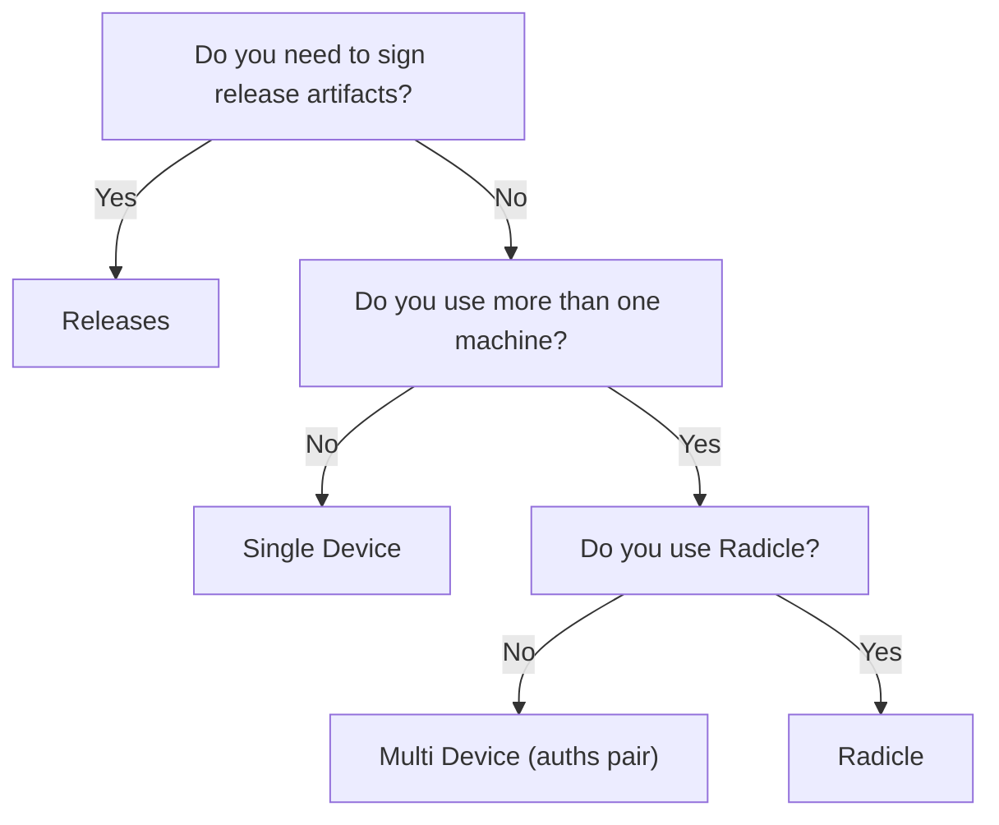

# Choose Your Workflow

Not sure which setup you need? Start here.

## Which setup fits you?

| Situation | Workflow | Time |
|-----------|----------|------|
| **"I just want signed commits"** | [Single Device](single-device.md) | 5 min |
| **"I work from multiple machines"** | [Multi Device](multi-device/index.md) | 5 min with `auths pair` |
| **"I need to sign release artifacts"** | [Releases](releases/index.md) | 10 min |
| **"I use Radicle"** | [Radicle](radicle.md) | 15 min |

!!! tip "Start with Single Device"
    If you're new to Auths, start with the [Single Device](single-device.md) workflow. You can always add more devices later -- nothing is locked in.

## Decision tree

## What each workflow covers

**Single Device** -- One identity, one machine, signed commits. The simplest path. Covers identity creation, Git config, and verification.

**Multi Device** -- Same identity across multiple machines. The recommended path is [`auths pair`](multi-device/pairing.md) (QR code / short code, handles crypto automatically). For full manual control, see [Manual Linking](multi-device/linking.md).

**Releases** -- Sign tarballs, binaries, and other release artifacts with `auths artifact sign`. Covers manual signing, CI/CD integration with GitHub Actions, and identity bundle export for stateless verification.

**Radicle** -- Auths identity using Radicle-compatible Git ref layouts. Covers custom layout flags and shell aliases for convenience.
