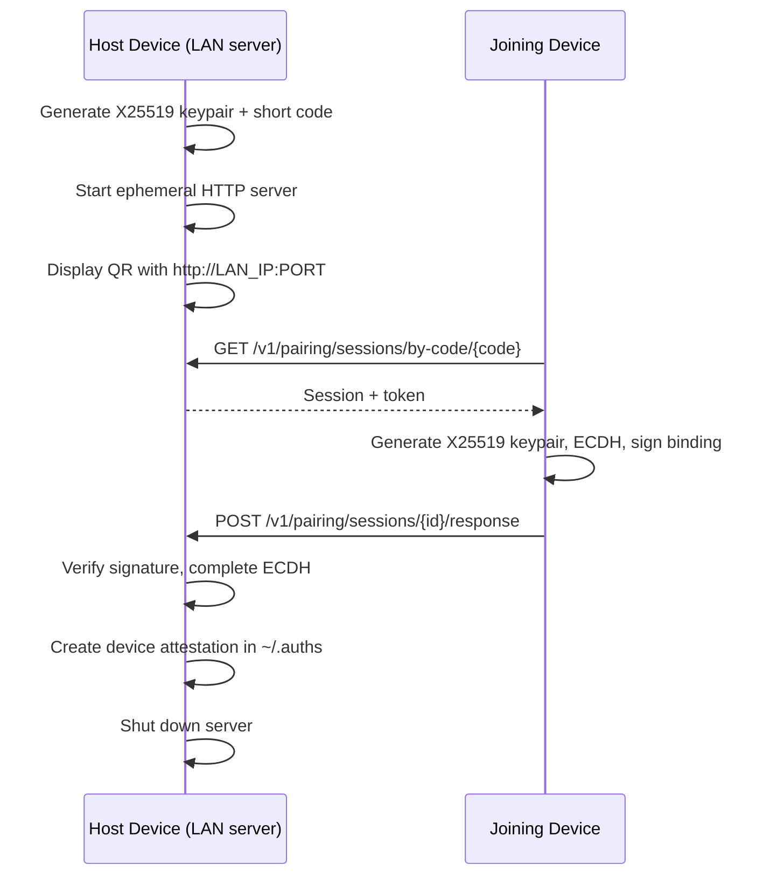
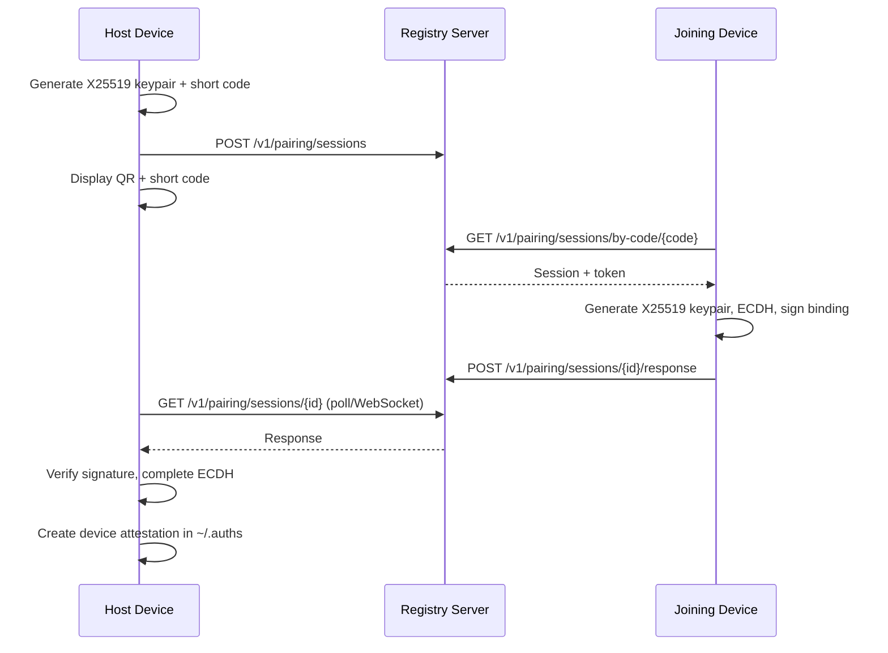

# Pairing (QR Code)

Link a second device to your identity using `auths pair`. The protocol uses [X25519](https://cryptography.io/en/latest/hazmat/primitives/asymmetric/x25519/#x25519-key-exchange) key agreement and [Ed25519](https://cryptography.io/en/latest/hazmat/primitives/asymmetric/ed25519/) binding signatures exchanged directly over the LAN or relayed through a registry server.

## Prerequisites

- An initialized identity on the host device (`auths init`)
- Auths CLI installed on both devices (or Auths mobile app on the joining device)
- Both devices on the same Wi-Fi network (for LAN mode), or a running registry server (for registry mode)

## Quick start

### LAN mode (default — no server required)

The simplest way to pair. One command, zero infrastructure.

#### 1. Host device initiates pairing

```bash
auths pair
```

The CLI detects your LAN IP, starts an ephemeral HTTP server, and displays a QR code:

```
━━━ 🔗 PAIRING (LAN) ━━━

  Server:  http://192.168.8.183:54688
  DID:     did:keri:EnXNx...

  mDNS: advertising on local network

  [QR CODE]

  Scan the QR code above, or enter this code manually:

    Z43-8JR

  Capabilities: sign_commit
  Expires: 20:23:07 (300s remaining)

  (Press Ctrl+C to cancel)

  Debug: Test from another terminal: curl http://xxx.xxx.x.xxx:54688/health
```

#### 2a. Join from the Auths mobile app

On your iPhone:
1. Open the Auths app
2. Tap **"I Have an Identity"**
3. Point the camera at the QR code
4. Tap **"Link Device"** on the confirmation sheet

#### 2b. Join from another CLI

```bash
auths pair --join Z43-8JR
```

The joiner discovers the host via mDNS, performs the key exchange, and the host creates a device attestation.

### Registry mode (with relay server)

Use registry mode when devices aren't on the same network, or to test the registry server itself.

#### 1. Start the registry server

```bash
cargo run --package auths-registry-server -- --cors
```

The server binds to `0.0.0.0:3000` by default. Leave it running.

#### 2. Host device initiates pairing

```bash
auths pair --registry http://localhost:3000
```

#### 3. Joining device enters the code

```bash
auths pair --join Z43-8JR --registry http://localhost:3000
```

The joiner performs the key exchange. The host verifies the response, completes ECDH, and creates a device attestation.

## Protocol

### LAN mode

The host runs a temporary HTTP server. The joiner connects directly — no relay.



### Registry mode

A central relay server mediates between host and joiner:



The binding signature covers `short_code || host_x25519_pubkey || device_x25519_pubkey`, preventing replay and MITM attacks.

## Command reference

### Host: initiate pairing

```bash
auths pair [OPTIONS]
```

| Flag | Default | Description |
|------|---------|-------------|
| `--registry <URL>` | *(omit for LAN mode)* | Registry server URL; omit to use LAN mode |
| `--no-qr` | `false` | Only show the short code, skip QR |
| `--no-mdns` | `false` | Disable mDNS advertisement in LAN mode |
| `--expiry <SECONDS>` | `300` | Session TTL (max 5 minutes) |
| `--capabilities <LIST>` | `sign_commit` | Comma-separated capabilities to grant |
| `--offline` | `false` | Render QR only, no server (testing only) |

### Mode selection

| Command | Mode | What happens |
|---------|------|-------------|
| `auths pair` | **LAN** | Starts local HTTP server, shows QR with `http://LAN_IP:PORT` |
| `auths pair --registry URL` | **Registry** | Uses registry relay at the given URL |
| `auths pair --join CODE` | **LAN join** | Discovers peer via mDNS, then joins |
| `auths pair --join CODE --registry URL` | **Registry join** | Joins via registry relay |
| `auths pair --offline` | **Offline** | Renders QR only, no server |

### Joiner: join a session

```bash
auths pair --join <CODE> [OPTIONS]
```

| Flag | Default | Description |
|------|---------|-------------|
| `--join <CODE>` | | The short code from the host |
| `--registry <URL>` | *(omit for LAN join)* | Must match the host's registry |

Dashes and spaces in the code are ignored (`Z43-8JR` and `Z438JR` are equivalent).

### Registry server

```bash
auths-registry-server [OPTIONS]
```

| Flag | Env Var | Default | Description |
|------|---------|---------|-------------|
| `--bind <ADDR>` | `AUTHS_BIND_ADDR` | `0.0.0.0:3000` | Bind address |
| `--repo <PATH>` | `AUTHS_REPO_PATH` | `~/.auths` | Identity repository path |
| `--cors` | `AUTHS_CORS` | disabled | Enable CORS for browser/mobile clients |
| `--log-level <LEVEL>` | `AUTHS_LOG_LEVEL` | `info` | Log level |

Environment variables take precedence over CLI flags.

## Capabilities

Capabilities control what the paired device is allowed to do:

```bash
auths pair --capabilities sign_commit,sign_tag
```

- `sign_commit` -- Sign Git commits
- `sign_tag` -- Sign Git tags

## Verifying the result

After pairing completes, confirm the device attestation was stored:

```bash
auths status
auths id show-devices
```

The paired device can now sign commits using the granted capabilities.

## Troubleshooting

### "Short code not found"

The host hasn't initiated a session yet, the session expired (>5 minutes), or the code was entered incorrectly. Make sure the host runs `auths pair` first, then enter the code on the joining device within 5 minutes.

### "Could not connect" / "Internet connection appears to be offline" (LAN mode)

The joining device can't reach the host's ephemeral server. Check:

1. **Same Wi-Fi?** Both devices must be on the same network and subnet.
2. **Mac firewall?** Check with `sudo /usr/libexec/ApplicationFirewall/socketfilterfw --getglobalstate`. Disable with `sudo pfctl -d` if needed.
3. **Test connectivity:** Run the curl command printed by the CLI (e.g., `curl http://192.168.x.x:PORT/health`). If this fails from your Mac, the server isn't reachable.
4. **iOS Local Network permission:** On iPhone, check Settings > Privacy & Security > Local Network > ensure Auths is toggled ON. If issues persist, delete the app, restart the iPhone, and reinstall.
5. **Router AP isolation:** Some routers block device-to-device traffic. Check your router's "AP isolation" or "client isolation" setting.

### "No peer found on local network" (LAN join)

mDNS discovery timed out. Are both devices on the same subnet? As a fallback, use registry mode:
```bash
auths pair --join CODE --registry http://HOST_IP:3000
```

### "Key not found" on the joining device

The joining device doesn't have an Auths identity initialized:

```bash
auths init
auths key list   # Verify a key exists
```

### "No signing key found for identity"

The keychain has no key associated with the loaded identity's DID:

```bash
auths key list
auths init --force   # Re-initialize if needed
```

### Host and joiner can't connect (registry mode)

Both must use the same `--registry` URL. When testing with a mobile device, use your Mac's LAN IP (not `localhost`):
```bash
# Find your Mac's IP
ipconfig getifaddr en0

# Use it in both commands
auths pair --registry http://YOUR_MAC_IP:3000
```

Pass `--cors` to the registry server when using mobile clients.

### Session expired

More than 5 minutes passed between the host initiating and the joiner entering the code. The host should run `auths pair` again for a fresh code.

### "Invalid signature" on host

The FFI crate may be out of date. The binding message is `short_code || initiator_x25519 || device_x25519`. Rebuild the XCFramework if using the mobile app.
