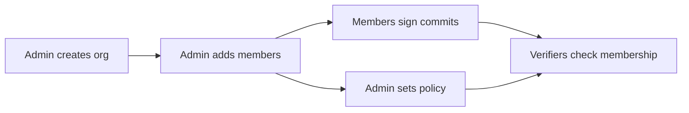

# Organizations

Auths organizations bring cryptographic identity to teams. Every member gets a verifiable identity tied to the org, with role-based capabilities and auditable policy enforcement -- no central server, no tokens to rotate, no shared secrets.

## What you get

**Verifiable membership** -- Every commit, tag, and release is signed by an identity that is cryptographically linked to your organization. Verifiers can confirm "this person is an authorized member of Acme Corp" without calling an API.

**Role-based access** -- Three built-in roles map to the capabilities your team actually needs:

| Role | Capabilities | Intended for |
|------|-------------|--------------|
| **Admin** | sign_commit, sign_release, manage_members, rotate_keys | Team leads, security leads |
| **Member** | sign_commit, sign_release | Engineers |
| **Readonly** | *(none)* | Auditors, external reviewers |

Need finer control? Override the defaults with per-member capability lists.

**Policy governance** -- Define what's allowed as code. Policies are JSON documents that express rules like "members can only sign commits to repos in this list" or "no signing in production without the `sign_release` capability." Lint, test, and diff policies before deploying them.

**Audit trail** -- Every membership change, capability grant, and revocation is recorded as a signed attestation in Git. The event log is tamper-evident and can be exported as an incident report at any time.

## How it works

1. An admin initializes the organization identity (`auths org init`)
2. Members are added with roles and capabilities (`auths org add-member`)
3. Members sign commits using their personal identity -- the org attestation links them
4. Verifiers confirm both the signature and the org membership in one step
5. Policies can restrict what actions are allowed, where, and by whom

Everything is stored as Git refs. No external service needed.

## Next steps

- [Organization Management](management.md) -- set up an org, add and revoke members, audit the membership roster
- [Policy Management](policy.md) -- write, test, and deploy authorization policies
