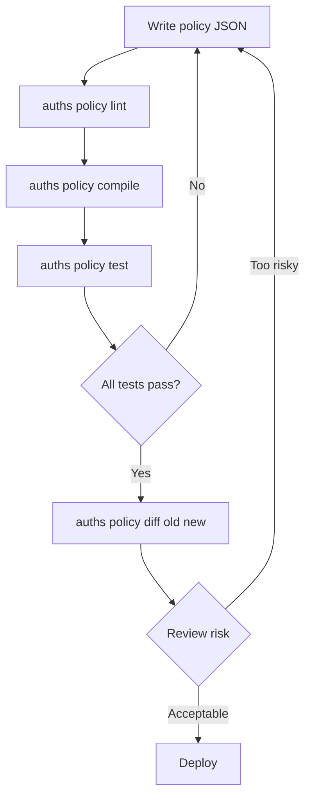

# Policy Management

Define, test, and deploy authorization policies for your organization. This workflow is geared towards tech leads, security teams, and platform teams who need to control what members can do, where, and when.

## Prerequisites

- An initialized organization (`auths org init`)
- Familiarity with [Policy concepts](../../../concepts/policy.md)

## 1. Write a policy

Policies are JSON files that combine predicates with boolean logic. Start with a baseline that most organizations need:

```json title="org-policy.json"
{
  "And": [
    "NotRevoked",
    "NotExpired",
    { "HasCapability": "sign_commit" },
    { "MaxChainDepth": 2 }
  ]
}
```

This allows any active, non-expired member with the `sign_commit` capability to sign, as long as the delegation chain is at most 2 levels deep.

### Common patterns

**Restrict to specific repos:**

```json
{
  "And": [
    "NotRevoked",
    "NotExpired",
    { "HasCapability": "sign_commit" },
    { "RepoIn": ["acme/frontend", "acme/backend", "acme/infra"] }
  ]
}
```

**Require admin role for releases:**

```json
{
  "And": [
    "NotRevoked",
    "NotExpired",
    { "HasAllCapabilities": ["sign_commit", "sign_release"] },
    { "RoleIs": "admin" }
  ]
}
```

**Environment gating:**

```json
{
  "And": [
    "NotRevoked",
    "NotExpired",
    { "HasCapability": "sign_commit" },
    { "EnvIn": ["staging", "development"] }
  ]
}
```

**Branch protection:**

```json
{
  "And": [
    "NotRevoked",
    "NotExpired",
    { "HasCapability": "sign_commit" },
    { "RefMatches": "refs/heads/feature/*" }
  ]
}
```

## 2. Lint

Check syntax before anything else:

```bash
auths policy lint org-policy.json
```

```
ok Valid JSON
ok All ops recognized
ok 342 bytes (limit: 65536)
```

## 3. Compile

Full validation with complexity checks:

```bash
auths policy compile org-policy.json
```

```
ok Compiled successfully
  Nodes: 5 (limit: 256)
  Depth: 2 (limit: 16)
  Hash:  a1b2c3d4e5f6...
```

Save the hash -- it's a content-addressable fingerprint of the policy, useful for auditing which version was active at any point in time.

## 4. Write tests

Create a test suite that covers your expected allow/deny scenarios:

```json title="org-tests.json"
[
  {
    "name": "active member can sign commits",
    "context": {
      "issuer": "did:keri:EOrg...",
      "subject": "did:key:z6MkDev...",
      "capabilities": ["sign_commit"],
      "role": "member"
    },
    "expect": "Allow"
  },
  {
    "name": "revoked member is denied",
    "context": {
      "issuer": "did:keri:EOrg...",
      "subject": "did:key:z6MkDev...",
      "capabilities": ["sign_commit"],
      "revoked": true
    },
    "expect": "Deny"
  },
  {
    "name": "member without capability is denied",
    "context": {
      "issuer": "did:keri:EOrg...",
      "subject": "did:key:z6MkDev...",
      "capabilities": [],
      "role": "readonly"
    },
    "expect": "Deny"
  },
  {
    "name": "wrong repo is denied",
    "context": {
      "issuer": "did:keri:EOrg...",
      "subject": "did:key:z6MkDev...",
      "capabilities": ["sign_commit"],
      "repo": "acme/secret-repo"
    },
    "expect": "Deny"
  }
]
```

Run the tests:

```bash
auths policy test org-policy.json --tests org-tests.json
```

```
  ok active member can sign commits: Allow (expected Allow)
  ok revoked member is denied: Deny (expected Deny)
  ok member without capability is denied: Deny (expected Deny)
  ok wrong repo is denied: Deny (expected Deny)
4/4 passed
```

## 5. Diff before deploying

When updating a policy, compare the old and new versions to understand the impact:

```bash
auths policy diff org-policy-v1.json org-policy-v2.json
```

```
Changes:
  - NotExpired: HIGH RISK [HIGH]
  + EnvIs(production): LOW [LOW]

Risk score: HIGH
```

Review HIGH-risk changes carefully -- they typically mean a safety check was removed.

## 6. Explain a decision

Debug why a specific action was allowed or denied:

```bash
auths policy explain org-policy.json --context action-context.json
```

```
Decision: DENY
  Reason: CapabilityMissing
  Message: Required capability 'sign_release' not found
Policy hash: a1b2c3d4e5f6...
```

## Recommended workflow



Keep policy files and test suites in version control alongside your code. Treat policy changes like code changes -- review, test, and merge via pull request.
