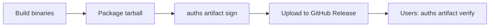

# Release Signing

Sign release artifacts with your Auths identity so users can verify who built them and that nothing was tampered with. No central server, no PGP keyservers -- just Git and cryptography.

## What you get

| Feature | Description |
|---------|-------------|
| **Tamper detection** | SHA-256 digest embedded in the signature; any modification is caught |
| **Provenance** | Signature ties the artifact to your `did:keri:` identity |
| **Stateless verification** | Identity bundles let anyone verify without `~/.auths` |
| **CI/CD integration** | Sign in release jobs, verify in downstream pipelines |

## How it works

1. You build and package your release artifacts (tarballs, zips, binaries)
2. `auths artifact sign` computes a SHA-256 digest and creates a dual-signed attestation with the `sign_release` capability
3. You upload both the artifact and its `.auths.json` signature to a GitHub Release
4. Users download both files and run `auths artifact verify` to confirm integrity and provenance

The signature file is a standard Auths [attestation](../../../concepts/attestations.md) -- the same format used for device authorization and commit signing.

## Next steps

- [Signing Tarballs](signing-tarballs.md) -- sign and publish release artifacts manually
- [GitHub Actions](github-actions.md) -- automate signing and verification in CI/CD
