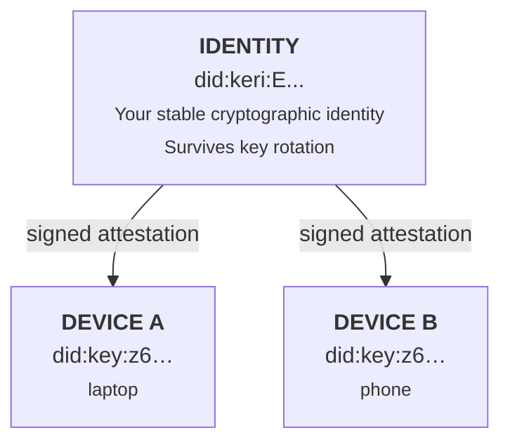

# Mental Model

Auths has three core ideas: **identity**, **devices**, and **attestations**. Everything else follows from these.

!!! info "The one thing to remember"
    **Your identity is not your key.** Keys live on devices and can be rotated. Your identity (`did:keri:E...`) is permanent and survives key changes. This distinction is what makes everything else work.

## The three layers

### Identity

Your identity is a `did:keri` identifier derived from an Ed25519 key. It's your permanent, portable name. Even if you rotate keys, the identity stays the same.

Think of it as: **"This is me."**

### Devices

Each machine you use gets its own `did:key` identifier -- its own Ed25519 keypair. Devices are not identities. They are instruments that act on behalf of an identity.

Think of it as: **"This is my laptop."**

### Attestations

An attestation is a signed JSON document that says: "Identity X authorizes Device Y." Both the identity key and the device key sign the attestation, creating a two-way binding.

Think of it as: **"My laptop is authorized to sign as me."**

## Why this matters

**Verification is local and offline.** To verify that a commit was signed by an authorized device, you only need:

1. The attestation (JSON with two signatures)
2. The identity's public key

No network call. No server. No blockchain lookup.

**Revocation is explicit.** When a device is compromised, you revoke its attestation. The revocation itself is a signed event stored in Git.

**Key rotation doesn't break history.** Because the identity DID is derived from the KERI event log, rotating keys produces a new signing key but the same DID. Past signatures verify against the historical key state.

## The payoff

If this seems like a lot of indirection, here's the payoff: **you get a single, stable identity that works across every device you own, survives key rotation, and can be verified offline with nothing but Git.** No accounts, no servers, no vendor lock-in. Just cryptography and Git refs.

## How it maps to storage

All data is stored as Git refs:

| Data | Git ref | Format |
|------|---------|--------|
| Identity | `refs/auths/identity` | JSON blob |
| Device attestation | `refs/auths/devices/nodes/<device-did>/` | JSON blob |
| Key event log | `refs/keri/kel` | Event entries |

The default storage location is `~/.auths` (a bare Git repository).
