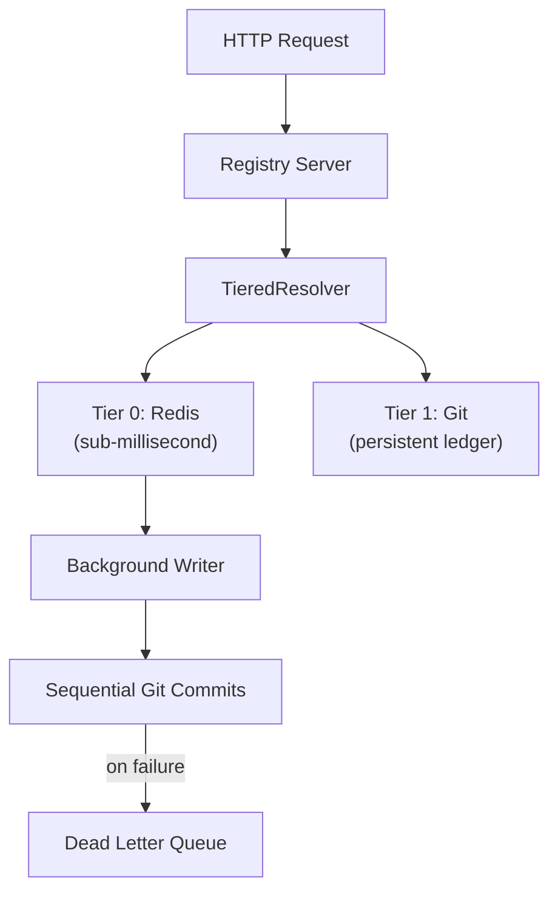

# Storage Architecture

## Overview

Auths uses a two-tier storage architecture to balance performance with durability:

- **Tier 0 (Hot cache):** Redis provides sub-millisecond identity lookups for the common case.
- **Tier 1 (Persistent ledger):** Git stores the authoritative cryptographic identity ledger on disk.

Most identity resolutions are served entirely from Redis. Git is only read on cache misses or when Redis is unavailable, and is written to asynchronously in the background.

## Architecture

## How Reads Work

When the registry server receives an identity lookup:

1. Check Redis for a cached copy of the identity state.
2. **Cache hit** — return immediately (sub-1ms).
3. **Cache miss** — read from the Git ledger, populate Redis, then return.

If Redis is unreachable, the system degrades gracefully to Git-only reads. Latency increases but the service stays available.

## How Writes Work

When an identity update is submitted:

1. Write the new state to Redis immediately.
2. Queue the update for the background worker.
3. Return success to the caller — the Git commit happens asynchronously.

The background worker processes updates sequentially, preserving the strict ordering required by KERI cryptographic hash chains.

## Failure Handling

KERI identity sequences are append-only hash chains. A dropped update would permanently corrupt the chain, so the system uses multiple layers of protection:

### Retry with Backoff

Failed Git writes are retried up to 3 times with exponential backoff (100ms, 400ms, 1600ms) plus random jitter to avoid contention.

### Dead Letter Queue

If all retries are exhausted, the message is routed to a Redis Stream dead letter queue (`auths:dlq:archival`) rather than being dropped. Messages in the DLQ can be inspected and replayed in order to restore chain integrity.

### Graceful Degradation

| Scenario | Behavior |
|----------|----------|
| Redis down (reads) | Falls through to Git. Higher latency, no downtime. |
| Redis down (writes) | Writes directly to Git synchronously. |
| Git lock contention | Retries with backoff, then routes to DLQ. |
| Git disk failure | DLQ preserves messages for replay after recovery. |

## Cache Behavior

- **TTL-based expiry:** Cached entries expire after a configurable duration (default: 1 hour).
- **Write-through:** On every identity update, Redis is written before Git, so the cache is always fresh.
- **Key format:** `auths:state:{did}` (e.g., `auths:state:did:keri:abc123`).
- **Serialization:** JSON, consistent with the Git blob format.

## Configuration

All settings are configured via environment variables:

| Environment Variable | Default | Description |
|----------------------|---------|-------------|
| `AUTHS_REDIS_URL` | `redis://127.0.0.1:6379` | Redis connection URL |
| `AUTHS_REDIS_POOL_SIZE` | `16` | Maximum Redis connection pool size |
| `AUTHS_CACHE_TTL_SECS` | `3600` | Cache entry time-to-live in seconds |
| `AUTHS_ARCHIVAL_CHANNEL_SIZE` | `1024` | Background writer queue buffer size |

## DLQ Recovery

If messages accumulate in the dead letter queue, follow these steps:

1. **Inspect** pending messages: `XRANGE auths:dlq:archival - +`
2. **Replay** messages in order (Redis Stream IDs preserve sequence).
3. **Verify** chain integrity: run `verify_chain(did)` for each affected identity.
4. **Remove** processed entries: `XDEL auths:dlq:archival <id>`
5. **Monitor** in production: alert when `XLEN auths:dlq:archival > 0`.
