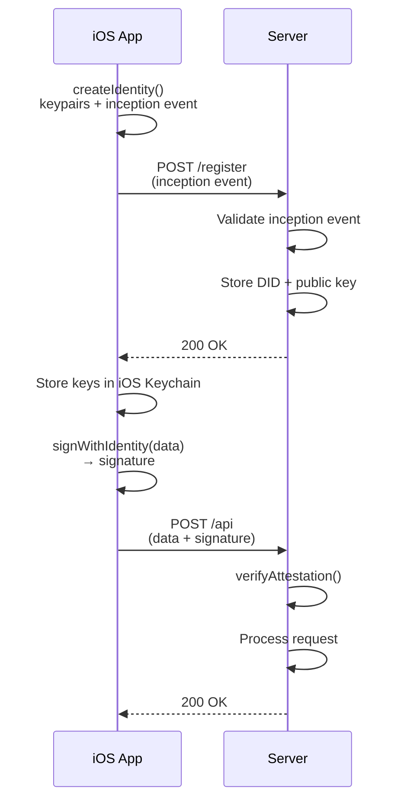

# Mobile Onboarding

Create an Auths identity on an iOS device and register it with a server.

## Architecture



## iOS implementation

```swift
import AuthsMobile

class OnboardingService {
    func createAccount() async throws -> String {
        // 1. Create identity on-device
        let identity = try createIdentity(deviceName: UIDevice.current.name)

        // 2. Store keys in iOS Keychain
        try KeychainService.save(
            key: identity.currentKeyPkcs8Hex,
            forKey: "auths-current-key"
        )
        try KeychainService.save(
            key: identity.nextKeyPkcs8Hex,
            forKey: "auths-next-key"
        )

        // 3. Register with server
        let response = try await API.post("/register", body: [
            "prefix": identity.prefix,
            "did": identity.did,
            "public_key_hex": identity.currentPublicKeyHex,
            "inception_event": identity.inceptionEventJson
        ])

        return identity.did
    }
}
```

## Server-side validation

```python
from auths_verifier import verify_attestation

@app.route("/register", methods=["POST"])
def register():
    data = request.json
    inception = data["inception_event"]
    pk_hex = data["public_key_hex"]

    # Validate the inception event is self-consistent
    # (signed by the key it claims to represent)
    result = verify_attestation(inception, pk_hex)
    if not result.valid:
        return jsonify({"error": "Invalid inception event"}), 400

    # Store the identity
    db.save_identity(
        did=data["did"],
        public_key=pk_hex,
        prefix=data["prefix"]
    )

    return jsonify({"status": "registered"})
```

## Security considerations

- Keys are generated using `ring::rand::SystemRandom` (cryptographically secure)
- Private keys never leave the device (stored in iOS Keychain)
- Inception events are self-authenticating (signed by the key they contain)
- The server should validate the inception event before trusting the identity
