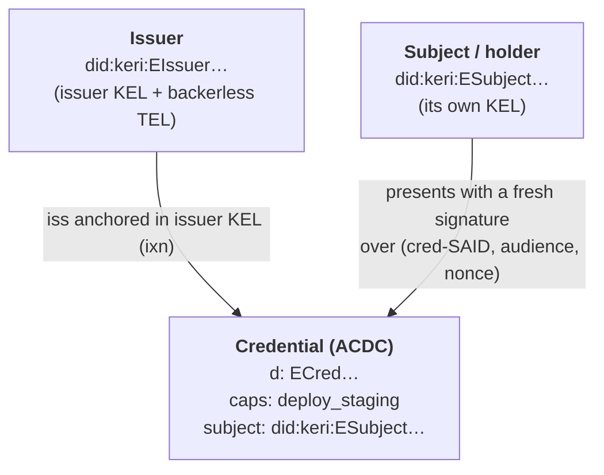

# Capability credentials

How a capability or role becomes a **verifiable credential** — issued by one KERI
identity to another, revocable per-credential, and honored only when the holder proves
they control the subject identity. Credentials are **ACDCs** (Authentic Chained Data
Containers) with KERI-native revocation through a **TEL** (Transaction Event Log)
anchored to the issuer's KEL — no central server, no bearer token.

This is the credential-grade upgrade to the [delegator-anchored scope
seal](delegation.md): the scope seal is the commit-time *advisory* fast path; a
credential is the *authoritative* source for credential-grade decisions, and it can be
revoked one at a time without rotating keys or revoking an identity.

## The credential model

A credential is a minimal ACDC `{v,d,i,ri,s,a}`:

- `v` — version string (`ACDC10JSON…`).
- `d` — the credential's SAID (self-addressing identifier).
- `i` — the **issuer** AID (`did:keri:`).
- `ri` — the registry SAID (the issuer's backerless TEL).
- `s` — the pinned capability **schema** SAID (embedded, immutable).
- `a` — the attributes: the **subject** AID (`a.i`), the granted capabilities, an
  optional role, and an optional expiry.

The subject `a.i` is a **KERI AID** — it has its own KEL. Authority is honored only when
the presenter proves *current* control of that AID. A possessed-but-unproven credential
grants nothing: it is **not a bearer token**.



## Step 1: The subject must have a KEL first

A credential's subject is a KERI AID, so the subject must exist before you can credential
it. For an agent or org member, delegate first (see [Delegation](delegation.md)):

```bash
auths id agent add --label deploy-bot --key my-key
# → did:keri:ESubject…
```

Issuing to a `did:keri:` that has no KEL hard-fails — there is no holder to bind to.

## Step 2: Issue the credential

The issuer mints an ACDC, anchors its `iss` event in the issuer's KEL, and lazily incepts
the backerless `vcp` registry on first issuance:

```bash
auths credential issue \
  --issuer my-key \
  --to did:keri:ESubject… \
  --cap deploy_staging --cap sign_commit \
  --role deployer \
  --expires-in 86400
```

What happens:

- A fresh ACDC `{v,d,i,ri,s,a}` is built; `a.i` is the subject AID, `a` carries the caps,
  role, and optional expiry, and `s` pins the embedded capability schema SAID.
- On the issuer's first issuance, a backerless (`NB`) `vcp` registry is incepted.
- The issuer signs the credential with its current signing key and anchors the TEL `iss`
  event in its **own** KEL with a `Seal::KeyEvent` `ixn`. The ACDC blob, the TEL event,
  and the KEL `ixn` land atomically in one commit.

The command prints the credential SAID (`ECred…`) — the handle for everything below.

## Step 3: Verify the credential

A relying party verifies a credential purely by replay — SAID, embedded schema, the
issuer's signing-time key, and the TEL status by KEL position:

```bash
auths credential verify ECred… --issuer my-key
```

This resolves the issuer KEL/TEL (and collects witness receipts) to the witnessed tip,
then reports a verdict:

- **valid** — SAID matches, attributes validate against the pinned schema, the `iss` is
  KEL-anchored and signed by the issuer's signing-time key, and no `rev` precedes the
  resolved tip. The output includes the "as-of" issuer KEL position.
- **revoked** / **expired** / **schema_invalid** / **issuer_signature_invalid** /
  **registry_not_established** / **issuer_kel_duplicitous** — distinct fail verdicts.
- **stale_or_unresolvable** — the issuer KEL/TEL could not be resolved to a fresh tip.
  This **fails closed**: absence of a `rev` against a stale view is never silently treated
  as "not revoked."

### Witnessed verification (fail-closed)

By default, verification runs in `Warn` mode: an under-quorum lifecycle anchor is a
non-fatal warning (trust-on-first-sight), and `detect_duplicity` still catches a
revocation hidden behind a KEL fork. To require witness quorum and fail closed:

```bash
auths credential verify ECred… --issuer my-key --require-witnesses
```

Under `--require-witnesses`, a credential is **valid only if** (a) the issuer's KEL
establishment events reached quorum, (b) its `vcp` *and* `iss` anchoring ixns reached
quorum, and (c) no quorum-reaching `rev` exists at or before the presentation's KEL
position. If a lifecycle anchor missed quorum, the verdict names which one
(`witness_quorum_not_met`). Witnessed fail-closed revocation depends on the witness
infrastructure (Epic D); see [ADR 008](../architecture/ADRs/008-acdc-tel-credentials.md).

## Step 4: Present the credential (holder-binding)

Verifying that a credential *exists and is not revoked* (Step 3) is distinct from a holder
proving they may *act* on it. Authority is honored only on proof of current control of the
subject AID — the credential is **not a bearer token**. This holder-binding presentation
is the model wired into the policy seam; it is exercised through the SDK, not a standalone
CLI verb.

The v1 default is **interactive challenge-response**:

1. The verifier issues a fresh single-use nonce bound to one `(audience, credential-SAID)`
   (an SDK `ChallengeSession`).
2. The subject signs `(credential-SAID || audience || nonce)` with its **current** signing
   key (`present_credential` → a `PresentationEnvelope`).
3. The verifier checks the envelope against the subject's KEL with
   `verify_presentation`, producing a `PresentationVerdict`:
   - **Valid** — the inner credential verified *and* the presenter proved current
     subject-key control. Only this variant carries authority (issuer, subject, caps,
     role, expiry).
   - **HolderNotCurrentKey** / **WrongAudience** / **NonceMismatchOrConsumed** /
     **Expired** / **SubjectKelInvalid** / **CredentialNotValid** — fail-closed.

A non-interactive path binds `(audience, purpose, short-TTL)` for audiences where no
challenge round-trip is possible, with a documented within-TTL same-audience replay
residual.

Only a `Valid` presentation flows into a policy decision: `context_from_credential` builds
an authority-bearing context **only** from a holder-verified presentation, never from a
raw ACDC — closing the bearer hole at the policy seam. Full IPEX grant/admit is deferred
(see [ADR 008](../architecture/ADRs/008-acdc-tel-credentials.md)); the v1 presentation
signature is what shipped.

## Step 5: Revoke a credential

The issuer revokes a single credential by anchoring a TEL `rev` in its KEL — no key
rotation, no identity revocation:

```bash
auths credential revoke ECred… --issuer my-key
auths credential list --issuer my-key            # the live set excludes it
auths credential list --issuer my-key --include-revoked
```

Revocation is **ordered by KEL position, not wall-clock** (the same discipline as agent
revocation): a presentation made *before* the `rev`'s position stays valid; one made
*after* it reports revoked. `revoke` is idempotent.

## What this is, and is not

**Is:** holder-bound (never bearer), per-credential revocable, witness-checked and
freshness-checked revocation, dual-curve (P-256 default + Ed25519), with a pinned embedded
schema and KEL-anchored issuance.

**Is not (v1):** not selectively disclosable — selective/graduated disclosure (`u`/`A`) is
a SAID-breaking v2, not an additive change. Not full IPEX — the v1 presentation *signature*
shipped, the full grant/admit choreography did not. No edge (`e`) / rule (`r`) content, no
OIDC→ACDC binding, no `Auths-Credential` commit trailer. These are tracked as deferred
scope in [ADR 008](../architecture/ADRs/008-acdc-tel-credentials.md).

## See also

- [ADR 008 — Credential-grade capabilities via ACDC + TEL](../architecture/ADRs/008-acdc-tel-credentials.md)
- [Delegation](delegation.md) (the advisory scope seal this upgrades; how a subject gets a KEL)
- [ADR 007 — Agent identity via delegation](../architecture/ADRs/007-agent-identity-via-delegation.md)
- [Trust model](trust-model.md)
