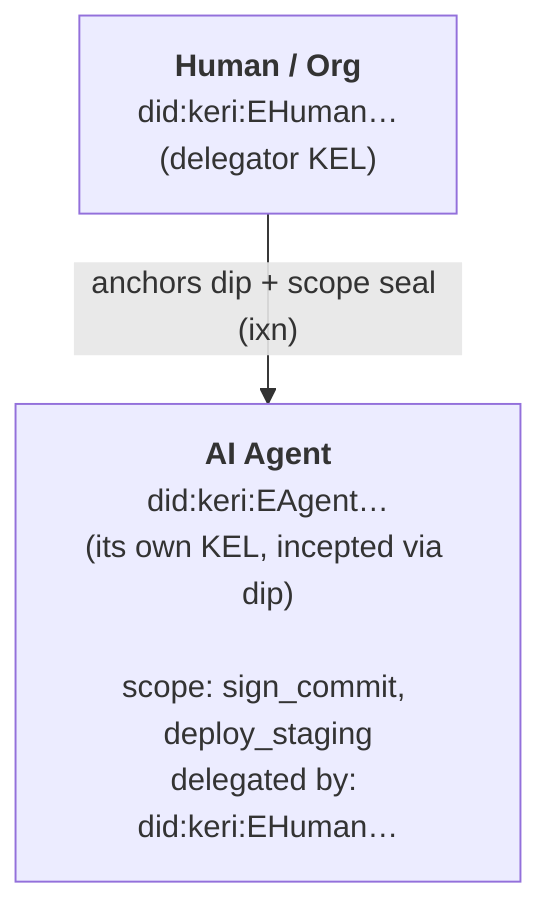

# Delegation

How authority flows from a human (or organization) to an AI agent, and how
verifiers trace actions back to the authorizing identity — entirely through the
Key Event Log (KEL), not through bearer tokens or stand-alone attestations.

## The delegation model

An agent is a **KERI delegated identifier**. It has its own KEL, incepted with a
`dip` (delegated inception) event that names the delegator's identity as its
delegator (`di`). The delegator **anchors** that `dip` in its own KEL with an `ixn`
whose seal points at the agent's inception event. Authority is therefore a fact in
the delegator's KEL, provable by replay — there is no attestation to trust and no
token to leak.

Capabilities and expiry ride a **delegator-anchored scope seal** in the delegator's
KEL: the delegator asserts what the agent may do. A delegate can only **narrow** the
delegator's scope, never widen it.



## Step 1: Create the delegator identity

The human operator (or organization) creates a KERI identity:

```bash
auths init
```

This produces the delegator's inception event (`icp`). The delegator's `did:keri`
is the root of authority; its signing key is what anchors every delegation.

## Step 2: Delegate an agent (`dip`, anchored by the delegator)

The delegator mints an agent as a delegated identifier and anchors it:

```bash
auths id agent add \
  --label deploy-bot \
  --key my-key \
  --scope sign_commit --scope deploy_staging \
  --expires-in 86400
```

What happens:

- A fresh agent key is generated; the agent's `dip` names the delegator as `di`.
- The delegator authors an `ixn` in its **own** KEL whose `Seal::KeyEvent` anchors
  the agent's `dip`. The `dip`/`drt` carry the reciprocal `-G` source seal, so the
  binding is **bilateral** (delegator-side seal + delegate-side back-reference) and
  byte-interoperable with keripy.
- The delegator anchors a **scope seal** carrying the requested capabilities and
  optional expiry. The requested scope must be a subset of the delegator's own.

The agent's `did:keri` is self-addressing — derived from its `dip` SAID.

## Step 3: Agent acts and rotates its own key

The agent signs commits and artifacts with its **own** private key, within its
delegator-anchored scope. It rotates its key without involving the delegator's key
material beyond the anchoring `ixn`:

```bash
auths id agent rotate did:keri:EAgent… --key my-key
```

This authors a `drt` on the agent's KEL (revealing its pre-committed next key) which
the delegator anchors. Replay holds; the old key stops verifying.

## Step 4: Verifier walks the KEL

A relying party verifies an agent-signed commit purely by KEL replay — no network
call, no central authority:

1. **Agent KEL valid?** The `dip`/`drt` chain replays and the signing key is the
   agent's current key.
2. **Delegated by the claimed root?** The delegator's KEL anchors the agent's `dip`
   (bilateral seal check).
3. **Not revoked?** No revocation seal precedes the signing event **by KEL
   position** (revocation is ordered against the signing event by KEL position, not
   wall-clock — a commit signed before revocation stays valid; one signed after
   fails).
4. **In scope and unexpired?** The signed action is within the delegator-anchored
   scope, and the injected verification time is before any anchored expiry.

```bash
auths verify HEAD
```

If any check fails — unanchored `dip`, revoked agent, out-of-scope action, expiry
passed — the commit is rejected (`OutsideAgentScope` / `AgentExpired` /
`SignedAfterRevocation`).

## Capability narrowing (delegator-anchored)

Scope follows a strict narrowing rule, enforced at delegation time against the
delegator's own anchored scope:

| Level | Entity | Scope |
|-------|--------|-------|
| Root | Human / Org | `sign_commit`, `deploy_staging`, `deploy_production` |
| Agent | `deploy-bot` | `sign_commit`, `deploy_staging` |

A delegate can never be granted a capability the delegator does not itself hold; the
SDK rejects an over-broad request with `OutsideDelegatorScope`.

## Revoking an agent

The delegator anchors a revocation seal in its KEL:

```bash
auths id agent revoke did:keri:EAgent… --key my-key
auths id agent list                      # the live set excludes it
```

Existing signatures from before the revocation's KEL position remain valid (they
were valid when authored); signatures ordered after it fail.

## Organization members

An organization member is the same primitive: a `dip` delegated by the **org AID**.
The org anchors the member's `dip` and a scope seal carrying the member's role and
capabilities:

```bash
auths org add-member --org did:keri:EOrg… --member alice --role member --key org-myorg
auths org list-members --org did:keri:EOrg…
auths org revoke-member --org did:keri:EOrg… --member did:keri:EAlice… --key org-myorg
```

Org authority is read **fail-closed from the KEL**: a member the org revoked on its
KEL is unauthorized even if a stale attestation is still present. (`kt≥2` org
delegators are not yet supported and return a typed error — see
[ADR 007](../architecture/ADRs/007-agent-identity-via-delegation.md).)

## Cloud access via OIDC

Once an agent has a valid, KEL-anchored delegation, it can exchange it for a standard
JWT through the [OIDC bridge](../architecture/oidc-bridge.md): the bridge verifies the
delegation by KEL replay (no IdP callback) and issues an RS256 JWT carrying the
agent's `keri_prefix`, capabilities, and delegator provenance — so cloud-side audit
logs trace the action back through the KEL to the authorizing human or org.

## See also

- [ADR 007 — Agent identity via delegation](../architecture/ADRs/007-agent-identity-via-delegation.md)
- [Device model](../architecture/device-model.md) (devices and agents share the `dip`/`drt` mechanism)
- [Agent provisioning](../AGENT_PROVISIONING.md)
