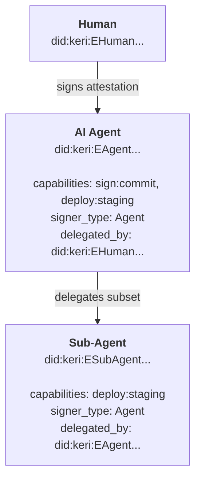

# Delegation

How authority flows from a human operator to an AI agent (or any automated system), and how verifiers trace actions back to the authorizing human.

## The delegation model

Auths delegation is a cryptographic chain of signed attestations. Each link in the chain grants a subset of the parent's capabilities to a child entity. Capabilities can only narrow at each hop — never widen.



## Step 1: Human creates identity and links a device

The human operator creates a KERI identity and links their device:

```bash
auths init
```

This produces an inception event and a device attestation:

```json
{
  "version": 1,
  "issuer": "did:keri:EHuman123...",
  "subject": "did:key:z6MkHumanDevice...",
  "capabilities": ["sign:commit", "deploy:staging", "deploy:production"],
  "signer_type": "Human",
  "expires_at": null
}
```

The human's attestation has no `delegated_by` — this is the root of the chain.

## Step 2: Human issues attestation to an AI agent

The human creates a scoped, time-limited attestation granting specific capabilities to an agent:

```bash
auths device link \
  --device-did did:key:z6MkAgentDevice... \
  --key my-key \
  --capabilities "sign:commit,deploy:staging" \
  --expires-in 24h
```

The resulting attestation:

```json
{
  "version": 1,
  "issuer": "did:keri:EHuman123...",
  "subject": "did:key:z6MkAgentDevice...",
  "capabilities": ["sign:commit", "deploy:staging"],
  "signer_type": "Agent",
  "delegated_by": "did:keri:EHuman123...",
  "expires_at": "2026-03-05T12:00:00Z",
  "identity_signature": "aabb...",
  "device_signature": "ccdd..."
}
```

Notice:

- **Capabilities narrowed**: The agent gets `sign:commit` and `deploy:staging`, but not `deploy:production`.
- **Time-bounded**: The attestation expires in 24 hours.
- **`delegated_by`** points to the human's identity, creating the accountability link.
- **Dual-signed**: Both the human's identity key and the agent's device key sign the attestation.

## Step 3: Agent acts and signs artifacts

The agent uses its attestation to sign commits, deploy to staging, or perform any action within its granted capabilities. Each signature is produced by the agent's own private key.

If the agent needs to delegate further — for example, spawning a sub-agent for a specific task — it issues a new attestation with further-narrowed capabilities:

```json
{
  "version": 1,
  "issuer": "did:keri:EAgent456...",
  "subject": "did:key:z6MkSubAgent...",
  "capabilities": ["deploy:staging"],
  "signer_type": "Agent",
  "delegated_by": "did:keri:EAgent456...",
  "expires_at": "2026-03-05T06:00:00Z"
}
```

The sub-agent's capabilities are a strict subset of the parent agent's. The expiration is shorter. The chain grows but authority only shrinks.

## Step 4: Verifier walks the chain

When a relying party receives a signed artifact, it verifies the full attestation chain using `verify_chain()`:

```bash
auths verify chain.json
```

The verifier checks, from leaf to root:

1. **Sub-Agent → Agent**: Is the sub-agent's attestation signed by the agent? Are the sub-agent's capabilities a subset of the agent's? Is it expired?
2. **Agent → Human**: Is the agent's attestation signed by the human? Are the capabilities valid? Is it expired?
3. **Human → KEL**: Does the human's identity key match the current key in the Key Event Log?

If any link fails — invalid signature, expired attestation, capability not granted — the entire chain is rejected.

The verification is a pure computation. No network call. No central authority. The verifier needs only the attestation chain and the root public key.

## Capability narrowing

Capabilities follow a strict narrowing rule across delegation hops:

| Hop | Entity | Capabilities |
|-----|--------|-------------|
| Root | Human | `sign:commit`, `deploy:staging`, `deploy:production` |
| Hop 1 | Agent | `sign:commit`, `deploy:staging` |
| Hop 2 | Sub-Agent | `deploy:staging` |

A child can never grant capabilities it does not possess. The OIDC bridge enforces this at token exchange time through intersection-based scope-down: the issued JWT contains only the intersection of the chain-granted capabilities and the capabilities the agent requests.

## Cloud access via OIDC

Once an agent has a valid attestation chain, it can exchange it for a standard JWT through the [OIDC bridge](../architecture/oidc-bridge.md):

1. Agent presents its attestation chain to the bridge's `/token` endpoint
2. Bridge verifies the chain cryptographically (no IdP callback)
3. Bridge issues a standard RS256 JWT with the agent's capabilities as claims
4. Agent uses the JWT with AWS STS, GCP Workload Identity, or Azure AD

The JWT includes `keri_prefix`, `capabilities`, and `delegated_by` provenance — so cloud-side audit logs can trace the action back through the full delegation chain to the originating human.
