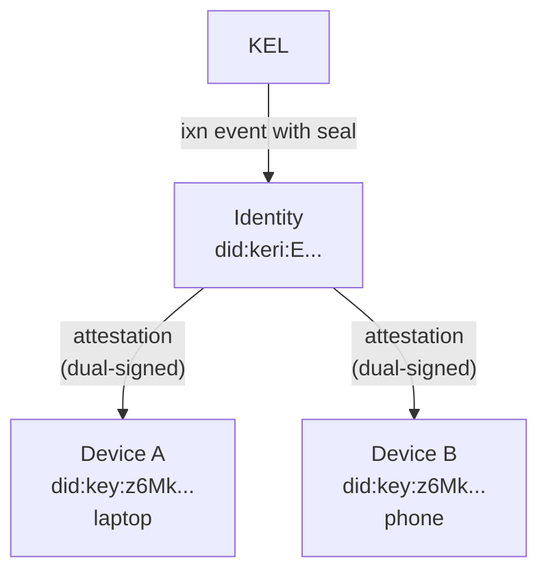
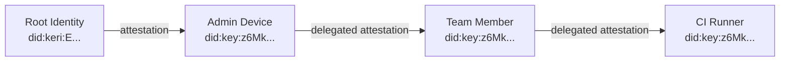

# Identity Lifecycle

An Auths identity moves through distinct phases: creation, device linking, key rotation, and optionally recovery or abandonment. This page walks through each phase and how attestations tie them together.

## Lifecycle overview

```mermaid
stateDiagram-v2
    [*] --> Inception: auths id create
    Inception --> Active: Identity created<br/>KEL seq 0
    Active --> Active: Link device<br/>IXN event anchors attestation
    Active --> Rotated: Rotate keys<br/>ROT event, KEL seq +1
    Rotated --> Active: New key active
    Active --> Recovered: Recovery via<br/>pre-committed next key
    Recovered --> Active: New key active
    Active --> Abandoned: Abandon identity<br/>ROT with empty next commitment
    Abandoned --> [*]
```



## Phase 1: Inception (creation)

Identity creation generates two Ed25519 keypairs and writes a single inception event to the Key Event Log.

```
auths id create --local-key-alias my-key
```

What happens internally:

1. **Current keypair** generated -- used for signing immediately
2. **Next keypair** generated -- committed to but not yet used (pre-rotation)
3. **Inception event** constructed with:
    - The current public key in the `k` field (prefixed with `D` for Ed25519)
    - A Blake3 hash of the next public key in the `n` field (prefixed with `E`)
4. The event's **SAID** (Self-Addressing Identifier) is computed via Blake3 hash of the canonical event JSON
5. The SAID becomes both the event identifier (`d`) and the identity prefix (`i`)
6. The event is **signed** with the current key and stored at `refs/did/keri/<prefix>/kel`
7. Both keypairs are **encrypted** and stored in the platform keychain

The resulting identity DID is `did:keri:<prefix>`, where the prefix starts with `E` (the Blake3 derivation code).

## Phase 2: Device linking

Each machine gets its own `did:key` identifier -- its own Ed25519 keypair. Linking a device to your identity creates a **dual-signed attestation**.

```
auths device link
```

The attestation binds the identity to the device:

- **Issuer**: your `did:keri:E...` identity
- **Subject**: the device's `did:key:z6Mk...`
- **Signatures**: both the identity key and the device key sign the canonical attestation data
- **Capabilities**: what the device is authorized to do (e.g., `sign_commit`, `sign_release`)

The attestation is stored as a JSON blob under `refs/auths/devices/nodes/<device-did>/signatures`. It is also anchored in the KEL via an interaction event (`ixn`) that includes a seal containing the attestation's digest.



### Multi-device model

You can link multiple devices to the same identity. Each device gets its own attestation with its own capabilities and expiration. Devices are independent -- revoking one does not affect the others.

| Device | Capabilities | Expires |
|--------|-------------|---------|
| Laptop | `sign_commit`, `sign_release` | 2027-01-01 |
| Phone | `sign_commit` | 2026-06-01 |
| CI runner | `sign_release` | 2026-04-01 |

## Phase 3: Key rotation

Key rotation replaces the current signing key while keeping the same `did:keri` identity. Auths uses KERI pre-rotation: the next key was already committed to at inception (or at the previous rotation).

```
auths id rotate --alias my-key
```

What happens internally:

1. The KEL is loaded and validated (replayed from inception to current state)
2. The **next keypair** (from the previous event's commitment) is verified against the commitment
3. A new **next keypair** is generated for future rotation
4. A **rotation event** (`rot`) is constructed:
    - `k`: the new current key (the former next key)
    - `n`: Blake3 hash of the new next key (new pre-commitment)
    - `p`: SAID of the previous event (chain linkage)
    - `s`: incremented sequence number
5. The event is signed with the new current key and appended to the KEL

```
KEL after one rotation:

  ┌──────────────────────┐     ┌──────────────────────┐
  │ icp (seq 0)          │     │ rot (seq 1)          │
  │ d: E<said>           │────>│ p: E<said>           │
  │ k: [D<key_A>]        │     │ k: [D<key_B>]        │
  │ n: [E<hash(key_B)>]  │     │ n: [E<hash(key_C)>]  │
  └──────────────────────┘     └──────────────────────┘
```

After rotation:

- The identity DID (`did:keri:E...`) stays the same
- Historical signatures remain valid -- they verify against the key that was active at signing time
- The old key is retained in the keychain for verifying historical signatures

## Phase 4: Revocation

When a device is compromised or decommissioned, its attestation is revoked. Revocation is a signed event: the identity key signs a new attestation with the `revoked_at` field set.

```
auths device revoke --device-did <DEVICE_DID> --key <KEY_ALIAS>
```

The revoked attestation replaces the original at the same Git ref path. The revocation is anchored in the KEL via an interaction event. After revocation, signatures from that device will fail verification (the verifier checks the `revoked_at` field).

## Phase 5: Recovery

If a signing key is suspected compromised, recovery uses the pre-committed next key. This is the same mechanism as rotation, but motivated by urgency rather than hygiene.

The pre-rotation commitment provides the security guarantee: even if an attacker compromises the current key, they cannot rotate to their own key because they do not hold the pre-committed next key. Only the legitimate owner, who generated the next key at inception (or at the last rotation), can perform a valid rotation.

After recovery:

1. Rotate to the pre-committed next key
2. Revoke any attestations for compromised devices
3. Re-issue attestations for legitimate devices with the new key

## Phase 6: Abandonment

An identity can be permanently abandoned by performing a rotation with an empty next-key commitment (`n: []`, `nt: "0"`). After abandonment, no further rotations are possible.

```
KEL after abandonment:

  ┌──────────────────────┐     ┌──────────────────────┐
  │ icp (seq 0)          │     │ rot (seq 1)          │
  │ k: [D<key_A>]        │────>│ k: [D<key_B>]        │
  │ n: [E<hash(key_B)>]  │     │ n: []                 │
  │                      │     │ nt: "0"               │
  └──────────────────────┘     └──────────────────────┘
                                       ↓
                               Identity is abandoned.
                               No further rotation possible.
```

The `KeyState.is_abandoned` flag is set to `true` and `can_rotate()` returns `false`. The identity can still be used for verification of historical data, but cannot issue new attestations or rotate keys.

## Attestation chain

Attestations can form chains for delegation. The `delegated_by` field links an attestation to the parent attestation that granted authority. Verification walks the chain from the root identity to the leaf device, checking each link:



At each link in the chain:

- The `subject` of the previous attestation must match the `issuer` of the next
- Both the `identity_signature` and `device_signature` must be valid
- The attestation must not be expired or revoked
- The delegating attestation must have sufficient capabilities

Chain verification is performed by `verify_chain()` in the `auths-verifier` crate -- a pure function with no dependencies on Git, network, or platform.

## Summary

| Phase | KEL event | What changes | What stays the same |
|-------|-----------|-------------|-------------------|
| Inception | `icp` (seq 0) | Identity created | -- |
| Device link | `ixn` | New attestation anchored | Identity DID, keys |
| Rotation | `rot` (seq +1) | Active signing key, next-key commitment | Identity DID, attestation history |
| Revocation | `ixn` | Device attestation marked revoked | Identity DID, keys |
| Recovery | `rot` (seq +1) | Active signing key (emergency) | Identity DID |
| Abandonment | `rot` (seq +1, `n: []`) | Identity frozen | Historical validity |
