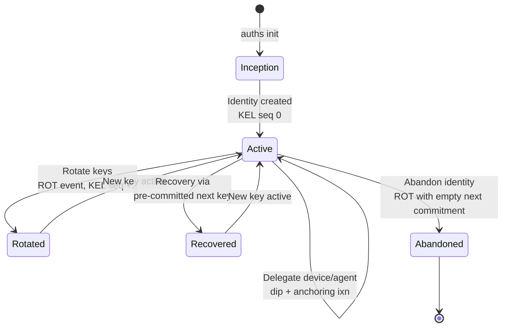
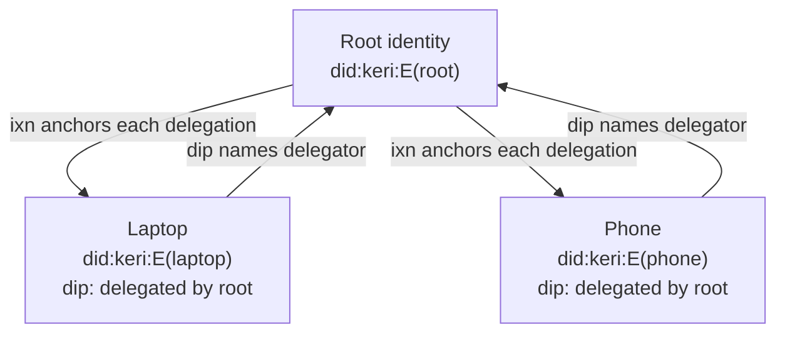

# Identity Lifecycle

An Auths identity moves through distinct phases: creation, device delegation, key rotation, and optionally recovery or abandonment. This page walks through each phase.

## Lifecycle overview



## Phase 1: Inception (creation)

Identity creation (`auths init`) generates two keypairs (P-256 by default) and writes a single inception event to the Key Event Log.

What happens internally:

1. **Current keypair** generated -- used for signing immediately
2. **Next keypair** generated -- committed to but not yet used (pre-rotation)
3. **Inception event** constructed with:
    - The current public key in the `k` field (with its CESR derivation code — `1AAJ` for P-256, `D` for Ed25519)
    - A hash of the next public key in the `n` field (prefixed with `E`)
4. The event's **SAID** (Self-Addressing Identifier) is computed over the canonical event bytes
5. The SAID becomes both the event identifier (`d`) and the identity prefix (`i`)
6. The event is **signed** with the current key (the signature travels as a CESR attachment) and stored in the registry
7. Both keypairs are **encrypted** and stored in the platform keychain

The whole sequence is transactional — if any step fails (for example, a passphrase that fails the strength policy), nothing is left behind.

The resulting identity DID is `did:keri:<prefix>`, where the prefix starts with `E`.

## Phase 2: Device delegation

Each additional machine gets **its own identity, delegated under yours**. The device generates its own keypair and a *delegated inception* event (`dip`) naming your root as delegator; your root anchors that delegation in its own KEL with an interaction event. The result is a two-way cryptographic link a verifier can replay.

```
auths pair          # QR / short-code pairing with the new device
auths device add    # or: create a delegated device directly
```



Delegations can carry **capability scopes** (an agent that may only `sign_commit`) and
**expirations**. Agents use exactly the same mechanism — see
[Agent Identities](../guides/agents/agent-identities.md).

### Multi-device model

Each device has its own KEL and its own keys. Devices are independent — revoking one
does not affect the others, and a root key rotation does not invalidate device
delegations (verifiers resolve authority by replaying the logs).

| Device | Mechanism | Scope |
|--------|-----------|-------|
| Laptop | delegated `did:keri:` | unrestricted |
| Phone | delegated `did:keri:` | unrestricted |
| Deploy agent | delegated `did:keri:` | `sign_commit`, expires in 7 days |

!!! note "Legacy: attestation-based linking"
    The older `auths device link` flow binds a device via a dual-signed attestation
    instead of delegation. It is kept for compatibility; new setups should use
    `auths pair` / `auths device add`.

## Phase 3: Key rotation

Key rotation replaces the current signing key while keeping the same `did:keri` identity. Auths uses KERI pre-rotation: the next key was already committed to at inception (or at the previous rotation).

```
auths id rotate --alias my-key
```

What happens internally:

1. The KEL is loaded and validated (replayed from inception to current state)
2. The **next keypair** (from the previous event's commitment) is verified against the commitment
3. A new **next keypair** is generated for future rotation
4. A **rotation event** (`rot`) is constructed:
    - `k`: the new current key (the former next key)
    - `n`: hash of the new next key (new pre-commitment)
    - `p`: SAID of the previous event (chain linkage)
    - `s`: incremented sequence number
5. The event is signed with the new current key and appended to the KEL

```
KEL after one rotation:

  ┌──────────────────────┐     ┌──────────────────────┐
  │ icp (seq 0)          │     │ rot (seq 1)          │
  │ d: E<said>           │────>│ p: E<said>           │
  │ k: [<key_A>]         │     │ k: [<key_B>]         │
  │ n: [E<hash(key_B)>]  │     │ n: [E<hash(key_C)>]  │
  └──────────────────────┘     └──────────────────────┘
```

After rotation:

- The identity DID (`did:keri:E...`) stays the same
- Historical signatures remain valid -- they verify against the key that was active at signing time
- The old key is retained in the keychain for verifying historical signatures

## Phase 4: Revocation

When a device is compromised or decommissioned, its attestation is revoked. Revocation is a signed event: the identity key signs a new attestation with the `revoked_at` field set.

```
auths device revoke --device <DEVICE_DID> --key <KEY_ALIAS>
```

The revoked attestation replaces the original at the same Git ref path. The revocation is anchored in the KEL via an interaction event. After revocation, signatures from that device will fail verification (the verifier checks the `revoked_at` field).

## Phase 5: Recovery

If a signing key is suspected compromised, recovery uses the pre-committed next key. This is the same mechanism as rotation, but motivated by urgency rather than hygiene.

The pre-rotation commitment provides the security guarantee: even if an attacker compromises the current key, they cannot rotate to their own key because they do not hold the pre-committed next key. Only the legitimate owner, who generated the next key at inception (or at the last rotation), can perform a valid rotation.

After recovery:

1. Rotate to the pre-committed next key
2. Revoke any attestations for compromised devices
3. Re-issue attestations for legitimate devices with the new key

## Phase 6: Abandonment

An identity can be permanently abandoned by performing a rotation with an empty next-key commitment (`n: []`, `nt: "0"`). After abandonment, no further rotations are possible.

```
KEL after abandonment:

  ┌──────────────────────┐     ┌──────────────────────┐
  │ icp (seq 0)          │     │ rot (seq 1)          │
  │ k: [<key_A>]         │────>│ k: [<key_B>]         │
  │ n: [E<hash(key_B)>]  │     │ n: []                 │
  │                      │     │ nt: "0"               │
  └──────────────────────┘     └──────────────────────┘
                                       ↓
                               Identity is abandoned.
                               No further rotation possible.
```

The `KeyState.is_abandoned` flag is set to `true` and `can_rotate()` returns `false`. The identity can still be used for verification of historical data, but cannot issue new attestations or rotate keys.

## Attestation chains (artifact provenance)

Attestations still play a role outside device identity: artifact signing produces
attestation chains, and the `delegated_by` field links an attestation to the parent
that granted authority. Verification walks the chain, checking each link:

- The `subject` of the previous attestation must match the `issuer` of the next
- All signatures must be valid
- The attestation must not be expired or revoked
- The delegating attestation must have sufficient capabilities

Chain verification is performed by `verify_chain()` in the `auths-verifier` crate -- a pure function with no dependencies on Git, network, or platform.

## Summary

| Phase | KEL event | What changes | What stays the same |
|-------|-----------|-------------|-------------------|
| Inception | `icp` (seq 0) | Identity created | -- |
| Device delegation | `dip` + anchoring `ixn` | New delegated device/agent identity | Identity DID, keys |
| Rotation | `rot` (seq +1) | Active signing key, next-key commitment | Identity DID, attestation history |
| Revocation | `ixn` | Device attestation marked revoked | Identity DID, keys |
| Recovery | `rot` (seq +1) | Active signing key (emergency) | Identity DID |
| Abandonment | `rot` (seq +1, `n: []`) | Identity frozen | Historical validity |
