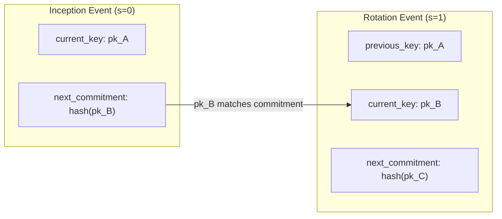

# Key Rotation

Key rotation replaces your active signing key while preserving your `did:keri` identity. Auths uses KERI pre-rotation, which means the next rotation key is cryptographically committed to before it is ever needed.

## When to rotate keys

- **Scheduled key hygiene** -- periodic replacement to limit the window of any potential compromise
- **Suspected compromise** -- the current key may have been exposed
- **Personnel change** -- a team member with access to the key is leaving
- **Emergency response** -- use `auths emergency rotate-now` for immediate rotation with an interactive safety flow

## How rotation works

When your identity is created (`auths init` or `auths id create`), two Ed25519 keypairs are generated:

1. **Current key** -- used for signing now
2. **Next key** -- a pre-committed rotation key, stored encrypted in the keychain under a derived alias (`<alias>--next-<sequence>`)

A hash of the next key's public key is included in the inception event. This creates a binding: only the holder of the pre-committed next key can perform a valid rotation.



After rotation:

- `pk_B` becomes the active signing key
- `pk_C` is pre-committed for the next rotation
- A new rotation event is appended to the Key Event Log (KEL)
- The old pre-committed key alias is cleaned up from the keychain

## Performing a rotation

### Standard rotation

```bash
auths id rotate --alias my-key
```

This uses the current key alias to find the pre-committed next key, generates a fresh future rotation key, and appends a rotation event to the KEL.

You will be prompted for:

1. The passphrase for the pre-committed next key
2. A new passphrase for the rotated key alias (entered twice for confirmation)

### Specifying a new alias

```bash
auths id rotate --alias my-key --next-key-alias my-key-v2
```

After this command, `my-key-v2` is the active signing key alias. Update any Git configuration or CI secrets that reference the old alias.

### Using `--current-key-alias` (alternative flag)

```bash
auths id rotate --current-key-alias my-key --next-key-alias my-key-v2
```

The `--current-key-alias` flag is equivalent to `--alias` and cannot be combined with it.

### Modifying witness configuration during rotation

```bash
auths id rotate --alias my-key \
  --add-witness "B<prefix>" \
  --witnesses-required 1
```

| Flag | Description |
|------|-------------|
| `--add-witness <PREFIX>` | Add a witness prefix (repeatable) |
| `--remove-witness <PREFIX>` | Remove a witness prefix (repeatable) |
| `--witnesses-required <N>` | Number of witnesses required to accept this rotation |

## Emergency rotation

For suspected key compromise, use the emergency rotation flow:

```bash
auths emergency rotate-now
```

This launches an interactive flow that:

1. Prompts for the current signing key alias
2. Prompts for a new key alias
3. Requires typing `ROTATE` to confirm
4. Performs the rotation
5. Prints next steps for re-authorizing devices

!!! warning "All devices must re-authorize after rotation"
    Rotation changes the active identity key. Existing device attestations were signed by the old key. Run `auths device link` on each device to create fresh attestations signed by the new key.

For non-interactive use (CI, scripts):

```bash
auths emergency rotate-now \
  --current-alias my-key \
  --next-alias my-key-v2 \
  --reason "Suspected key exposure" \
  --yes
```

Use `--dry-run` to preview actions without making changes:

```bash
auths emergency rotate-now --dry-run
```

## What happens to old signatures after rotation

**Old signatures remain valid.** Verification resolves the key state at signing time by walking the Key Event Log. A commit signed by `pk_A` at sequence 0 still verifies against `pk_A`, even after the identity has rotated to `pk_B` at sequence 1.

### What stays the same

- Your `did:keri:E...` identifier
- Your attestation history
- Historical signature validity

### What changes

- The active signing key (the keypair used for new signatures)
- The KEL gains a rotation event entry
- Device attestations need to be re-created with the new key

## Key Event Log (KEL)

The KEL is a hash-linked sequence of signed events:

| Event type | Description |
|------------|-------------|
| **Inception** | Creates the identity; commits to the first rotation key |
| **Rotation** | Replaces the active key; commits to the next rotation key |
| **Interaction** | Non-key-changing event (anchoring data to the log) |

Each event is signed by the current key and references the previous event's SAID (Self-Addressing Identifier Digest), forming a tamper-evident chain.

The KEL is stored in Git at `refs/keri/kel` (legacy backend) or packed under `refs/auths/registry` (registry backend).

## Security properties

- **Pre-commitment prevents key hijacking** -- even if the current key is compromised, the attacker cannot rotate to their own key because they do not hold the pre-committed next key
- **Forward security** -- rotating keys limits the window of compromise
- **Non-repudiation** -- the KEL provides a tamper-evident history of all key changes
- **Commitment verification** -- during rotation, the next key's public key is verified against the hash committed in the previous event; a mismatch aborts the rotation

## Post-rotation checklist

1. Re-authorize devices: `auths device link` on each device
2. Update CI/CD secrets if they reference the old key alias
3. Verify the setup: `auths doctor`
4. Confirm the new key is active: `auths id show`
