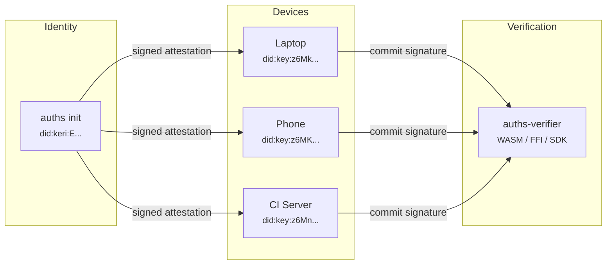

---
hide:
  - navigation
  - toc
---

<h1 class="hero-text">Decentralized Identity for Developers</h1>

One identity, multiple devices, Git-native storage. Sign commits with a cryptographic identity that lives in your keychain — no servers, no blockchain, no GPG.

[Get Started](getting-started/quickstart.md){ .md-button .md-button--primary }
&nbsp;&nbsp;
[Read Concepts](concepts/mental-model.md){ .md-button }

-   :material-key-variant: **One Identity, Many Devices**

    ---

    Create a stable `did:keri` identity and link your laptop, phone, and CI server to it via signed attestations. Every device signs as **you**.

    [How identity works](concepts/identity/index.md)

-   :material-shield-lock: **Git-Native Storage**

    ---

    Attestations are stored as Git refs — no database, no central server. Your `~/.auths` repo is the single source of truth, with offline-first operation.

    [See Git layouts](concepts/git-layouts.md)

-   :material-check-decagram: **Verify Anywhere**

    ---

    Embed `auths-verifier` via **WASM**, **FFI**, or native SDKs. Verify attestation chains in browsers, CI pipelines, mobile apps, and backend services.

    [Explore SDKs](sdks/overview.md)

-   :material-rotate-right: **Key Rotation Built In**

    ---

    KERI pre-rotation lets you replace signing keys while preserving your identity. Past signatures remain valid. No key re-distribution.

    [Understand rotation](concepts/key-rotation.md)

-   :material-devices: **Cross-Platform**

    ---

    macOS Keychain, Linux Secret Service, Windows Credential Manager. Plus UniFFI bindings for **Swift** and **Kotlin** mobile identity creation.

    [Installation](getting-started/install.md)

-   :material-robot: **AI Agent Governance**

    ---

    Provision scoped identities for AI agents and CI bots. Capability attenuation ensures agents never exceed granted permissions. Revoke instantly.

    [Agent identities](concepts/identity/agent.md)

-   :material-flash: **5-Minute Setup**

    ---

    `cargo install`, `auths init`, `git commit -S`. Three commands to a signed commit. No key servers, no web-of-trust, no ceremony.

    [Try Quickstart](getting-started/quickstart.md)

---

## Why Auths?

The modern developer workflow is great at **code signing** but terrible at **identity**. GPG was designed for email in the 1990s. SSH signing works per-key but doesn't connect devices. Blockchain adds cost and latency you don't need.

Auths gives you a **multi-device cryptographic identity** backed by Git. Link your laptop, phone, and CI server to one DID. Revoke a lost device in one command. Verify signatures without a network call.

---

## How It Works

1. **Create Identity** — Generate an Ed25519 keypair, derive your `did:keri`, store the key in your platform keychain
2. **Link Devices** — Each device gets its own `did:key`, linked via dual-signed attestations stored as Git refs
3. **Sign Commits** — Git's native SSH signing invokes `auths-sign`, which loads your key from the keychain
4. **Verify Anywhere** — Embed `auths-verifier` (Rust, Python, JS, Go, Swift) to check attestation chains with zero dependencies

---

## SDK Support

| Language | Binding | Package | Status |
|----------|---------|---------|--------|
| Rust | Native | `auths-verifier` | :material-check-circle:{ .green } GA |
| Python | PyO3 | `pip install auths-verifier` | :material-check-circle:{ .green } GA |
| JavaScript | WASM | `npm install @auths/verifier` | :material-check-circle:{ .green } GA |
| Go | CGo (FFI) | `go get github.com/auths/...` | :material-check-circle:{ .green } GA |
| Swift | UniFFI | Swift Package Manager | :material-check-circle:{ .green } GA |
| Kotlin | UniFFI | Gradle | :material-check-circle:{ .green } GA |

[View all SDKs](sdks/overview.md){ .md-button }

---

## Open Source

Auths is fully open source under the Apache 2.0 license.

[View on GitHub :material-github:](https://github.com/auths-dev/auths){ .md-button }
