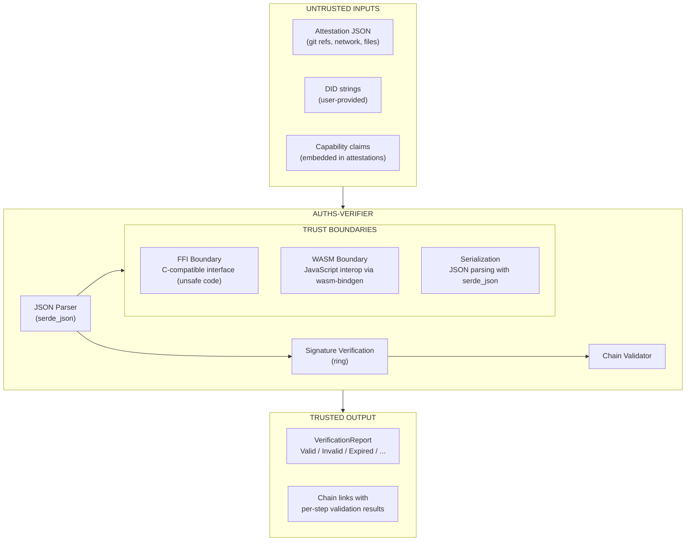

# Auths-Verifier Threat Model

## 1. Overview

`auths-verifier` is the embeddable verification component of the Auths identity attestation system. It is designed to be:

- **Lightweight**: Minimal dependencies for easy auditing
- **Cross-platform**: Works on any target including WASM and FFI consumers
- **Trust-minimizing**: Performs cryptographic verification without requiring private keys

The verifier is responsible for validating attestation chains, checking signatures, and enforcing capability-based authorization. Third parties embed this library to verify that commits, releases, or other artifacts were signed by authorized identities.

## 2. Assets

### 2.1 What the Verifier Protects

| Asset | Description | Impact if Compromised |
|-------|-------------|----------------------|
| **Attestation Integrity** | Ed25519 signatures must be valid | Unauthorized commits could be accepted |
| **Identity Binding** | DIDs must correctly map to public keys | Impersonation attacks possible |
| **Capability Authorization** | Only granted capabilities should be accepted | Privilege escalation |
| **Chain Validity** | Delegation chains must be unbroken | Bypass of authorization hierarchy |
| **Temporal Validity** | Expired/revoked attestations must be rejected | Use of stale credentials |

### 2.2 What the Verifier Does NOT Handle

| Asset | Where It Lives | Notes |
|-------|---------------|-------|
| Private keys | Platform keychain, HSM, `auths-daemon` | Never touched by verifier |
| Key generation | `auths-cli` or `auths-daemon` | Verifier is read-only |
| Attestation storage | Git refs (`refs/auths/*`) | Verifier receives attestations as input |

## 3. Threat Actors

| Actor | Motivation | Capabilities |
|-------|------------|--------------|
| **Malicious Contributor** | Inject unauthorized commits into trusted repo | Can submit PRs, may have compromised or forged signing key |
| **Compromised CI** | Bypass verification to merge malicious code | Has access to CI secrets, can modify verification outputs |
| **Stolen Device** | Impersonate authorized user | Has device attestation, may have device private key |
| **Network Attacker** | MITM attestation delivery | Can intercept/modify network traffic (if attestations fetched remotely) |
| **Supply Chain Attacker** | Compromise verifier dependency | Can inject malicious code via compromised crate |
| **Insider Threat** | Abuse granted capabilities | Has valid attestation with some capabilities |

## 4. Trust Boundaries

### 4.1 Boundary Details

| Boundary | Interface | Trust Level |
|----------|-----------|-------------|
| **Git Repository** | Attestations stored as `refs/auths/*` | Partially trusted (signatures verified) |
| **FFI Boundary** | `ffi_verify_attestation_json()` | Untrusted caller (unsafe) |
| **WASM Boundary** | JavaScript bindings | Untrusted caller |
| **Serialization** | JSON input to `Attestation::from_json()` | Untrusted data |

## 5. Attack Vectors & Mitigations

### 5.1 Signature Bypass

**Threat**: Forge attestation without valid Ed25519 signature.

**Attack Surface**:

- Weak signature algorithm
- Signature verification bugs
- Canonical JSON inconsistencies

**Mitigations**:

- Ed25519 via `ring` library (audited, widely used)
- All signed fields included in canonical JSON envelope
- Canonical JSON via `json-canon` ensures deterministic serialization
- Org fields (role, capabilities, delegated_by) are included in signed envelope

**Residual Risk**: Low. Ed25519 is cryptographically strong; `ring` is well-audited.

### 5.2 Capability Escalation

**Threat**: Gain capabilities not granted by the attestation chain.

**Attack Surface**:

- Tampering with capability list after signing
- Exploiting intersection logic bugs
- Injecting capabilities via JSON parsing

**Mitigations**:

- Capabilities are part of the signed envelope (tampering invalidates signature)
- `verify_chain_with_capability()` uses intersection semantics
- Delegation cannot escalate: child attestation capabilities are intersected with parent

**Residual Risk**: Low. Cryptographic binding prevents tampering.

### 5.3 Timestamp Attacks

**Threat**: Use expired attestation or create future-dated forgery.

**Attack Surface**:

- Clock skew between systems
- Replaying old attestations
- Future-dating attestations

**Mitigations**:

- 5-minute clock skew tolerance (`MAX_SKEW_SECS = 300`)
- Past timestamps are allowed (attestations in Git are verified days/months later)
- Future timestamps beyond skew tolerance are rejected
- Explicit `expires_at` field is checked

**Residual Risk**: Medium. Systems with significantly wrong clocks could accept invalid attestations.

### 5.4 FFI Buffer Overflow

**Threat**: Malicious FFI caller provides wrong buffer length, causing memory corruption.

**Attack Surface**:

- `ffi_verify_attestation_json()` accepts raw pointers and lengths

**Mitigations**:

- Null pointer checks before use
- Length validation for public key (must be 32 bytes)
- `panic::catch_unwind()` prevents panics from propagating to C code
- FFI module gated behind `ffi` feature flag

**Residual Risk**: Medium. Caller is responsible for providing valid buffer lengths.

**Recommendation for Integrators**: Always validate buffer lengths before calling FFI functions.

### 5.5 JSON Parsing DoS

**Threat**: Large or deeply nested JSON exhausts memory or stack.

**Attack Surface**:

- `Attestation::from_json()` accepts arbitrary bytes
- `serde_json` has no built-in size limits

**Mitigations**:

- Fuzzing harnesses test parsing resilience
- Attestation structure has bounded fields

**Residual Risk**: Medium. No explicit size limits in verifier.

**Recommendation for Integrators**: Implement size limits (e.g., max 64KB) before calling verification functions.

### 5.6 DID Parsing Attacks

**Threat**: Malformed DID strings cause unexpected behavior.

**Attack Surface**:

- `did_key_to_ed25519()` parses arbitrary strings
- Base58 decoding, multicodec prefix parsing

**Mitigations**:

- Explicit prefix check (`did:key:z`)
- Multicodec prefix validation (`[0xED, 0x01]`)
- Length validation (must be 34 bytes decoded)
- Returns error instead of panicking

**Residual Risk**: Low. Explicit validation at each step.

### 5.7 Chain Linkage Attacks

**Threat**: Break the issuer→subject chain to bypass authorization hierarchy.

**Attack Surface**:

- Mismatch between attestation issuer and previous subject
- Gaps in delegation chain

**Mitigations**:

- `verify_chain()` explicitly checks `att.issuer == prev_att.subject`
- Empty chains return `BrokenChain` status
- Each link is individually verified

**Residual Risk**: Low. Explicit linkage validation.

### 5.8 Revocation Bypass

**Threat**: Use revoked attestation before revocation is detected.

**Attack Surface**:

- Revocation is boolean only (no `revoked_at` timestamp)
- Race condition between revocation and verification

**Mitigations**:

- `revoked` field is part of signed envelope
- Verification checks revocation status

**Residual Risk**: Medium. Revocation granularity is limited.

**Known Limitation**: Revocation is currently boolean. Time-aware revocation checking would require adding a `revoked_at` field.

## 6. Known Limitations

| Limitation | Description | Potential Impact |
|------------|-------------|------------------|
| **Boolean Revocation** | No `revoked_at` timestamp | Cannot verify if attestation was valid at a specific past time |
| **No Rate Limiting** | Verification functions don't limit calls | DoS via rapid verification requests |
| **is_device_authorized() Signature** | Convenience function does NOT verify signatures | Should only be used with pre-verified attestations |
| **No Size Limits** | JSON parsing has no built-in size limits | Memory exhaustion possible |
| **Clock Dependency** | Relies on system clock for expiration | Systems with wrong clocks may accept/reject incorrectly |

## 7. Security Recommendations for Integrators

### 7.1 Required Practices

1. **Always use `verify_chain()` for cryptographic verification** - Do not rely on `is_device_authorized()` alone.

2. **Validate FFI buffer lengths** - Before passing to `ffi_verify_attestation_json()`, ensure pointers and lengths are correct.

3. **Implement size limits** - Limit attestation JSON to reasonable size (e.g., 64KB) before parsing.

4. **Validate root public keys** - Ensure the root public key used for chain verification is from a trusted source.

### 7.2 Recommended Practices

5. **Use capability-aware verification** - Prefer `verify_chain_with_capability()` when checking for specific permissions.

6. **Handle all verification statuses** - Check for `Expired`, `Revoked`, `InvalidSignature`, and `BrokenChain` explicitly.

7. **Log verification failures** - Capture details for security auditing.

8. **Monitor for anomalies** - Track verification failure rates for potential attack detection.

### 7.3 Defense in Depth

9. **Don't trust verification alone** - Combine with other controls (branch protection, code review, etc.).

10. **Keep dependencies updated** - Especially `ring` for cryptographic fixes.

11. **Run fuzzing regularly** - Use provided fuzz targets to detect regressions.

## 8. Dependency Analysis

### 8.1 Critical Dependencies

| Dependency | Purpose | Risk Level | Notes |
|------------|---------|------------|-------|
| `ring` | Ed25519 signature verification | Low | Widely audited, used by rustls |
| `serde_json` | JSON parsing | Low | Mature, fuzzed extensively |
| `bs58` | Base58 encoding for DID:key | Low | Simple, limited attack surface |

### 8.2 Supporting Dependencies

| Dependency | Purpose | Risk Level | Notes |
|------------|---------|------------|-------|
| `chrono` | Timestamp handling | Low | Well-maintained |
| `json-canon` | Canonical JSON | Medium | Less audited, but simple |
| `thiserror` | Error types | Low | Proc macro, compile-time only |
| `hex` | Hex encoding | Low | Simple utility |
| `log` | Debug logging | Low | No security impact |

### 8.3 Optional Dependencies

| Dependency | Feature | Purpose |
|------------|---------|---------|
| `libc` | `ffi` | C-compatible FFI interface |
| `wasm-bindgen` | `wasm` | WASM/JavaScript bindings |
| `getrandom` | `wasm` | Randomness for WASM targets |

## 9. Audit Checklist

For security auditors reviewing this crate:

- [ ] Review `ring` Ed25519 verification usage in `verify.rs`
- [ ] Check canonical JSON generation in `core.rs` includes all signed fields
- [ ] Verify FFI boundary safety in `ffi.rs` (feature-gated)
- [ ] Confirm no panics in JSON parsing paths (`Attestation::from_json`)
- [ ] Review chain validation logic in `verify_chain()`
- [ ] Check capability intersection logic in `verify_chain_with_capability()`
- [ ] Verify timestamp/expiration checks in `verify_with_keys_at()`
- [ ] Review DID parsing in `did_key_to_ed25519()`
- [ ] Run all fuzz targets for at least 1 hour each
- [ ] Check for unsafe code outside FFI boundary

## 10. KEL State Cache

### 10.1 Purpose

The local KEL (Key Event Log) state cache is a performance optimization that eliminates repeated O(n) replays of the full event log when resolving identity state. The cache stores validated `KeyState` objects keyed by DID and validated against the KEL tip SAID.

### 10.2 Security Properties

| Property | Description |
|----------|-------------|
| **Cache is not trusted** | Always validated against current KEL tip SAID before use |
| **Cache never replaces verification** | On any mismatch, full replay occurs |
| **Cannot introduce false positives** | Only speeds up valid lookups |
| **Fail-closed** | Worst-case failure = slower verification via full replay |
| **DID verification** | Stored DID must match requested DID to prevent file swap attacks |

### 10.3 Threat Scenarios

| Threat | Attack | Mitigation |
|--------|--------|------------|
| **Cache poisoning** | Attacker modifies cache file with wrong state | SAID validation detects mismatch, triggers full replay |
| **File swap attack** | Attacker swaps cache files between DIDs | DID field in cache is verified against requested DID |
| **Cache deletion** | Attacker deletes cache file | System falls back to full replay (no security impact) |
| **File corruption** | Cache file becomes corrupted | JSON parse failure treated as cache miss |
| **Stale cache** | KEL updated but cache not | Tip SAID mismatch invalidates cache |
| **Version downgrade** | Old cache format used | Version field mismatch triggers cache miss |
| **Path traversal** | Malicious DID containing `../` | SHA-256 hash of DID used for filename |

### 10.4 Design Constraints

The cache:

- Is **local-only**: Never committed to Git or replicated to peers
- Is **not a trust anchor**: Cannot be used to bypass cryptographic verification
- Is **deletable without impact**: Safe to remove at any time
- Uses **atomic writes**: Temp file → fsync → rename pattern
- Has **restrictive permissions**: 0o600 on Unix systems

### 10.5 What the Cache is NOT

- **Not a distributed data structure** - Lives only on local filesystem
- **Not replicated to peers** - Each node maintains its own cache
- **Not stored in Git** - Never part of the repository
- **Not part of the trust anchor chain** - Derived from, not replacing, the KEL

### 10.6 Implementation Notes

| Aspect | Implementation |
|--------|----------------|
| **File location** | `$AUTHS_HOME/cache/kel/<sha256(did)>.json` |
| **Filename** | SHA-256 hash of DID (prevents collisions and path traversal) |
| **Version field** | Allows cache format evolution without silent corruption |
| **Validated fields** | version, did, validated_against_tip_said |

### 10.7 Recommendations for Operators

1. **Cache is optional** - Deleting `~/.auths/cache/kel/` is always safe
2. **Use `auths cache clear`** - To force full replay for debugging
3. **Inspect with `auths cache inspect <did>`** - To verify cache state
4. **Environment variable** - Set `AUTHS_HOME` for custom cache location

## 11. Registry Append Path

### 11.1 Overview

The packed registry backend (`crates/auths-id/src/storage/registry/packed.rs`) accepts KEL events via `append_event()`. Before accepting an event, the registry enforces five structural constraints:

1. **Event file uniqueness** — Refuses if an event file already exists at the sequence number
2. **Prefix match** — Event prefix must match the target identity
3. **Monotonic sequence** — Sequence number must be exactly `current_tip + 1` (or 0 for first event)
4. **Inception first** — The first event (seq 0) must be an inception event
5. **Chain linkage** — Non-inception events must reference the previous event's SAID

After fn-2.6, a sixth constraint will be added:

6. **Cryptographic verification** — `verify_event_crypto(new_event, current_state)` validates the event signature against the current key state before acquiring the advisory lock. This runs in O(1) time against cached `KeyState`, not O(n) full KEL replay.

### 11.2 Residual Risk

- **Pre-fn-2.6**: The registry accepts structurally valid events without verifying Ed25519 signatures. A compromised client could append events with invalid signatures.
- **Post-fn-2.6**: Signature verification eliminates this gap. The O(1) delta validation design ensures write throughput does not degrade with KEL length.

## 12. Auth Server Session Storage

### 12.1 Current Implementation (RESOLVED)

The two servers use different session store backends:

- **Auth server**: `PostgresSessionStore` (`crates/auths-auth-server/src/adapters/postgres_session_store.rs`) stores sessions in PostgreSQL via sqlx. The `SessionStore` trait (`crates/auths-auth-server/src/ports/session_store.rs`) is fully async (via `async-trait`) and defines six operations: `create`, `get`, `update_status`, `delete`, `list_active`, and `cleanup_expired`. Schema is managed via sqlx migrations (`migrations/001_init.sql`). A background task runs every 60s to evict expired sessions. Falls back to `InMemorySessionStore` when `DATABASE_URL` is not set.

- **Registry server**: `SqlitePairingStore` (`crates/auths-registry-server/src/adapters/sqlite_pairing_store.rs`) stores pairing sessions in SQLite with WAL mode. The `PairingStore` trait (`crates/auths-registry-server/src/ports/pairing_store.rs`) separates persistent session data from ephemeral WebSocket notifiers. A background task runs every 60s to evict expired sessions.

In-memory implementations (`InMemorySessionStore`, `InMemoryPairingStore`) remain available for testing.

### 12.2 Resolved Limitations

| Previous Limitation | Resolution |
|---------------------|------------|
| **Sessions lost on restart** | PostgreSQL persistence — sessions survive server restarts |
| **No eviction policy** | Background cleanup task every 60s removes expired sessions |
| **No `delete()` or `list()` on SessionStore trait** | Trait expanded with `delete()`, `list_active()`, `cleanup_expired()` |
| **Auth server single-node only** | PostgreSQL supports horizontal scaling via connection pooling (`PgPool`) |

### 12.3 Remaining Gaps

| Limitation | Impact |
|------------|--------|
| **Registry server horizontal scaling** | SQLite `PairingStore` is single-node; Redis or PostgreSQL needed for multi-instance |
| **Rate limiting per IP** | Pairing store tracks total creation count but not per-client |

### 12.4 Future: Redis-backed Stores

The `PairingStore` trait is designed for substitution. A Redis-backed implementation would enable horizontal scaling of the registry server via shared session state and native TTL via Redis EXPIRE.

## 13. Version History

| Version | Date | Changes |
|---------|------|---------|
| 0.1.0 | TBD | Initial threat model |
| 0.2.0 | TBD | Added KEL State Cache section |
| 0.3.0 | 2026-02-14 | Added Registry Append Path and Auth Server Session Storage sections |
| 0.4.0 | 2026-02-16 | Resolved session storage gap: SQLite-backed stores for auth-server and registry-server |
| 0.5.0 | 2026-02-18 | Auth server migrated from SQLite to PostgreSQL (hard cut); `SessionStore` trait made fully async |

---

*This threat model should be reviewed and updated whenever significant changes are made to `auths-verifier` or related security-sensitive components.*
