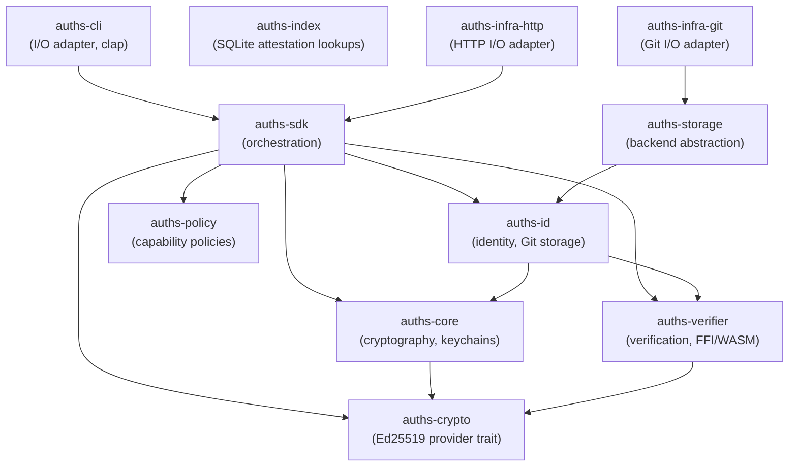
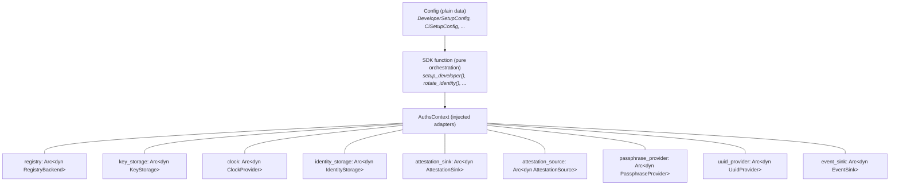

# Rust SDK Overview

## Crate Ecosystem

Auths is structured as a workspace of focused crates. The `auths-sdk` crate is the orchestration layer that most Rust consumers should depend on directly.



## Which Crate for What

| Crate | Purpose | When to use |
|---|---|---|
| `auths-sdk` | High-level orchestration: identity setup, device linking, signing, rotation | Most consumers start here |
| `auths-core` | Ed25519 cryptography (via `ring`), platform keychains, encryption primitives | Building custom signing pipelines |
| `auths-id` | Identity and attestation logic; Git ref storage under `refs/auths/` and `refs/keri/` | Custom storage backends |
| `auths-verifier` | Standalone verification with minimal dependencies; FFI and WASM support | Embedding verification in servers, browsers, or C programs |
| `auths-crypto` | `CryptoProvider` trait abstracting Ed25519 operations | Plugging in alternative crypto backends |
| `auths-policy` | Capability-based authorization policies | Policy evaluation outside the SDK |
| `auths-index` | SQLite-backed O(1) attestation lookups | High-volume attestation queries |
| `auths-storage` | Backend abstraction layer (Git, SQLite) | Custom storage integrations |
| `auths-infra-git` | Git I/O adapter implementing storage traits | Wiring Git-backed storage into `AuthsContext` |
| `auths-infra-http` | HTTP client adapter for registry operations | Remote registry communication |

## Dependency Graph Summary

```text
auths-cli  -->  auths-sdk  -->  auths-core + auths-id
(I/O adapter)   (orchestration)  (domain)

auths-verifier  (standalone, minimal deps for FFI/WASM embedding)
auths-index     (SQLite-backed O(1) attestation lookups)
auths-crypto    (Ed25519 provider trait, shared by core + verifier)
```

Key design principles:

- **`auths-sdk` never performs I/O itself.** It delegates to injected adapters via `AuthsContext`.
- **`auths-verifier` has no heavy dependencies.** It does not depend on `git2`, `tokio`, or platform keychains. This makes it suitable for WASM and C FFI targets.
- **`auths-core` and `auths-sdk` never reference CLI code.** The dependency graph flows strictly from presentation to domain.

## Workspace Version

All crates share a single workspace version declared in the root `Cargo.toml`:

```toml
[workspace.package]
version = "0.0.1-rc.5"
license = "Apache-2.0"
rust-version = "1.93"
```

## Feature Flags

| Crate | Feature | Effect |
|---|---|---|
| `auths-core` | `keychain-file-fallback` | Enables encrypted file storage when platform keychain is unavailable |
| `auths-core` | `keychain-windows` | Windows Credential Manager backend |
| `auths-core` | `crypto-secp256k1` | Secp256k1 key support |
| `auths-core` | `test-utils` | Shared test helpers |
| `auths-id` | `auths-radicle` | Radicle protocol integration |
| `auths-id` | `indexed-storage` | SQLite-backed indexed storage |
| `auths-verifier` | `ffi` | C-compatible FFI bindings (enables `libc`) |
| `auths-verifier` | `wasm` | WASM bindings via `wasm-bindgen` |

## SDK Architecture

The SDK follows a ports-and-adapters pattern. Config structs (`DeveloperSetupConfig`, `CiSetupConfig`, etc.) carry serializable data. The `AuthsContext` struct carries injected infrastructure adapters:



This separation allows the SDK to operate as a headless, storage-agnostic library embeddable in cloud SaaS, WASM, or C-FFI runtimes.
