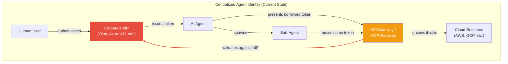
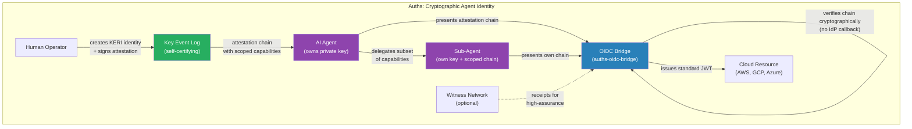

# The Agent Identity Problem Is an Architecture Problem

**Response to [NCCoE Concept Paper: Accelerating the Adoption of Software and AI Agent Identity and Authorization](https://www.nccoe.nist.gov/sites/default/files/2026-02/accelerating-the-adoption-of-software-and-ai-agent-identity-and-authorization-concept-paper.pdf)**

*Submitted by the creator of [Auths](https://auths.dev/), an open-source cryptographic identity framework for autonomous systems*

---

## The Problem: Agents Break Every Assumption Identity Was Built On

The NCCoE concept paper identifies five areas of exploration: agent identification, authorization, access delegation, logging, and data flow tracking. These are the right questions. But the answers being deployed today share a structural flaw: they assume a trusted central authority is always reachable, always correct, and always fast enough.

That assumption held when identity meant "a human logs into a web app." It does not hold for autonomous agents.

Agents are **ephemeral** — spun up for a single task and destroyed. They are **cross-boundary** — a single workflow may touch AWS, a GitHub API, a corporate database, and a third-party SaaS tool. They **delegate** — an agent spawns sub-agents that need scoped subsets of the parent's authority. And they operate at **machine speed** — an agent that must round-trip to an IdP before every action introduces latency that defeats the purpose of automation.

Today, 44% of organizations authenticate agents with static API keys. 43% use username/password. Only 28% can trace agent actions back to a human sponsor. The industry knows this is broken. The question is what replaces it [1].

## Everyone Is Solving It Backwards

The dominant response has been to add layers of governance **around** agents — gateways, proxies, policy engines — while leaving the identity foundation unchanged. The agent still has no cryptographic identity of its own. It borrows credentials from humans, service accounts, or centralized token issuers. The governance layer intercepts calls and enforces policy, but the identity itself remains a borrowed artifact from a system designed for a different era.

This creates a specific architectural failure mode:

**What breaks:**

- **Single point of failure.** If the IdP is unreachable, every agent stops. In cross-cloud workflows, this happens routinely during region failovers.
- **No delegation chain.** The sub-agent reuses the parent's token. There is no cryptographic proof of *who delegated what authority to whom*. The NCCoE paper calls this out explicitly: link specific user identities to AI agents to support effective delegation controls and maintain accountability.
- **Credential sprawl at machine scale.** Every agent-to-resource connection requires a pre-provisioned secret. At 50:1 NHI-to-human ratios (already typical), this is thousands of static credentials per organization.
- **Verification requires connectivity.** Every relying party must call back to the IdP or gateway to validate a token. Agents crossing trust boundaries — the primary agentic use case — hit this wall constantly.
- **Key compromise is catastrophic.** There is no pre-rotation. If a signing key is compromised, revocation is a race condition between the attacker and the IdP's propagation delay. JWKS caches at relying parties may be stale for up to 24 hours.

The gateway-centric approach treats identity as a network problem. It is not. It is a **cryptographic** problem.

## Auths: Identity That Originates From Cryptography, Not Infrastructure

Auths is an open-source framework that gives autonomous systems self-certifying cryptographic identities with delegated, capability-scoped authority — and bridges that identity into the cloud provider ecosystem via standard OIDC.

The core insight: **an agent's identity should be verifiable by anyone, anywhere, without calling home to a central authority.** This is what [KERI (Key Event Receipt Infrastructure)](https://keri.one/keri-resources/) provides, and what Auths implements as a practical, deployable system [2].

### How It Works (Without the Sordid Details)

**Identity creation.** An identity is born as a KERI inception event — a signed record binding a self-certifying identifier to a public key, with a pre-committed hash of the *next* key already embedded. No registry. No certificate authority. The identifier *is* the cryptography.

**Capability delegation.** A human (or parent agent) creates a signed attestation chain granting specific capabilities to a child agent. The chain is cryptographically verifiable: each link is signed by the issuer, countersigned by the recipient, and specifies exactly what the recipient is authorized to do (`sign:commit`, `deploy:staging`, `read:metrics`). Delegation is scoped, time-bounded, and revocable.

**Cloud access.** The agent presents its attestation chain to an OIDC bridge, which verifies the cryptographic chain and issues a standard JWT. AWS STS, GCP Workload Identity Federation, and Azure AD accept this JWT through their existing OIDC federation mechanisms. No cloud provider changes required.

**Key rotation without authority.** Because each KERI event pre-commits to the next key via a hash commitment, key rotation is a local operation. The controller proves they know the pre-committed key. No CA needs to re-issue a certificate. No IdP needs to update a directory. Compromised keys are rotated by the identifier controller, and the rotation event is verifiable by anyone who has the key event log.

### The System

Auths is implemented as 18 Rust crates (~125K lines of code) comprising:

- **`auths-id`** — KERI identity lifecycle, including inception, rotation, key event log management ([Crates.io](https://crates.io/crates/auths-id))
- **`auths-crypto`** — Ed25519 signatures, Blake3 SAIDs, CESR-encoded primitives ([Crates.io](https://crates.io/crates/auths-crypto))
- **`auths-verifier`** — Attestation chain verification, witness receipt validation ([Crates.io](https://crates.io/crates/auths-verifier))
- **`auths-oidc-bridge`** — Translates verified attestation chains into RS256 JWTs with standard OIDC discovery, e.g. `/.well-known/openid-configuration`, `/.well-known/jwks.json` ([Crates.io](https://crates.io/crates/auths-oidc-bridge))
- **`auths-sdk`** — Embeddable library for applications to create identities, issue attestations, and request cloud credentials ([Crates.io](https://crates.io/crates/auths-sdk))
- **`auths-cli`** — Command-line tooling for developers, including identity creation, commit signing, attestation management, agent identity creation tied back to originating human actor, etc. ([Crates.io](https://crates.io/crates/auths-cli))

The system includes >1,600 tests, >50 fuzz targets, and has been validated end-to-end against AWS STS `AssumeRoleWithWebIdentity`.

### How This Addresses Each NCCoE Focus Area

**Identification of AI and Software Systems.** Each agent holds a KERI-based self-certifying identifier derived from its own public key. The identifier is globally unique, cryptographically bound to the agent, and distinguishable from human identities by structure. No central registry required for uniqueness.

**Authorization of AI Systems.** Attestation chains encode fine-grained capabilities (`sign:commit`, `deploy:production`, `read:metrics`). The OIDC bridge performs intersection-based scope-down: agents request only the capabilities they need for a given task, and the bridge issues JWTs containing the intersection of requested and chain-granted capabilities. This is OAuth-compatible — the issued JWT is a standard Bearer token consumable by any OIDC relying party.

**Access Delegation.** This is where Auths differs most from centralized approaches. Delegation is a first-class cryptographic operation. A parent agent (human or AI agent) signs an attestation granting a subset of its capabilities to a child agent (usually another AI agent). The child's attestation chain includes the full provenance: `human operator → parent agent → child agent`, each link signed and capability-scoped. Delegation depth, capability narrowing, and time bounds are enforced cryptographically at verification time.

**Logging and Transparency.** Every KERI event (inception, rotation, interaction) is a signed, content-addressed record in the Key Event Log. The attestation chain provides a complete, tamper-evident audit trail from human sponsor to agent action. Because identifiers are self-certifying, log entries are independently verifiable without access to any central system. The central systems become an optional add-on.

**Tracking Data Flows.** Attestation chains carry provenance metadata: who created the agent, what capabilities were delegated, when, and by whom. Combined with the OIDC bridge's JWT claims (`keri_prefix`, `capabilities`, `github_actor`, `github_repository`), cloud-side audit logs can correlate agent actions back through the full delegation chain to the originating human identity.

## What We're Proposing

Auths is open source (Apache-2.0 for protocol crates) and available for evaluation. We propose:

1. **Inclusion in the NCCoE demonstration** as a working implementation of cryptographic agent identity that bridges to existing cloud IAM via OIDC. The system is functional today against AWS STS, with GCP and Azure validation in progress.

2. **Alignment with the standards under consideration.** Auths already implements or integrates with OAuth 2.0 (JWT issuance), OpenID Connect (full discovery + JWKS), and KERI/CESR (the SPIFFE analog for self-certifying identities). The OIDC bridge is specifically designed to make KERI identities consumable by relying parties that speak standard protocols.

3. **A practical reference point for the delegation problem.** The concept paper identifies access delegation as a focus area, but the standards listed (OAuth, OIDC, SPIFFE, SCIM, NGAC) don't natively solve cryptographic delegation chains with capability scoping. Auths demonstrates one way to fill that gap with working code.

The agent identity problem will not be solved by adding governance layers around borrowed credentials. It requires giving agents their own cryptographic identity, with delegation chains that are independently verifiable, capability-scoped, and revocable — then bridging that identity into the cloud ecosystem through the standards that already exist.

Auths is that bridge.

---

*Contact: bordumbb@gmail.com*

*Repository: https://github.com/auths-dev/auths*

*Website: https://auths.dev*

*License: Apache-2.0*

---

## References

1. Cloud Security Alliance & Strata Identity. (2026, February 5). *Securing Autonomous AI Agents*. Survey of 285 IT and security professionals, September–October 2025. [https://cloudsecurityalliance.org/press-releases/2026/02/05/cloud-security-alliance-strata-survey-finds-that-enterprises-are-in-time-to-trust-phase-as-they-build-ai-autonomy-foundations](https://cloudsecurityalliance.org/press-releases/2026/02/05/cloud-security-alliance-strata-survey-finds-that-enterprises-are-in-time-to-trust-phase-as-they-build-ai-autonomy-foundations)

2. Smith, S. M. (2024). *Key Event Receipt Infrastructure (KERI) Design and Build*. [https://github.com/SmithSamuelM/Papers/blob/master/whitepapers/KERI_WP_2.x.web.pdf](https://github.com/SmithSamuelM/Papers/blob/master/whitepapers/KERI_WP_2.x.web.pdf)
